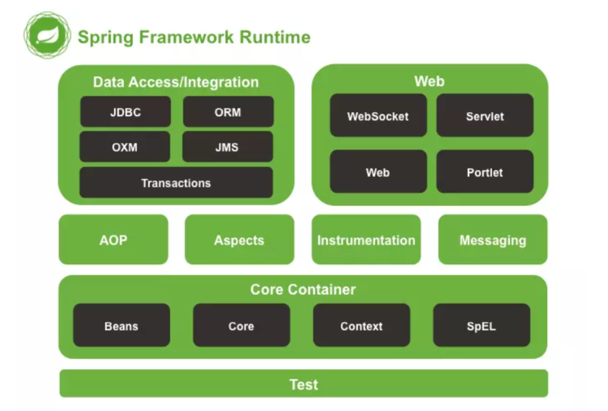
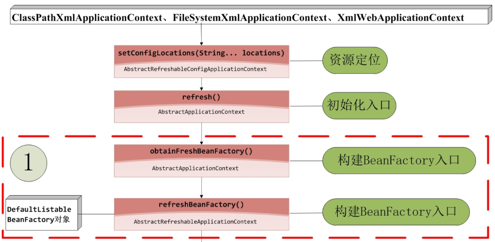
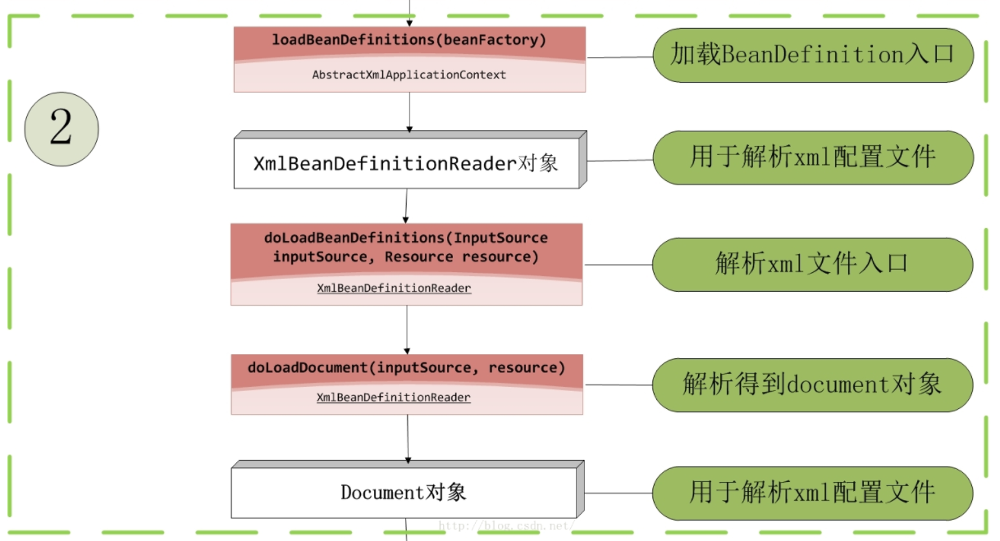
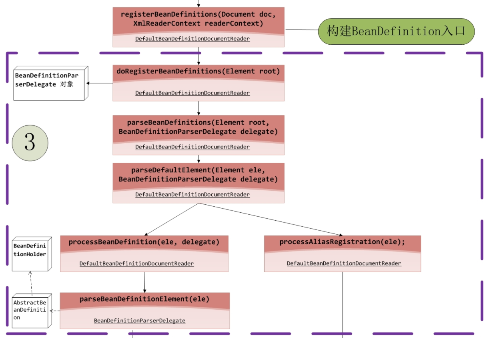
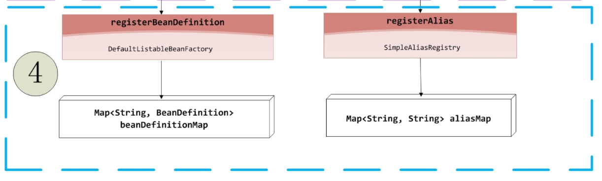
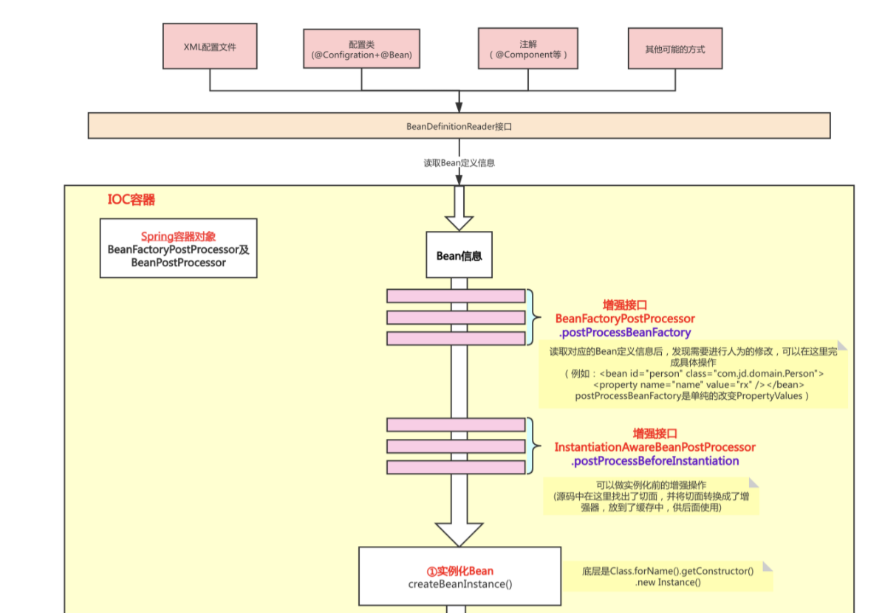
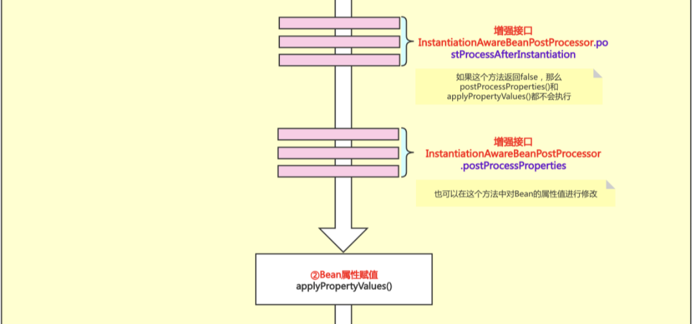
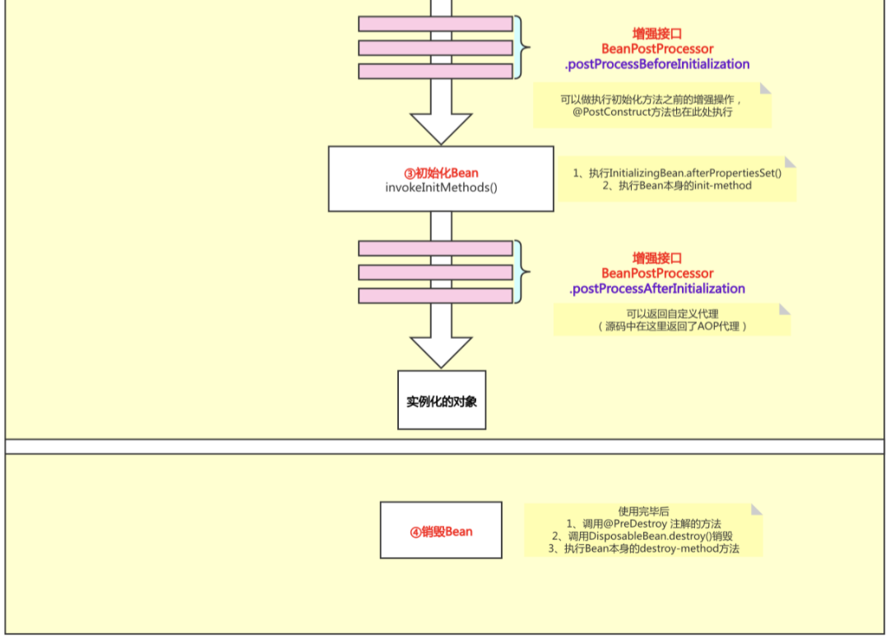
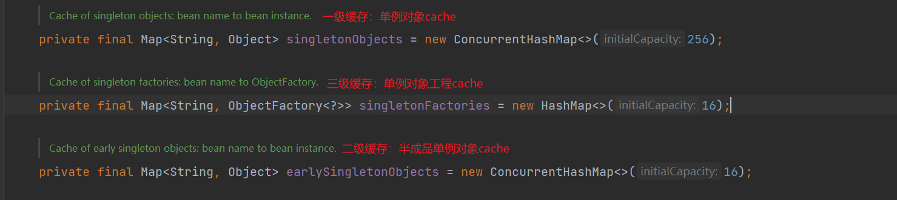
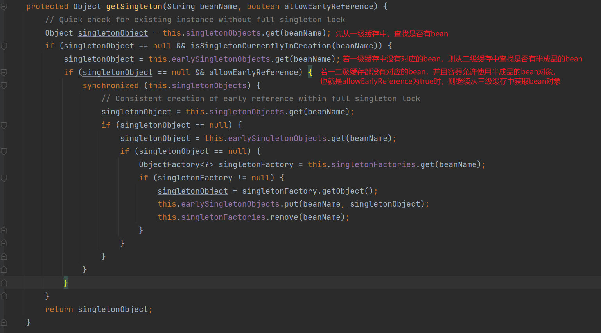

## Spring学习笔记

### Spring简介

1. 引用Spring官网的语句介绍： Spring是一个轻量级Java开发框架，它为企业级开发提供给了丰富的功能，但是这些功能的底层都依赖于它的两个核心特性，也就是控制反转（Inversion of
   Control，IOC）和面向切面编程（aspect-oriented programming，AOP）。 IOC让相互协作的组件保持松散的耦合，而AOP编程允许你把遍布于应用各层的功能分离出来形成可重用的功能组件。

2. Spring的优缺点
    1. 优点：
        1. 方便解耦，简化开发：Spring就是一个大工厂，可以将所有对象的创建和依赖关系的维护，交给Spring管理。
        2. AOP编程的支持：Spring提供面向切面编程，可以方便的实现对程序进行权限拦截、运行监控等功能。
        3. 声明式事务的支持：只需要通过配置就可以完成对事务的管理，而无需手动编程。
        4. 方便程序的测试：Spring对Junit4支持，可以通过注解方便的测试Spring程序。
        5. 方便集成各种优秀框架：Spring不排斥各种优秀的开源框架，其内部提供了对各种优秀框架的直接支持（如：MyBatis等）。
    2. 缺点：
        1. Spring明明一个很轻量级的框架，却给人感觉大而全
        2. Spring依赖反射，反射影响性能
        3. 使用门槛升高，入门Spring需要较长时间
3. Spring由哪些模块组成
    1. Spring 总共大约有 20 个模块， 由 1300 多个不同的文件构成。 而这些组件被分别整合在核心容器（Core Container） 、 AOP（Aspect Oriented
       Programming）和设备支持（Instrmentation） 、数据访问与集成（Data Access/Integeration） 、 Web、 消息（Messaging） 、 Test等 6 个模块中。 以下是
       Spring 5 的模块结构图

       

    2. Spring模块简介：
        1. spring core：提供了框架的基本组成部分，包括控制反转（Inversion of Control，IOC）和依赖注入（Dependency Injection，DI）功能。
        2. spring beans：提供了BeanFactory，是工厂模式的一个经典实现，Spring将管理对象称为Bean。
        3. spring context：构建于 core 封装包基础上的 context 封装包，提供了一种框架式的对象访问方法。
        4. spring jdbc：提供了一个JDBC的抽象层，消除了烦琐的JDBC编码和数据库厂商特有的错误代码解析，用于简化JDBC。
        5. spring aop：提供了面向切面的编程实现，让你可以自定义拦截器、切点等。
        6. spring Web：提供了针对 Web 开发的集成特性，例如文件上传，利用 servlet listeners 进行 ioc 容器初始化和针对 Web 的 ApplicationContext。
        7. spring test：主要为测试提供支持的，支持使用JUnit或TestNG对Spring组件进行单元测试和集成测试。
    3. Spring 框架中都用到了哪些设计模式：
        1. 工厂模式：BeanFactory就是简单工厂模式的体现，用来创建对象的实例。
        2. 单例模式：Bean默认为单例模式。
        3. 代理模式：Spring的AOP功能用到了JDK的动态代理和CGLIB字节码生成技术。
        4. 模板方法：用来解决代码重复的问题。比如. RestTemplate, JmsTemplate, JpaTemplate。
        5. 观察者模式：定义对象键一种一对多的依赖关系，当一个对象的状态发生改变时，所有依赖于它的对象都会得到通知被制动更新，如Spring中listener的实现–ApplicationListener。

### Spring IOC容器的初始化过程和Bean的生命周期

1. IOC容器的初始化图

   

   

   

   

2. 过程简述：
    1. 第一个过程是Resource资源定位。这个Resource指的是BeanDefinition的资源定位。这个过程就是容器找数据的过程，就像水桶装水需要先找到水一样。
    2. 第二个过程是BeanDefinition的载入过程。这个载入过程是把用户定义好的Bean表示成Ioc容器内部的数据结构，而这个容器内部的数据结构就是BeanDefinition。
    3. 第三个过程是向IOC容器注册这些BeanDefinition的过程，这个过程就是将前面的BeanDefinition保存到HashMap中的过程。
3. Bean的生命周期流程图

   

   

   

4. 总体分为四个阶段
    1. ①实例化 CreateBeanInstance
    2. ②属性赋值 PopulateBean
    3. ③初始化 Initialization
    4. ④销毁 Destruction
5. 循环依赖也是在属性填充阶段解决
    1. 使用了三级缓存解决循环依赖的问题（二级缓存也能够解决，但是为了AOP代理对象的存储，才引入了三级缓存）,因为调用singletonFactory.getObject()
       方法时，会对bean对象进行增强处理，动态代理也是在这一步完成的，所以三级缓存是用来存储动态代理的对象，二级缓存用来存储半成品对象，一级缓存用来存储初始化完毕的bean对象，三个Map缓存各司其职，符合单一功能的职责，也为了保证bean的生命周期不受到影响
    2. 三级缓存主要指三个Map

       

       

    3. 为什么要三级缓存?
        1. 假设去掉三级缓存，Bean 直接创建 earlySingletonObjects，看着好像也可以。如果有代理的时候，在 earlySingletonObjects
           直接放代理对象就行了。但是会导致一个问题：在实例化阶段就得执行后置处理器，判断有 AnnotationAwareAspectJAutoProxyCreator 并创建代理对象。这么一想，是不是会对 Bean
           的生命周期有影响。同样，先创建 singletonFactory 的好处就是：在真正需要实例化的时候，再使用 singletonFactory.getObject() 获取 Bean 或者 Bean
           的代理。相当于是延迟实例化。
        2. 假设去掉二级缓存：如果去掉了二级缓存，则需要直接在 singletonFactory.getObject() 阶段初始化完毕，并放到一级缓存中。那有这么一种场景，B 和 C 都依赖了 A。要知道在有代理的情况下
           singletonFactory.getObject() 获取的是代理对象。而多次调用 singletonFactory.getObject() 返回的代理对象是不同的，就会导致 B 和 C 依赖了不同的 A。