## HashMap详解

### 1. HashMap概览

* HashMap 主要用来存放键值对，它基于哈希表的 Map 接口实现，是常用的 Java 集合之一，是非线程安全的。
* HashMap 可以存储 null 的 key 和 value，但 null 作为键只能有一个，null 作为值可以有多个。
* JDK1.8 之前 HashMap 由 数组+链表 组成的，数组是 HashMap 的主体，链表则是主要为了解决哈希冲突而存在的（“拉链法”解决冲突）。
* JDK1.8 以后的 HashMap 在解决哈希冲突时有了较大的变化，当链表长度大于阈值（默认为 8）（将链表转换成红黑树前会判断，如果当前数组的长度小于
  64，那么会选择先进行数组扩容，而不是转换为红黑树）时，将链表转化为红黑树，以减少搜索时间。
* HashMap 默认的初始化大小为 16。之后每次扩充，容量变为原来的 2 倍。并且， HashMap 总是使用 2 的幂作为哈希表的大小。

### 2. HashMap数据结构

#### 2.1 JDK1.8之前的实现

2.1.1 概览：

* JDK1.8之前HashMap 底层是 数组和链表 结合在一起使用也就是 链表散列。

  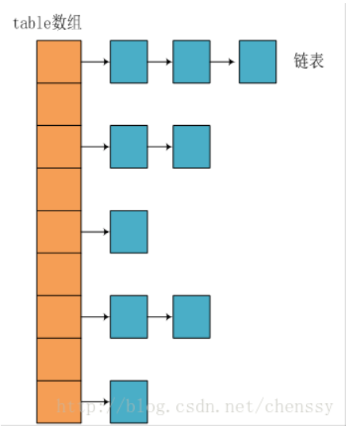
* HashMap 通过 key 的 hashCode 经过扰动函数处理过后得到 hash 值，然后通过 (n - 1) & hash 判断当前元素存放的位置（这里的 n
  指的是数组的长度），如果当前位置存在元素的话，就判断该元素与要存入的元素的 hash 值以及 key 是否相同，如果相同的话，直接覆盖，不相同就通过拉链法解决冲突。
* 使用扰动函数能够优化比较差的hashCode()方法，减少hash碰撞。

  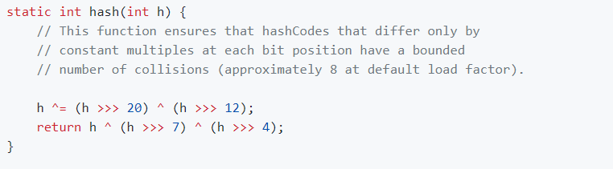

2.1.2 扩容机制

* 调用了resize方法：主要的功能就是创建扩容后的新数组，并且将调用transfer函数将旧数组中的元素迁移到新的数组。

  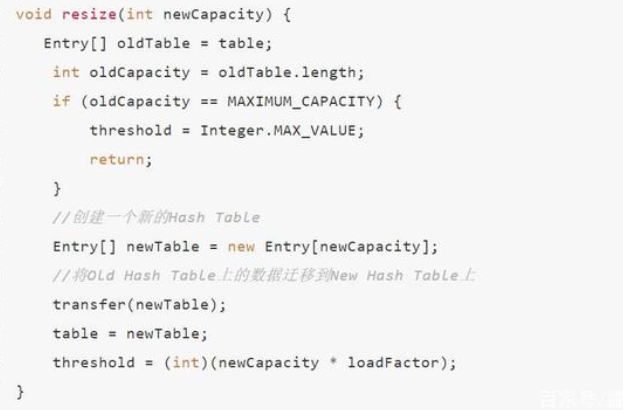
* JDK1.8之前使用的是头插法进行链表的插入，在多线程的场景下进行扩容，会出现循环列表的情况，导致死循环，主要原因在于transfer方法中的while循环。

  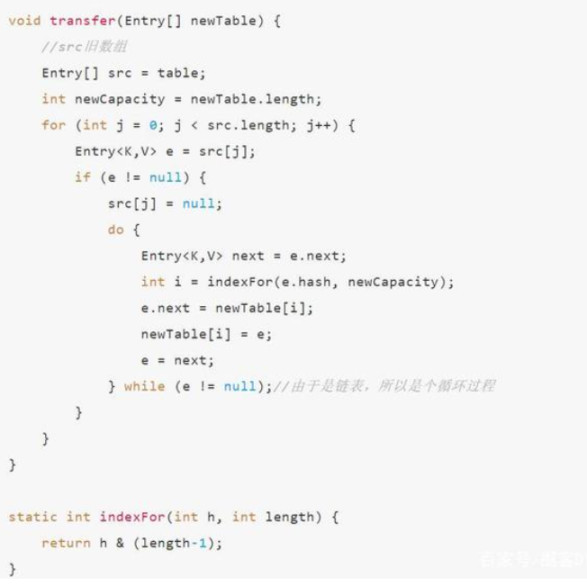
* 由于会出现链表过长的情况，会导致查找效率的时间复杂度变成O(n)

#### 2.2 JDK1.8之后的实现

2.2.1 JDK1.8的hash实现和1.7的有所不同，性能上稍有提升只需要进行两次位运算即可

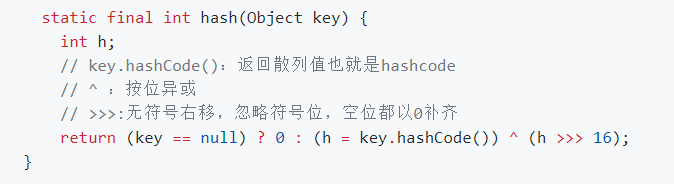

2.2.2 数据结构的变化

* 当链表长度大于阈值（默认为 8）时，会首先调用 treeifyBin()方法, 这个方法会根据 HashMap 数组来决定是否转换为红黑树。
* 当数组长度大于或者等于 64 的情况下，才会执行转换红黑树操作，以减少搜索时间。否则，就是只是执行 resize() 方法对数组扩容。

  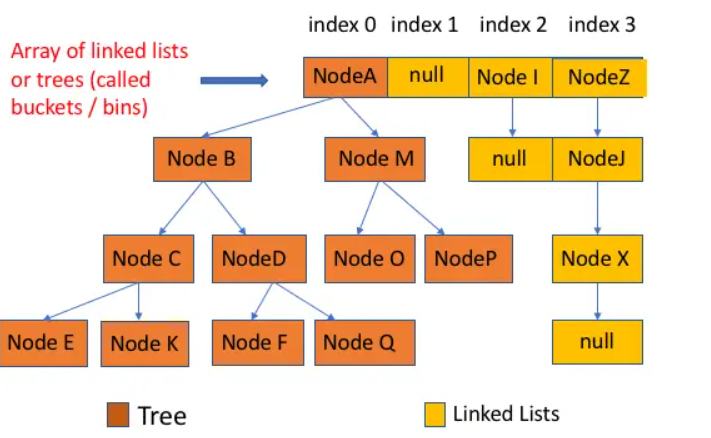
* JDK1.8之后链表由Entry转变成了Node

  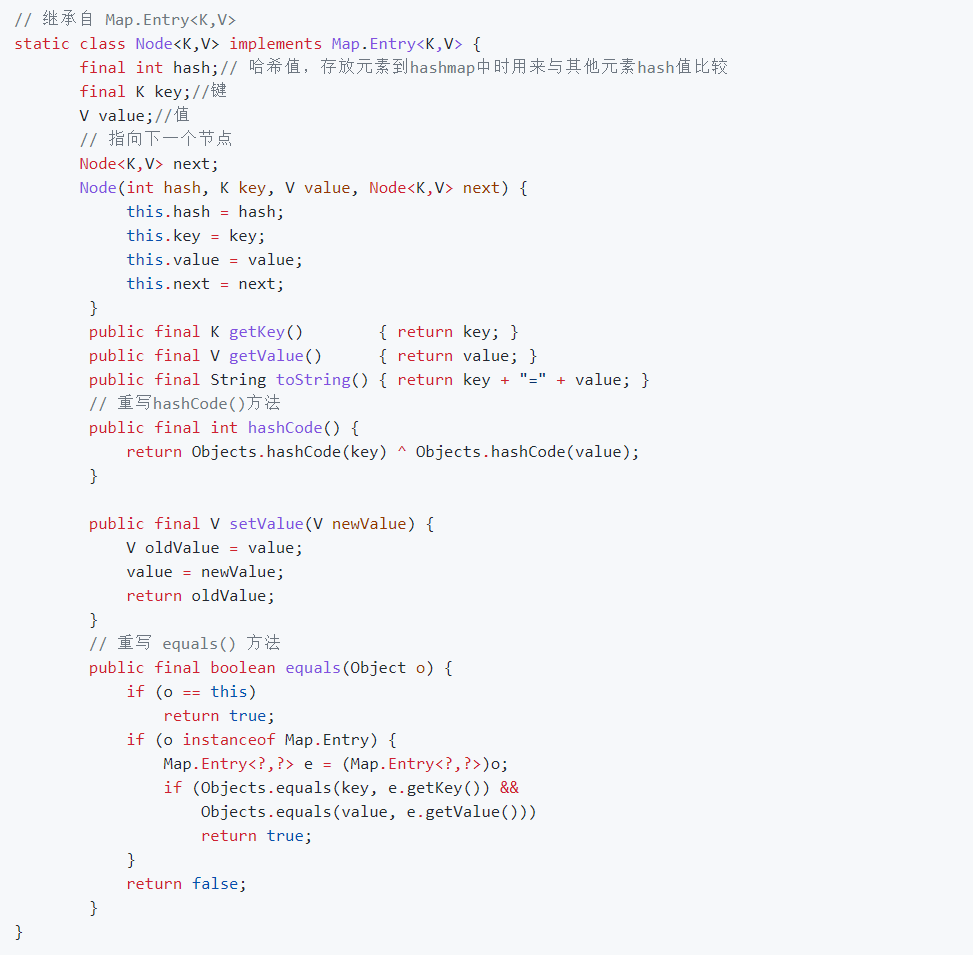

2.2.3 put方式的变化

* 链表的生成方式从头插法变成尾插法，避免了死循环的问题。
* 当链表过长的场景下，不会优先进行扩容处理

#### 2.3 HashMap 源码分析

2.3.1 类的属性

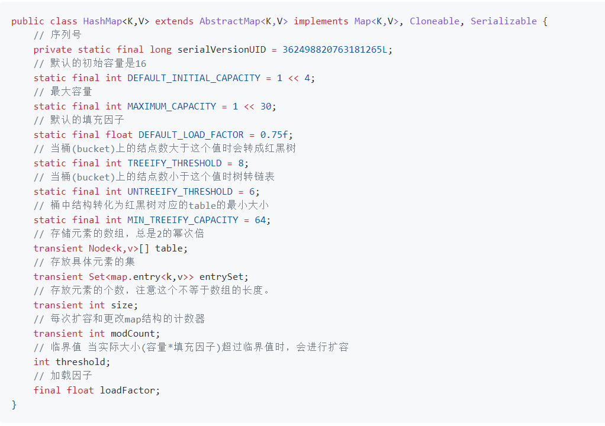

* loadFactor 加载因子: loadFactor 加载因子是控制数组存放数据的疏密程度，loadFactor 越趋近于 1，那么 数组中存放的数据(entry)也就越多，也就越密，也就是会让链表的长度增加，loadFactor
  越小，也就是趋近于 0，数组中存放的数据(entry)也就越少，也就越稀疏。
* threshold: threshold = capacity * loadFactor，当 Size>=threshold的时候，那么就要考虑对数组的扩增了，也就是说，这个的意思就是 衡量数组是否需要扩增的一个标准。

2.3.2 内部类源码

* Node 节点类源码

  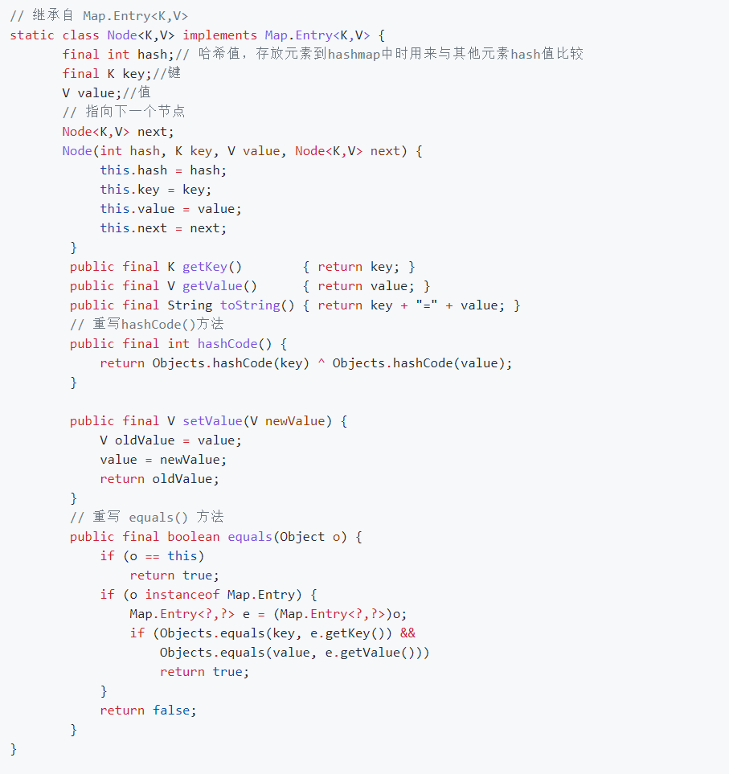
* 树节点类源码

  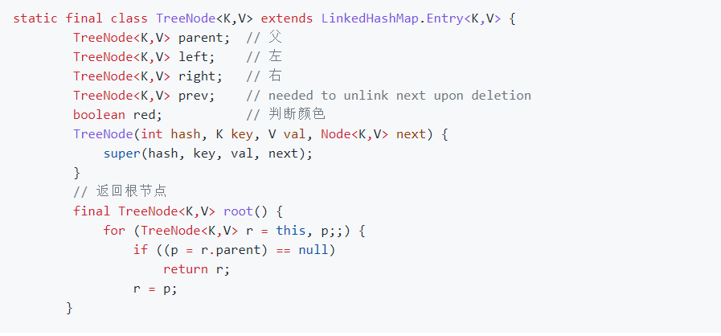

2.3.3 构造器

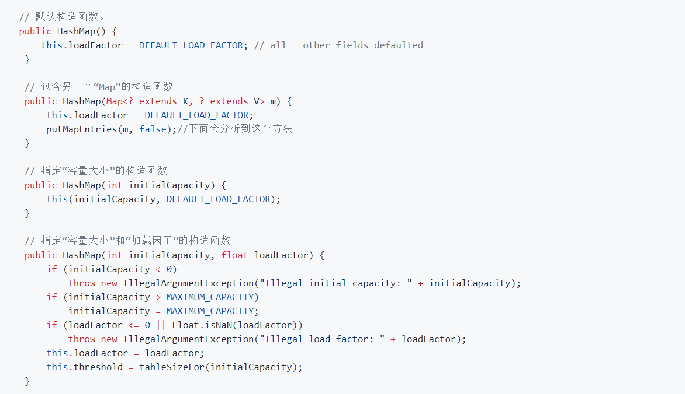

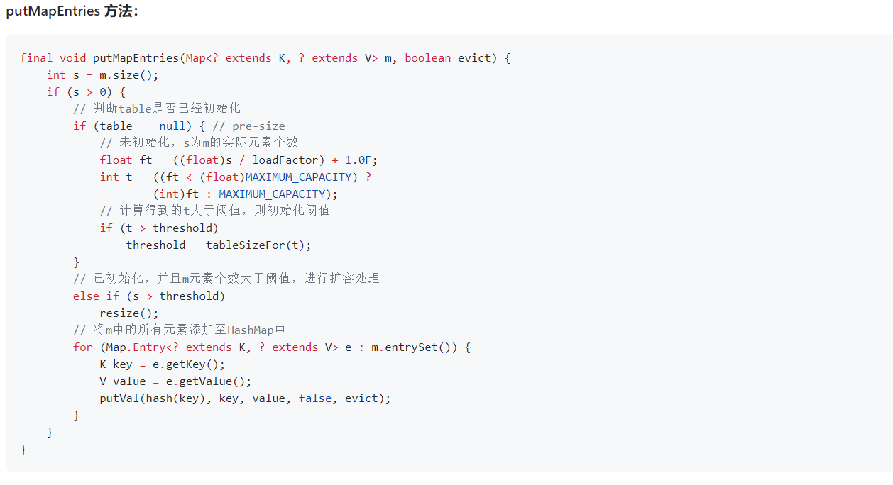

2.3.4 put方法

* HashMap 只提供了 put 用于添加元素，putVal 方法只是给 put 方法调用的一个方法，并没有提供给用户使用。

* 对 putVal 方法添加元素的分析如下：
    * 如果定位到的数组位置没有元素 就直接插入。
    * 如果定位到的数组位置有元素就和要插入的 key 比较，如果 key 相同就直接覆盖，如果 key 不相同，就判断 p 是否是一个树节点，如果是就调用e = ((TreeNode<K,V>)p).putTreeVal(this,
      tab, hash, key, value)将元素添加进入。如果不是就遍历链表插入(插入的是链表尾部)。

      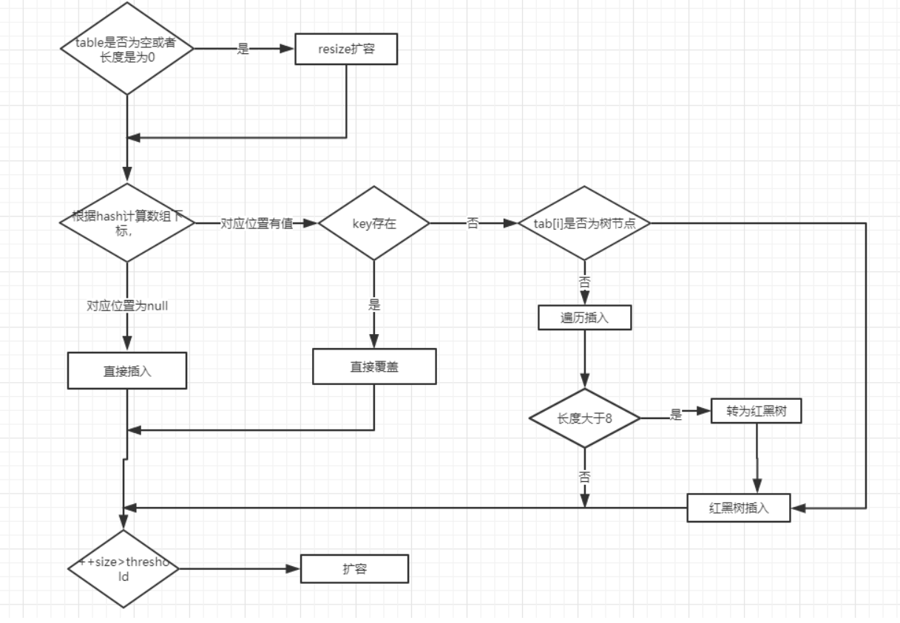
* put方法源码解析

  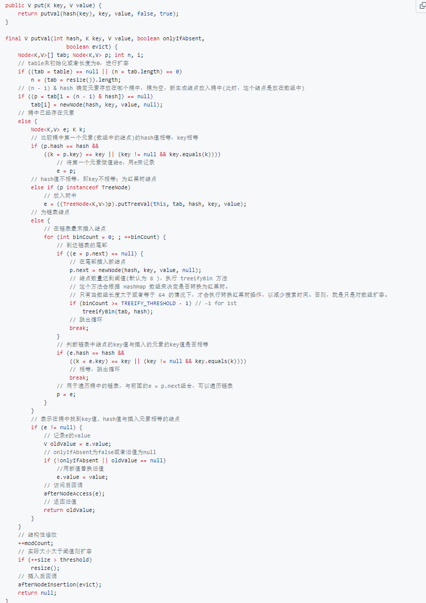

2.3.5 get方法源码解析

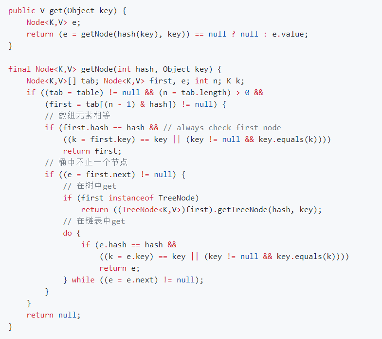

2.3.6 resize方法源码解析

* 进行扩容，会伴随着一次重新 hash 分配，并且会遍历 hash 表中所有的元素，是非常耗时的。在编写程序中，要尽量避免 resize。

  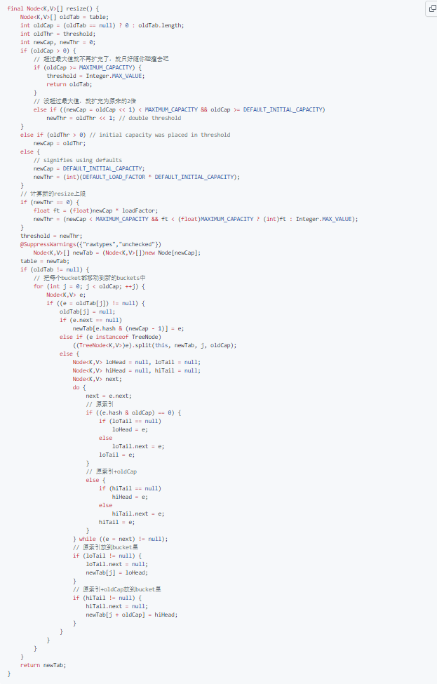

* (e.hash & oldCap) == 0这个判断，用来优化链表元素过多的场景，使得扩容后元素分布更加均匀。

