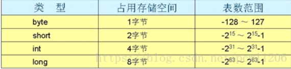
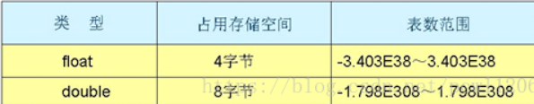

## Java的8种基本类型

先说明两个词汇的基本概念：

bit （位）：位是计算机中存储数据的最小单位，指二进制数中的一个位数，其值为“0”或“1”。

byte （字节）：字节是计算机存储容量的基本单位，一个字节由8位二进制数组成。在计算机内部，一个字节可以表示一个数据或者一个英文字母，但是一个汉字需要两个字节表示。

* 1Byte=8bit
* 1KB=1024Byte(字节)=8*1024bit
* 1MB=1024KB
* 1GB=1024MB
* 1TB=1024GB

### 1. 整数类型

byte：8 位，用于表示最小数据单位，如文件中数据，-128~127

short：16 位，很少用，-32768 ~ 32767

int：32 位、最常用，-2^31-1~2^31 （21 亿）

long：64 位、次常用

注意事项：int i = 8;这里的8叫做直接量或者字面量，就是直接写出来的常数。 整数字面量默认都是int类型，所以在定义的long类型后面要加上L或l。
**小于32位的变量都是按照int结果去计算的，例如byte b = 1; 实际上b被转换成了int类型，进行表达式运算**。特别提醒的是强转符比数学运算符优先级要高。

### 2. 浮点数类型

loat:单精度类型，32 位，后缀 F 或 f，1 位符号位，8 位指数，23 位有效尾数。

double：64 位，最常用，后缀 D 或 d，1 位符号位，11 位指数，52 位有效尾数。

java浮点型默认为double型，所以要声明一个变量为float型时，需要在数字后面加F或者f, 例如：double d = 88888.8; float f = 88888.8f; //不加f的话会报错

### 3. 字符类型

char:16位，java字符使用Unicode编码。

### 4. 布尔类型

boolean：true 真 和 false 假

### 5. 总结

* 8位：Byte（字节型）

* 16位：short（短整型）、char（字符型）

* 32位：int（整型）、float（单精度型/浮点型）

* 64位：long（长整型）、double（双精度型）

* 最后一个：boolean(布尔类型）

### 6. 基本类型间的转换

在Java中整型、实型、字符型被视为简单数据类型，这些类型由低级到高级分别为： **byte <（short=char）< int < long < float < double 
**
如果从小转换到大，可以自动完成，而从大到小，必须强制转换。short和char两种相同类型也必须强制转换。

### 7. 赋值及表达式中的类型转换

* 字面值赋值：在使用字面值对整数赋值的过程中，可以将int字面量赋值给byte short char int，只要不超出范围。这个过程中的类型转换时自动完成的，
  但是如果你试图将long字面量赋给byte，即使没有超出范围，也必须进行强制类型转换。例如 byte b = 10L；是错的，要进行强制转换。
* 表达式中的自动类型提升： 除了赋值以外，表达式计算过程中也可能发生一些类型转换。在表达式中，类型提升规则如下：
    * 所有byte/short/char都被提升为int。
    * 如果有一个操作数为long，整个表达式提升为long。float和double情况也一样。