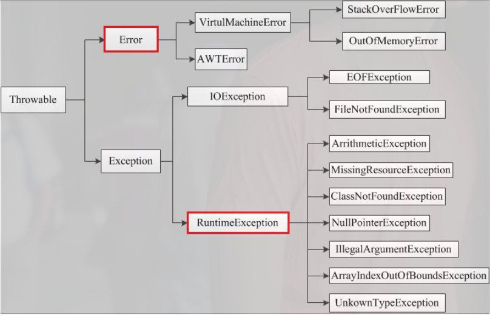
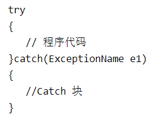
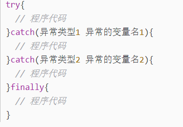

## Java异常详解

### 1. 异常实现及分类

1. 先看下异常类的结构图
   
2. 所有的异常都是从Throwable继承而来的，是所有异常的共同祖先。
3. Throwable有两个子类，Error和Exception。
    1. 其中Error是错误，对于所有的编译时期的错误以及系统错误都是通过Error抛出的。
    2. 这些错误表示故障发生于虚拟机自身、或者发生在虚拟机试图执行应用时，如Java虚拟机运行错误（Virtual MachineError）、类定义错误（NoClassDefFoundError）等
    3. 这些错误是不可查的，因为它们在应用程序的控制和处理能力之 外，而且绝大多数是程序运行时不允许出现的状况。
    4. 对于设计合理的应用程序来说，即使确实发生了错误，本质上也不应该试图去处理它所引起的异常状况。在 Java中，错误通过Error的子类描述
    5. Exception，是另外一个非常重要的异常子类。它规定的异常是程序本身可以处理的异常。异常和错误的区别是，异常是可以被处理的，而错误是没法处理的。
4. Checked Exception：
    1. 可检查的异常，这是编码时非常常用的，所有checked exception都是需要在代码中处理的。它们的发生是可以预测的，正常的一种情况，可以合理的处理
    2. 比如IOException，或者一些自定义的异常。除了RuntimeException及其子类以外，都是checked exception。
5. Unchecked Exception：
    1. RuntimeException及其子类都是unchecked exception。
    2. 比如NPE空指针异常，除数为0的算数异常ArithmeticException等等，这种异常是运行时发生，无法预先捕捉处理的。Error也是unchecked exception，也是无法预先处理的。

### 2. 异常的处理

1. 代码中的异常处理其实是对可检查异常的处理。
    1. 通过try...catch语句块来处理：当保护代码块中发生一个异常时，try 后面的 catch 块就会被检查。
       
    2. 另外，也可以在具体位置不处理，直接抛出，通过throws/throw到上层再进行处理
    3. 具体的，如果一个方法没有捕获到一个检查性异常，那么该方法必须使用 throws 关键字来声明。throws 关键字放在方法签名的尾部。也可以使用 throw 关键字抛出一个异常，无论它是新实例化的还是刚捕获到的。
       
2. finally关键字：
    1. finally 关键字用来创建在 try 代码块后面执行的代码块。
    2. 无论是否发生异常，finally 代码块中的代码总会被执行。
    3. 在 finally 代码块中，可以运行清理类型等收尾善后性质的语句。
    4. finally 代码块出现在 catch 代码块最后，语法如下：
       