## IO流详解

### 1. inputStream和outputStream概念

#### 1.1 什么是IO流

* 我们把这种数据的传输，可以看做是一种数据的流动，按照流动的方向，以内存为基准，分为输入input 和输出output ，即流向内存是输入流，流出内存的输出流。

#### 1.2 IO的分类

1. 根据数据的流向分为：输入流和输出流
    * 输入流 ：把数据从其他设备上读取到内存中的流。
    * 输出流 ：把数据从内存 中写出到其他设备上的流。
2. 根据数据的类型分为：字节流和字符流
    * 字节流 ：以字节为单位，读写数据的流。
    * 字符流 ：以字符为单位，读写数据的流。
3. 如图所示

   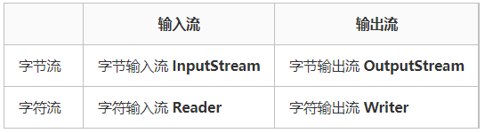

4. 类结构图如下

   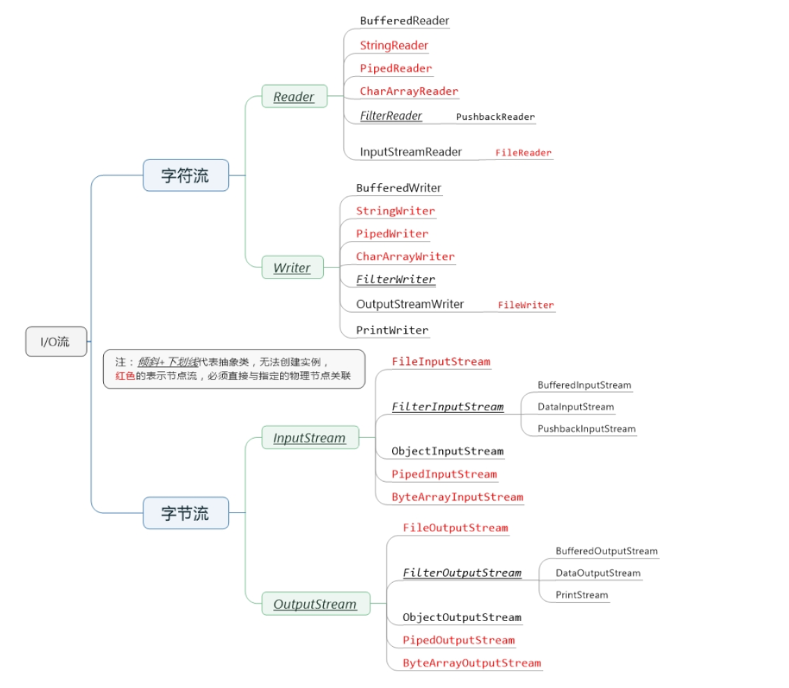

5. OutputStream与InputStream的继承关系

   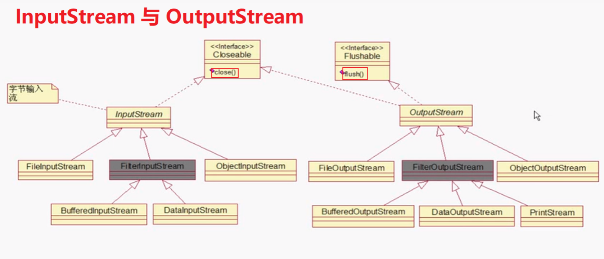

### 2. 字节流

#### 2.1 字节的概念

1. 我们必须明确一点的是，一切文件数据(文本、图片、视频等)
   在存储时，都是以二进制数字的形式保存，都一个一个的字节，那么传输时一样如此。所以，字节流可以传输任意文件数据。在操作流的时候，我们要时刻明确，无论使用什么样的流对象，底层传输的始终为二进制数据。

#### 2.2 字节输出流（OutputStream）

1. java.io.OutputStream抽象类是表示字节输出流的所有类的超类（父类），将指定的字节信息写出到目的地。它定义了字节输出流的基本共性功能方法
2. 字节输出流的基本共性功能方法:
    * public void close() ：关闭此输出流并释放与此流相关联的任何系统资源。
    * public void flush() ：刷新此输出流并强制任何缓冲的输出字节被写出。
    * public void write(byte[] b)：将 b.length个字节从指定的字节数组写入此输出流。
    * public void write(byte[] b, int off, int len) ：从指定的字节数组写入 len字节，从偏移量 off开始输出到此输出流。也就是说从off个字节数开始读取一直到len个字节结束
    * public abstract void write(int b) ：将指定的字节输出流。
    * 以上五个方法则是字节输出流都具有的方法，由父类OutputStream定义提供，子类都会共享以上方法
3. FileOutputStream类（文件输出流，用于将数据写出到文件）
    1. 构造方法
        * public FileOutputStream(File file)：根据File对象为参数创建对象。
        * public FileOutputStream(String name)： 根据名称字符串为参数创建对象。
        * 当指定的路径不存在时，会自动创建文件在当前路径下
        * 构造器中的append入参，代表是否在当前文件的内容后拼接数据，ture为是，false则会清空当前文件的数据，重新写入数据
    2. write方法
        * public void write(int b)
        * public void write(byte[] b)
        * public void write(byte[] b,int off,int len)  //从`off`索引开始，`len`个字节
    3. 输出数据如何换行
        * 回车符\r和换行符\n
            * 回车符：回到一行的开头（return）。
            * 换行符：下一行（newline）。
        * 系统中的换行：
            * Windows系统里，每行结尾是 回车+换行 ，即\r\n；
            * Unix系统里，每行结尾只有 换行 ，即\n；
            * Mac系统里，每行结尾是 回车 ，即\r。从 Mac OS X开始与Linux统一。

#### 2.3 字节输入流（InputStream）

1. java.io.InputStream抽象类是表示字节输入流的所有类的超类（父类），可以读取字节信息到内存中。它定义了字节输入流的基本共性功能方法。
2. 字节输入流的基本共性功能方法:
    * public void close() ：关闭此输入流并释放与此流相关联的任何系统资源。
    * public abstract int read()： 从输入流读取数据的下一个字节。
    * public int read(byte[] b)： 该方法返回的int值代表的是读取了多少个字节，读到几个返回几个，读取不到返回-1
3. FileInputStream类（java.io.FileInputStream类是文件输入流，从文件中读取字节。）
    1. FileInputStream的构造方法
        * FileInputStream(File file)： 通过打开与实际文件的连接来创建一个 FileInputStream ，该文件由文件系统中的 File对象 file命名。
        * FileInputStream(String name)： 通过打开与实际文件的连接来创建一个 FileInputStream ，该文件由文件系统中的路径名name命名。
        * 当你创建一个流对象时，必须传入一个文件路径。该路径下，如果没有该文件,会抛出FileNotFoundException。
    2. read方法
        * read()
        * read(byte[] b)
        * read(byte[]b, off, int len)
        * 每次读取b的长度个字节到数组中，返回读取到的有效字节个数，读取到末尾时，返回-1
        * 在开发中一般强烈推荐使用数组读取文件,因为最后一次读取的字节长度不一定等于byte数组的长度，会出现读取null的情况
        * 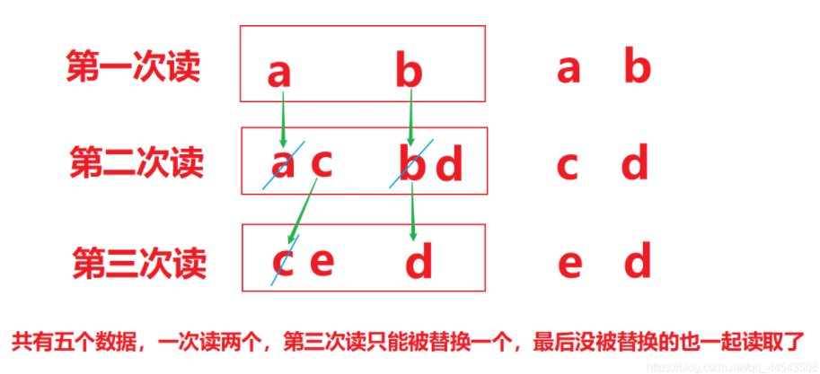

### 3. 字符流

#### 3.1 字符流的概念

1. 字符流的由来：因为数据编码的不同，因而有了对字符进行高效操作的流对象，字符流本质其实就是基于字节流读取时，去查了指定的码表，而字节流直接读取数据会有乱码的问题（读中文会乱码）
2. 字符流Reader和Writer

   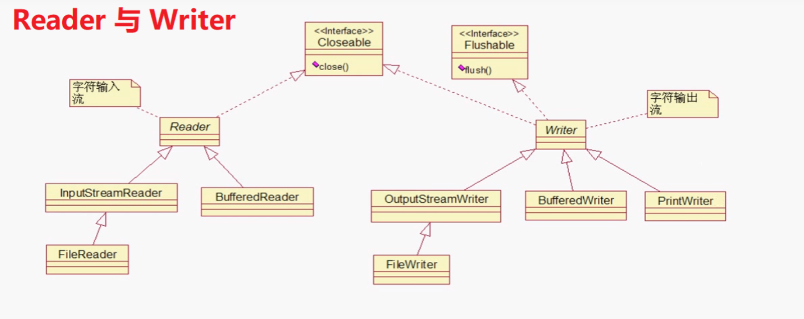

3. 从另一角度来说: 字符流 = 字节流 + 编码表

#### 3.2 字符输入流（Reader）

1. java.io.Reader抽象类是字符输入流的所有类的超类（父类），可以读取字符信息到内存中。它定义了字符输入流的基本共性功能方法。
2. 字符输入流的共性方法：
    * public void close() ：关闭此流并释放与此流相关联的任何系统资源。
    * public int read()： 从输入流读取一个字符。
    * public int read(char[] c)： 从输入流中读取一些字符，并将它们存储到字符数组c中
3. FileReader类(java.io.FileReader类是读取字符文件的便利类。构造时使用系统默认的字符编码和默认字节缓冲区)
    1. 构造方法
        * FileReader(File file)： 创建一个新的 FileReader ，给定要读取的File对象。
        * FileReader(String fileName)： 创建一个新的 FileReader ，给定要读取的文件的字符串名称。
    2. FileReader读取字符数据
        * 读取字符：read方法，每次可以读取一个字符的数据，提升为int类型，读取到文件末尾，返回-1，循环读取，代码使用演示：
        * 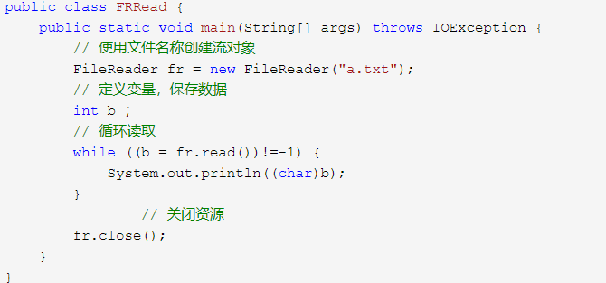

#### 3.3 字符输出流（Writer）

1. java.io.Writer抽象类是字符输出流的所有类的超类（父类），将指定的字符信息写出到目的地。它同样定义了字符输出流的基本共性功能方法。
2. 字符输出流的基本共性功能方法：
    * void write(int c) 写入单个字符。
    * void write(char[] c)写入字符数组。
    * abstract void write(char[] cbuf, int off, int len)写入字符数组的某一部分,off数组的开始索引,len写的字符个数。
    * void write(String str)写入字符串。
    * void write(String str, int off, int len) 写入字符串的某一部分,off字符串的开始索引,len写的字符个数。
    * void flush()刷新该流的缓冲。
    * void close() 关闭此流，但要先刷新它。
3. FileWriter类
    1. 构造方法
        * FileWriter(File file)： 创建一个新的 FileWriter，给定要读取的File对象。
        * FileWriter(String fileName)： 创建一个新的 FileWriter，给定要读取的文件的名称。
    2. FileWriter写出数据
        * 写出字符：write(int b) 方法，每次可以写出一个字符数据，【注意】关闭资源时,与FileOutputStream不同。 如果不关闭,数据只是保存到缓冲区，并未保存到文件,代码使用演示：
        * 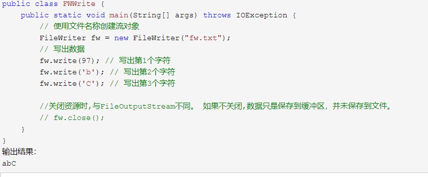
    3. 关闭close和刷新flush
        * 因为内置缓冲区的原因，如果不关闭输出流，无法写出字符到文件中。但是关闭的流对象，是无法继续写出数据的。如果我们既想写出数据，又想继续使用流，就需要flush 方法了。
        * flush ：刷新缓冲区，流对象可以继续使用。
        * close:先刷新缓冲区，然后通知系统释放资源。流对象不可以再被使用了。
        * flush()这个函数是清空的意思，用于清空缓冲区的数据流，进行流的操作时，数据先被读到内存中，然后再用数据写到文件中，那么当你数据读完时，我们如果这时调用close()
          方法关闭读写流，这时就可能造成数据丢失，为什么呢？因为，读入数据完成时不代表写入数据完成，一部分数据可能会留在缓存区中，这个时候flush()方法就格外重要了。

### 4. 缓冲流

#### 4.1 简要概述

1. 缓冲流的基本原理
    * 使用了底层流对象从具体设备上获取数据，并将数据存储到缓冲区的数组内。
    * 通过缓冲区的read()方法从缓冲区获取具体的字符数据，这样就提高了效率。
    * 如果用read方法读取字符数据，并存储到另一个容器中，直到读取到了换行符时，将另一个容器临时存储的数据转成字符串返回，就形成了readLine()功能。
    * 在创建流对象时，会创建一个内置的默认大小的缓冲区数组，通过缓冲区读写，减少系统IO次数，从而提高读写的效率。
    * 底层的默认bufferSize：DEFAULT_BUFFER_SIZE = 8192
    * 最大缓冲容量：MAX_BUFFER_SIZE = Integer.MAX_VALUE - 8;
2. 缓冲流分类
    * 字节缓冲流：BufferedInputStream，BufferedOutputStream
    * 字符缓冲流：BufferedReader，BufferedWriter
    * 使用了装饰器模式，增强了基础IO流的效果

#### 4.2 字节缓冲流

1. 构造方法
    * public BufferedInputStream(InputStream in) ：创建一个新的缓冲输入流，注意参数类型为InputStream。
    * public BufferedOutputStream(OutputStream out)： 创建一个新的缓冲输出流，注意参数类型为OutputStream。
    * 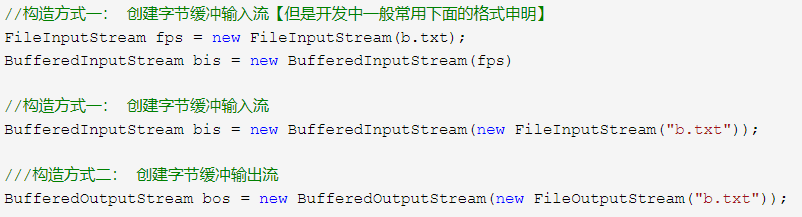
2. 普通方法和基础IO流方法一致

#### 4.3 字符缓冲流

1. 构造方法
    * public BufferedReader(Reader in) ：创建一个新的缓冲输入流，注意参数类型为Reader。
    * public BufferedWriter(Writer out)： 创建一个新的缓冲输出流，注意参数类型为Writer。
    * 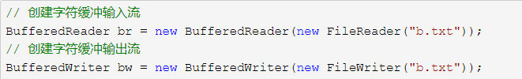
2. 字符缓冲流的基本方法与普通字符流调用方式一致，这里不再阐述，我们来看字符缓冲流具备的特有方法。
    * public String readLine(): 读一行数据。 读取到最后返回null
    * public void newLine(): 换行,由系统属性定义符号。

### 5. 转换流

#### 5.1 概念

1. 图示

* 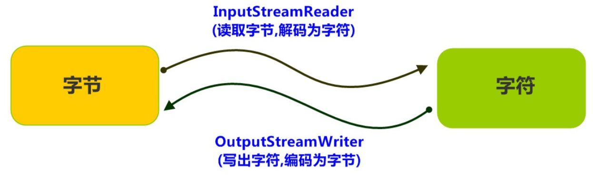

2. 字符编码与解码

    * 众所周知，计算机中储存的信息都是用二进制数表示的，而我们在屏幕上看到的数字、英文、标点符号、汉字等字符是二进制数转换之后的结果。
    * 按照某种规则，将字符存储到计算机中，称为编码。
    * 将存储在计算机中的二进制数按照某种规则解析显示出来，称为解码。
    * 按照A规则存储，同样按照A规则解析，那么就能显示正确的文本符号。反之，按照A规则存储，再按照B规则解析，就会导致乱码现象。
    * 代码解释则是：
        * String(byte[] bytes, String charsetName):通过指定的字符集解码字节数组
        * byte[] getBytes(String charsetName):使用指定的字符集合把字符串编码为字节数组
    * 编码:把看得懂的变成看不懂的String -- byte[]
    * 解码:把看不懂的变成看得懂的byte[] -- String
    * 字符编码 Character Encoding: 就是一套自然语言的字符与二进制数之间的对应规则。而编码表则是生活中文字和计算机中二进制的对应规则
3. 字符集

    * 字符集 Charset：也叫编码表。是一个系统支持的所有字符的集合，包括各国家文字、标点符号、图形符号、数字等。
    * 计算机要准确的存储和识别各种字符集符号，需要进行字符编码，一套字符集必然至少有一套字符编码。常见字符集有ASCII字符集、GBK字符集、Unicode字符集等。
    * 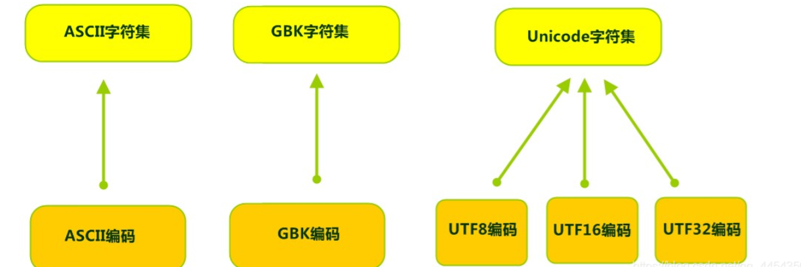
    * ASCII字符集 ：
        * ASCII（American Standard Code for Information
          Interchange，美国信息交换标准代码）是基于拉丁字母的一套电脑编码系统，用于显示现代英语，主要包括控制字符（回车键、退格、换行键等）和可显示字符（英文大小写字符、阿拉伯数字和西文符号）。
        * 基本的ASCII字符集，使用7位（bits）表示一个字符，共128字符。ASCII的扩展字符集使用8位（bits）表示一个字符，共256字符，方便支持欧洲常用字符。
    * ISO-8859-1字符集：
        * 拉丁码表，别名Latin-1，用于显示欧洲使用的语言，包括荷兰、丹麦、德语、意大利语、西班牙语等。
        * ISO-8859-1使用单字节编码，兼容ASCII编码。
    * GBxxx字符集：
        * GB就是国标的意思，是为了显示中文而设计的一套字符集。
        * GB2312：简体中文码表。一个小于127的字符的意义与原来相同。但两个大于127的字符连在一起时，就表示一个汉字，这样大约可以组合了包含7000多个简体汉字，
          此外数学符号、罗马希腊的字母、日文的假名们都编进去了，连在ASCII里本来就有的数字、标点、字母都统统重新编了两个字节长的编码，这就是常说的"全角"字符，而原来在127号以下的那些就叫"半角"字符了。
        * GBK：最常用的中文码表。是在GB2312标准基础上的扩展规范，使用了双字节编码方案，共收录了21003个汉字，完全兼容GB2312标准，同时支持繁体汉字以及日韩汉字等。
        * GB18030：最新的中文码表。收录汉字70244个，采用多字节编码，每个字可以由1个、2个或4个字节组成。支持中国国内少数民族的文字，同时支持繁体汉字以及日韩汉字等。
    * Unicode字符集 ：
        * Unicode编码系统为表达任意语言的任意字符而设计，是业界的一种标准，也称为统一码、标准万国码。
        * 它最多使用4个字节的数字来表达每个字母、符号，或者文字。有三种编码方案，UTF-8、UTF-16和UTF-32。最为常用的UTF-8编码。
        * UTF-8编码，可以用来表示Unicode标准中任何字符，它是电子邮件、网页及其他存储或传送文字的应用中，优先采用的编码。
          互联网工程工作小组（IETF）要求所有互联网协议都必须支持UTF-8编码。所以，我们开发Web应用，也要使用UTF-8编码。它使用一至四个字节为每个字符编码，编码规则：
            * 128个US-ASCII字符，只需一个字节编码。
            * 拉丁文等字符，需要二个字节编码。
            * 大部分常用字（含中文），使用三个字节编码。
            * 其他极少使用的Unicode辅助字符，使用四字节编码。

#### 5.2 转换流分类(字节流到字符流的桥梁)

1. InputStreamReader类
    1. 转换流java.io.InputStreamReader，是Reader的子类，从字面意思可以看出它是从字节流到字符流的桥梁。它读取字节，并使用指定的字符集将其解码为字符。它的字符集可以由名称指定，也可以接受平台的默认字符集。
    2. 构造方法
        * InputStreamReader(InputStream in): 创建一个使用默认字符集的字符流。
        * InputStreamReader(InputStream in, String charsetName): 创建一个指定字符集的字符流。
        * 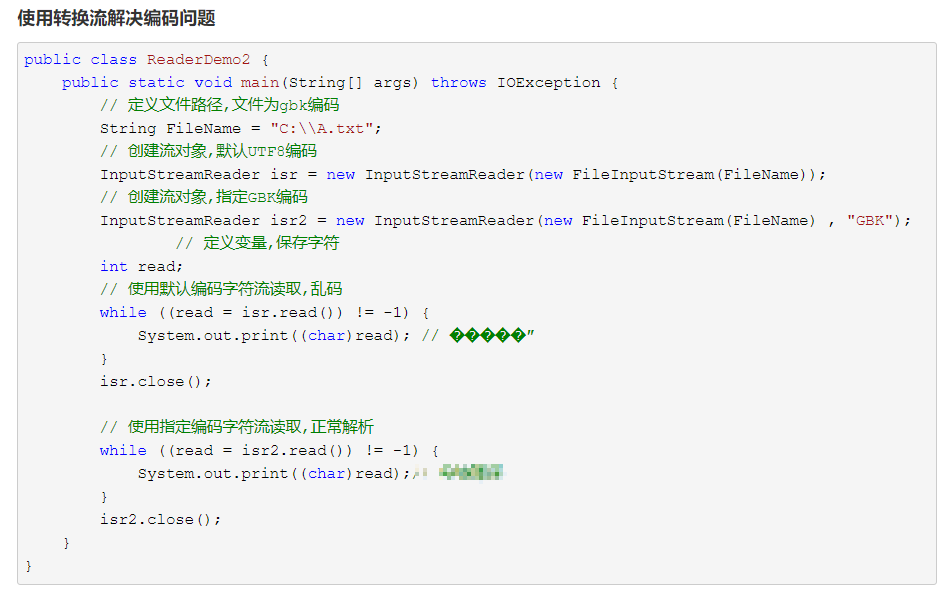
2. OutputStreamWriter类
    1. 转换流java.io.OutputStreamWriter ，是Writer的子类。
    2. 构造方法
        * OutputStreamWriter(OutputStream in): 创建一个使用默认字符集的字符流。
        * OutputStreamWriter(OutputStream in, String charsetName): 创建一个指定字符集的字符流。
        * 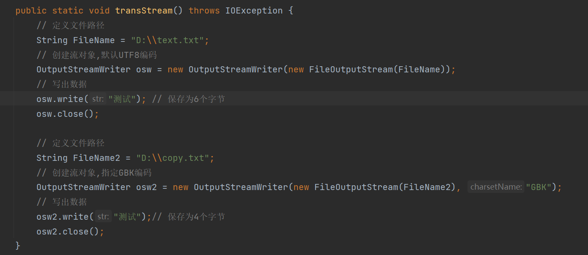

### 6. 序列化流

#### 6.1 何谓序列化

1. Java 提供了一种对象序列化的机制。用一个字节序列可以表示一个对象，该字节序列包含该对象的数据、对象的类型和对象中存储的属性等信息。字节序列写出到文件之后，相当于文件中持久保存了一个对象的信息。
2. 该字节序列还可以从文件中读取回来，重构对象，对它进行反序列化。对象的数据、对象的类型和对象中存储的数据信息，都可以用来在内存中创建对象。
3. 如图所示

   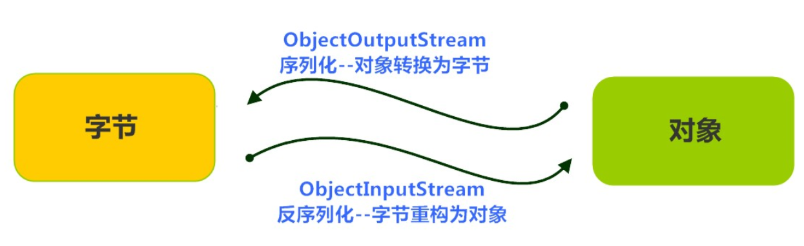

#### 6.2  ObjectOutputStream类

1. java.io.ObjectOutputStream 类，将Java对象的原始数据类型写出到文件,实现对象的持久存储。
2. 构造方法
    * public ObjectOutputStream(OutputStream out)： 创建一个指定OutputStream的ObjectOutputStream。
3. 序列化操作
    1. 一个对象要想序列化，必须满足两个条件:
        * 该类必须实现java.io.Serializable 接口，Serializable 是一个标记接口，不实现此接口的类将不会使任何状态序列化或反序列化，会抛出NotSerializableException。
        * 该类的所有属性必须是可序列化的。如果有一个属性不需要可序列化的，则该属性必须注明是瞬态的，使用transient 关键字修饰。
        * 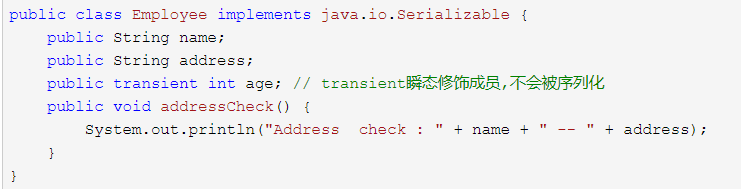
    2. 写出对象方法
        * public final void writeObject (Object obj) : 将指定的对象写出。
        * 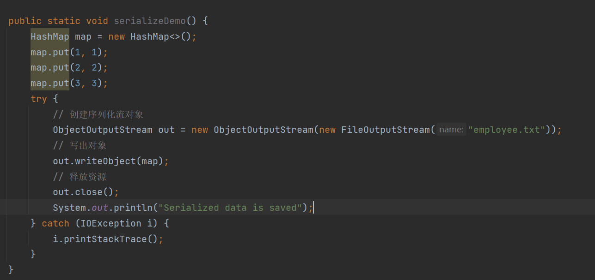

#### 6.3 ObjectInputStream类

1. ObjectInputStream反序列化流，将之前使用ObjectOutputStream序列化的原始数据恢复为对象。
2. 构造方法
    * public ObjectInputStream(InputStream in)： 创建一个指定InputStream的ObjectInputStream。
3. 反序列化操作
    1. 如果能找到一个对象的class文件，我们可以进行反序列化操作，调用ObjectInputStream读取对象的方法：
        * public final Object readObject () : 读取一个对象。
        * 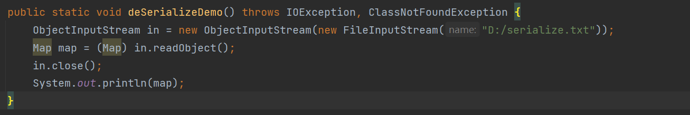

### 7. Properties属性类

#### 7.1 概念

1. 是一个集合类，Hashtable的子类
2. 和IO流结合的方法
    1. 把键值对形式的文本文件内容加载到集合中
        * public void load(Reader reader)
        * public void load(InputStream inStream)
    2. 把集合中的数据存储到文本文件中
        * public void store(Writer writer,String comments)
        * public void store(OutputStream out,String comments)
3. java.util.Properties 继承于Hashtable
   ，来表示一个持久的属性集。它使用键值结构存储数据，每个键及其对应值都是一个字符串。该类也被许多Java类使用，比如获取系统属性时，System.getProperties 方法就是返回一个Properties对象。

#### 7.2 Properties类

1. 构造方法
    * public Properties() :创建一个空的属性列表。
2. 基本的存储方法
    * public Object setProperty(String key, String value) ： 保存一对属性。
    * public String getProperty(String key) ：使用此属性列表中指定的键搜索属性值。
    * public Set<String> stringPropertyNames() ：所有键的名称的集合。
3. 与流相关的方法
    * public void load(InputStream inStream)： 从字节输入流中读取键值对。
    * 参数中使用了字节输入流，通过流对象，可以关联到某文件上，这样就能够加载文本中的数据了。现在文本数据格式如下:
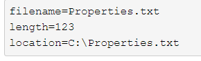

    * 加载代码演示：
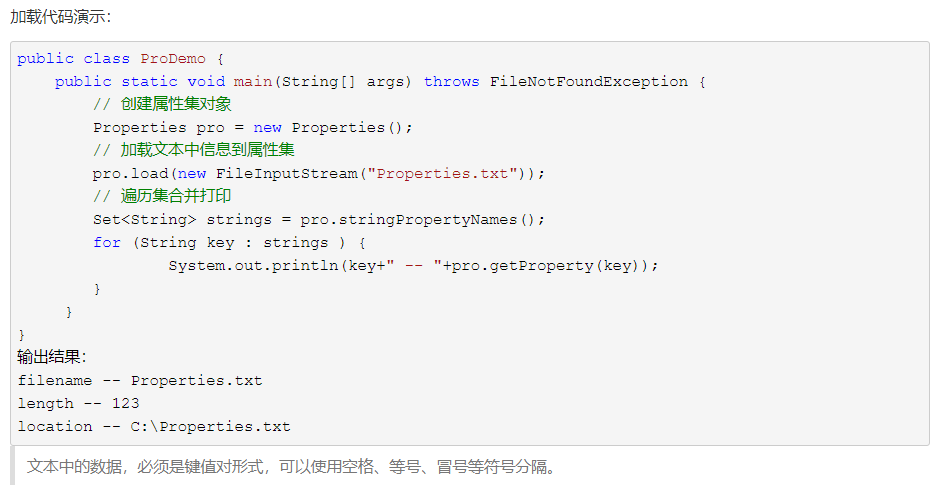

    