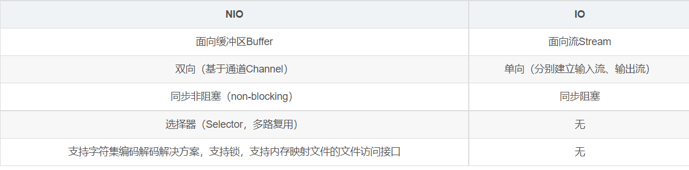
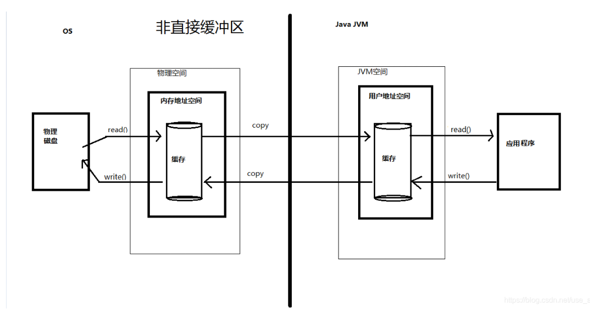
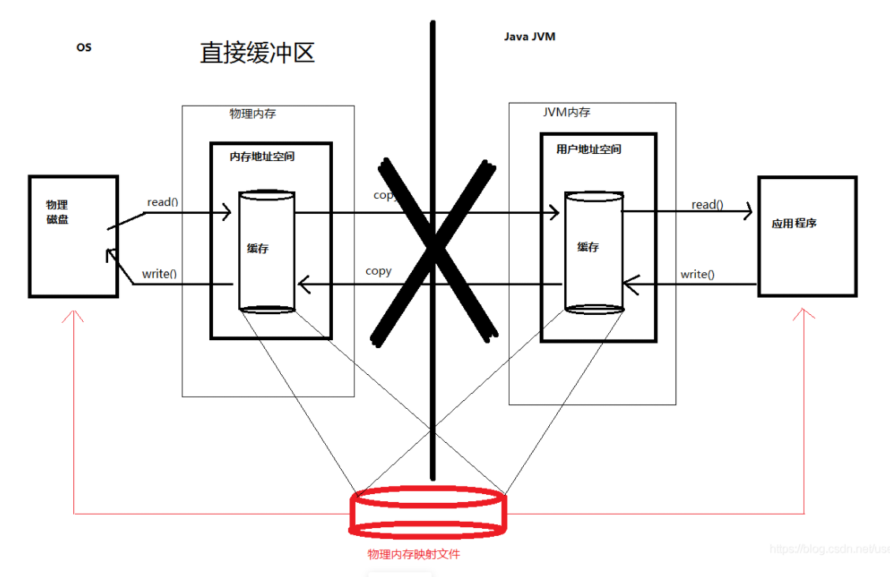
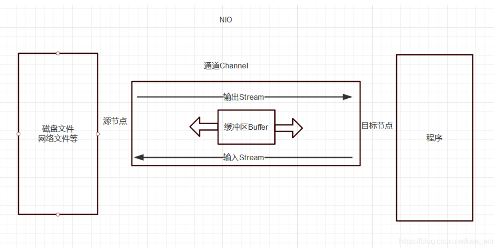
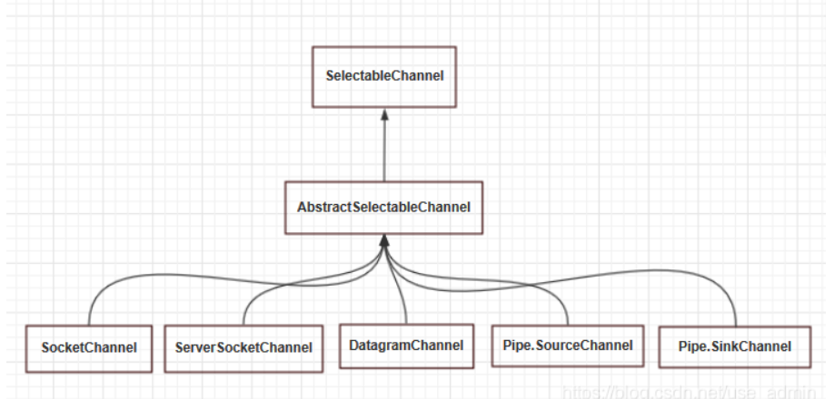
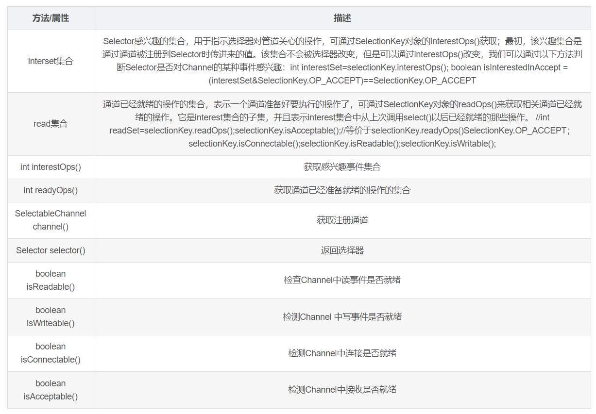
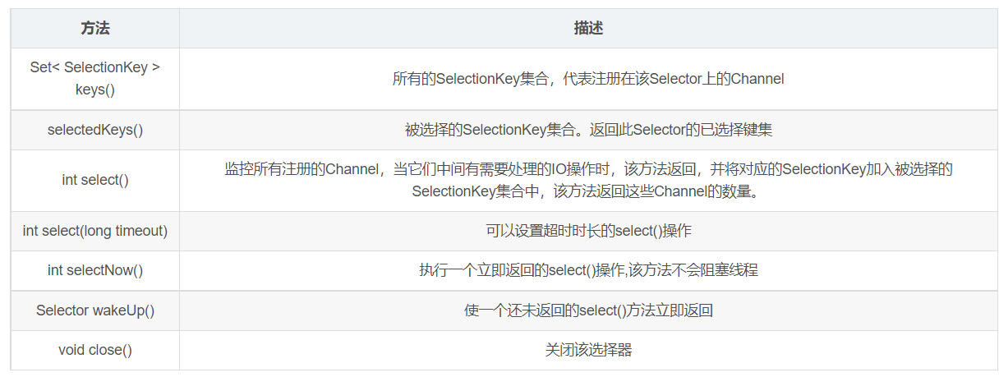

## NIO详解（非阻塞IO）

### 1. 概览

1. java1.4版本推出了一种新型的IO API,与原来的IO具有相同的作用和目的
2. 可代替标准java IO，只是实现的方式不一样，NIO是面向缓冲区、基于通道的IO操作;通过NIO可以提高对文件的读写操作。
3. 基于这种优势，现在使用NIO的场景越来愈多，很多主流行的框架都使用到了NIO技术，如Tomcat、Netty、Jetty等
4. NIO与传统IO的对比

   

5. 主要核心原理：
    1. 主要包括：缓冲区（Buffer）、通道（Channel）和选择器（Selector）、字符集（Charset）
    2. 首先获取用于连接IO设备的通道channel以及用于容纳数据的缓冲区，利用选择器Selector监控多个Channel的IO状况（多路复用），然后操作缓冲区，对数据进行处理
    3. NIO基于Channel和Buffer(缓冲区)进行操作，数据总是从通道读取到缓冲区中，或者从缓冲区写入到通道中。
    4. Selector(选择器)用于监听多个通道的事件（比如：连接打开，数据到达）。因此，单个线程可以监听多个数据通道，即一个单独的线程现在可以管理多个输入和输出通道。

### 2. 缓冲区Buffer（负责数据的存取）

1. 在javaNIO中负责数据的存取，底层缓冲区就是数组，用于存储不同数据类型的数据
2. 根据不同的数据类型（Boolean除外），提供了相应类型的缓冲区：ByteBuffer、ShortBuffer、IntBuffer、LongBuffer、FloatBuffer、DoubleBuffer、CharBuffer
3. 这7种数据类型的Buffer都是通过allocate获取非直接缓冲区或allocateDirect(ByteBuffer通过此方式创建)或wrap(除ByteBuffer意外其他的创建方式)获取直接缓冲区域，分配一个指定大小的缓冲区。
4. 缓冲区的四个核心属性：
    1. capacity：容量，表示缓冲区的最大容量，一旦声明就不能改变
    2. limit：界限，缓冲区中可以操作数据的大小（limit后面的数据不能读写）
    3. position：位置，表示缓冲区中正在操作数据的位置。
    4. mark：标志，表示记录当前position的位置，可以通过reset()恢复到mark的位置。
    5. 四者的关系：0<mark<=position<=limit<=capacity
5. 缓冲区的三个核心操作方法：
    1. put()：存数据到缓存区，写数据模式。
    2. flip()：切换到读数据模式（position和limit改变，capacity不变）
    3. get()：从缓冲区中拿数据。
6. 直接缓冲区和非直接缓冲区：
    1. 非直接缓冲区：通过：static ByteBuffe allocate(int capacity)
       创建指定大小的缓冲区，在JVM内存中创建，在每次调用基础操作系统的一个本机IO之前或者之后，虚拟机都会将缓冲区的内容复制到中间缓冲区（或者从中间缓冲区复制内容），缓冲区的内容驻留在JVM内，因此销毁容易，但是占用JVM内存开销，处理过程中有复杂的操作。
       

    2. 直接缓冲区：通过：static ByteBuffer allocateDirect(int capacity)字节Buffer创建指定大小的缓冲区，其他类型的Buffer通过wrap()
       方法创建缓冲区；在JVM内存外开辟空间，在每次调用基础操作系统的一个本机IO之前或者之后，虚拟机都会避免将缓冲区的内容复制到中间缓冲区（或者从缓冲区中复制内容），缓冲区的内容驻留在屋里内存中，少一次复制过程，如果需要循环使用缓冲区，用直接缓冲区可以很大地提高性能；虽然直接缓冲区可以使JVM进行高效的I/O操作，但它使用的内存使操作系统分配的，绕过了JVM堆栈，建立和销毁比堆栈上的缓存区要更大的开销。
       

    3. 直接缓冲区和非直接缓冲区的区别
        1. 字节缓冲区要么是直接的，要么是非直接的。如果为直接字节缓冲区，则 Java 虚拟机会尽最大努力直接在此缓冲区上执行本机 I/O 操作。也就是说，在每次调用基础操作系统的一个本机 I/O
           操作之前（或之后），虚拟机都会尽量避免将缓冲区的内容复制到中间缓冲区中（或从中间缓冲区中复制内容）。
        2. 直接字节缓冲区可以通过调用此类的 allocateDirect()
           工厂方法来创建。此方法返回的缓冲区进行分配和取消分配所需成本通常高于非直接缓冲区。直接缓冲区的内容可以驻留在常规的垃圾回收堆之外，因此，它们对应用程序的内存需求量造成的影响可能并不明显。所以，建议将直接缓冲区主要分配给那些易受基础系统的本机
           I/O 操作影响的大型、持久的缓冲区。一般情况下，最好仅在直接缓冲区能在程序性能方面带来明显好处时分配它们。
        3. 直接字节缓冲区还可以通过 FileChannel 的 map() 方法 将文件区域直接映射到内存中来创建。该方法返回MappedByteBuffer 。 Java 平台的实现有助于通过 JNI
           从本机代码创建直接字节缓冲区。如果以上这些缓冲区中的某个缓冲区实例指的是不可访问的内存区域，则试图访问该区域不会更改该缓冲区的内容，并且将会在访问期间或稍后的某个时间导致抛出不确定的异常。
           字节缓冲区是直接缓冲区还是非直接缓冲区可通过调用其 Buffer.isDirect() 方法来确定。提供此方法是为了能够在性能关键型代码中执行显式缓冲区管理

### 3. 通道Channel（负责数据的运输）

1. Channel表示到IO设备（如：文件、套接字）的连接，即用于源节点与目标节点的连接，在java NIO中Channel本身不负责存储数据，主要是配合缓冲区，负责数据的传输。
   

2. 通道的主要实现类:
    1. FileChannel类：本地文件IO通道，用于读取、写入、映射和操作文件的通道。
    2. SocketChannel类：网络套接字IO通道，TCP协议，针对面向流的连接套接字的可选择通道（一般用在客户端）。
    3. ServerSocketChannel类：网络通信IO操作，TCP协议，针对面向流的监听套接字的可选择通道（一般用于服务端）。
    4. DatagramChannel类：针对面向数据报套接字的可选择通道，能够发送和接受UDP数据包的Channel。UDP协议，由于UDP是一种无连接的网络协议，只能发送和接受数据包。
    5. 以上几个类都实现了java.nio.channels.Channel接口。
3. 通道的获取方式:
    1. java针对支持通道的类提供了getChannel()方法：
        1. 本地文件IO的Channel类有：FileInputStream/FileOutStream，RandomAccessFile。
        2. 网络套接字IO的Channel类：SocketChannel、ServerSocketChannel、DatagraSocket。
    2. 在JDK7.0中的NIO2针对各个通道提供静态方法open()
    3. 在JDK7.0中的NIO2的Files工具类的newByteChannel()
4. 通道之间的数据传输: 使用Channel的实现类的对应方法（在直接缓冲区）：transferForm()和transferTo()
5. 通道的分散读取和聚集写入:
    1. 分散读取：将通道的数据读取到多个缓冲区buffer中。方法：channel.read()
    2. 聚集写入：将多个缓冲区的数据聚集写道通道channel中。方法：channel.write()。

### 4. 选择器Selector（负责监控通道的IO状况）

1. 是selectableChannel的多路复用器，用于监控SelectableChannel的IO状况。利用selector可以实现在一个线程中管理多个通道Channel，selector是非阻塞IO的核心。
   

2. 选择器使用步骤:
    1. 创建selector,通过调用Selector.open()方法创建一个Selector。
    2. 向选择器注册通道
    3. 注册之前，先设置通道为非阻塞的，channel.configureBlocking(false);然后再调用SelectableChannel.register(Selector sel,int ops)
       方法将channel注册到Selector中；其中ops的参数作用是设置选择器对通道的监听事件，ops参数的事件类型有四种（可以通过SelectionKey的四个常量表示）：
        1. 读取操作：SelectionKey.OP_READ,数值为1.
        2. 写入操作：SelectionKey.OP_WRITE,数值为4.
        3. socket连接操作：SelectionKey.OP_CONNECT,数值为8.
        4. socket接受操作：SelectionKey .OP_ACCEPT,数值为16.
        5. 若注册时不止监听一个事件，可以使用“| 位或”操作符连接。
3. 选择键SelectionKey
    1. 表示SelectableChannel在Selector中的注册的标志，每次向选择器注册通道的时候就会选择一个事件（以上四种事件类型）即选择键，选择键包含两个表示位整数值的操作集(分别为interst集合和ready集合)
       ，操作集的每一位都表示该键的通道所支持的一类可选择操作。
       

    2. Selector常用方法
       

