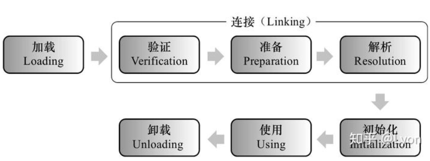
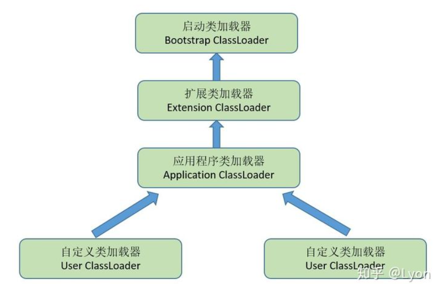

## 学习类加载器Classloader

#### 1. 什么是类加载器

1. 类加载器是把class文件加载到jvm内存中，所使用到的一种工具。
2. 类加载器加载类的流程：
    1. 加载Loading：
        1. 通过一个类的全限定名来获取此类的二进制字节流。
        2. 将这个字节流所代表的静态存储结构转化为方法区的运行时数据结构。
        3. 在内存中生成一个代表这个类的java.lang.Class对象,作为方法区这个类的各种数据的访问入口。其中生成Class对象的方法有以下五种：
            * 使用new关键字创建对象
            * 使用Class类的newInstance方法(反射机制)
            * 使用Constructor类的newInstance方法(反射机制)
            * 使用Clone方法创建对象
            * 使用(反)序列化机制创建对象
    2. 连接Linking:
        1. 验证Verification：了确保Class文件的字节流包含的信息符合当前虚拟机的要求，并且不会危害虚拟机自身的安全，主要进行的验证有：文件格式验证，元数据验证，字节码验证，符号引用验证
        2. 准备Preparation：准备阶段是正式为类变量分配内存并设置类变量初始值的阶段，这些变量使用的内存都将在方法区中进行分配
        3. 解析Resolution：解析阶段是虚拟机将常量池内的符号引用替换为直接引用的过程。解析主要包括：类或接口的解析，字段解析，类方法解析，接口方法解析
    3. 初始化Initialization：开始执行类中定义的Java程序代码(字节码)。初始化对于类来说，就是执行类构造器<clinit>()方法的过程。
    4. 使用Using：开始使用类
    5. 卸载Unloading：卸载类

       

#### 2. 类加载器的分类

1. Bootstrap ClassLoader根类加载器
    1. 根类加载器，加载位于/jre/lib目录中的或者被参数-Xbootclasspath所指定的目录下的核心Java类库。此类加载器是Java虚拟机的一部分，使用native代码(C++)编写。
    2. rt.jar这个jar包就是Bootstrap根类加载器负责加载的，其中包含了java各种核心的类如java.lang,java.io,java.util，java.sql等
2. Extension ClassLoader拓展类加载器
    1. 加载位于/jre/lib/ext目录中的或者java.ext.dirs系统变量所指定的目录下的拓展类库。此加载器由sun.misc.Launcher$ExtClassLoader实现。
3. Application ClassLoader应用程序类加载器
    1. 系统类加载器，加载用户路径(ClassPath)上所指定的类库。此加载器由sun.misc.Launcher$AppClassLoader实现。

#### 3. 双亲委派机制

1. 类加载器之间的关系：
    1. 应用程序都是由这3种类加载器互相配合进行加载的，如果有必要还可以加入自己定义的类加载器。这些类加载器之间的关系如下图：

       

    2. 图中的层次关系，称为类加载器的双亲委派模型。
    3. 双亲委派模型要求除了顶层的根类加载器以外，其余的类加载器都应该有自己的父类加载器(一般不是以继承实现，而是使用组合关系来复用父加载器的代码)。
    4. 如果一个类收到类加载请求，它首先请求父类加载器去加载这个类，只有当父类加载器无法完成加载时(其目录搜索范围内没找到需要的类)，子类加载器才会自己去加载。
2. 双亲委派的优势
    1. 使用双亲委派模型来组织类加载器之间的关系，有一个显而易见的好处就是Java类随着它的类加载器一起具备了一种带有优先级的层次关系。
    2. 通过这种层级关可以避免类的重复加载，当父亲已经加载了该类时，就没有必要子ClassLoader再加载一次.
    3. 其次是考虑到安全因素，java核心api中定义类型不会被随意替换，假设通过网络传递一个名为java.lang.Integer的类，通过双亲委托模式传递到启动类加载器，而启动类加载器在核心Java
       API发现这个名字的类，发现该类已被加载，并不会重新加载网络传递的过来的java.lang.Integer，而直接返回已加载过的Integer.class，这样便可以防止核心API库被随意篡改。