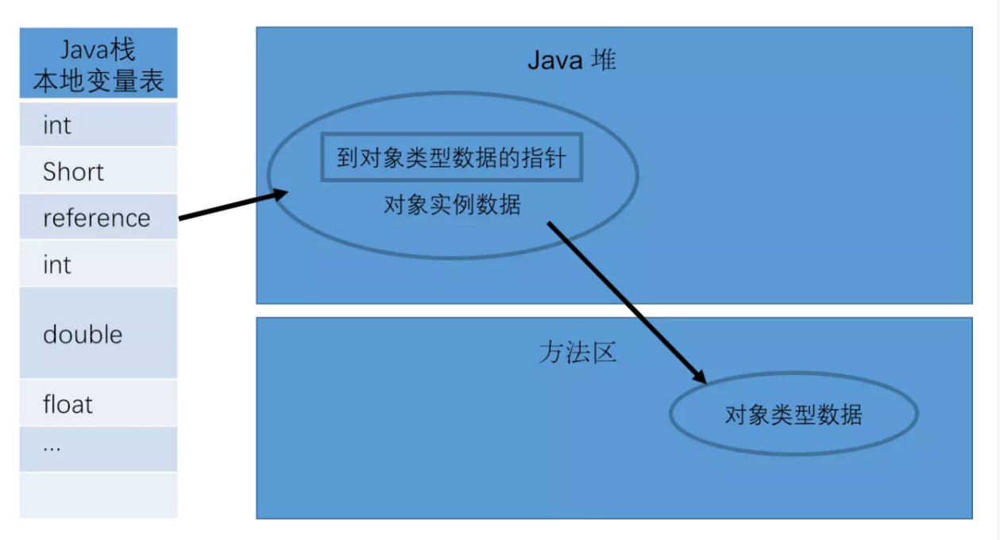
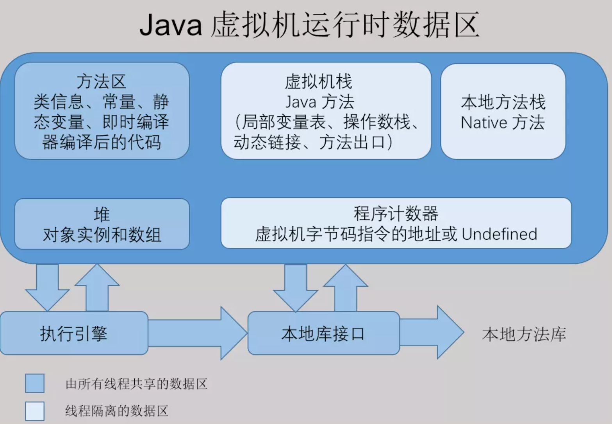
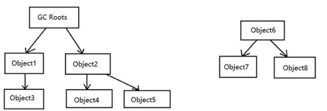
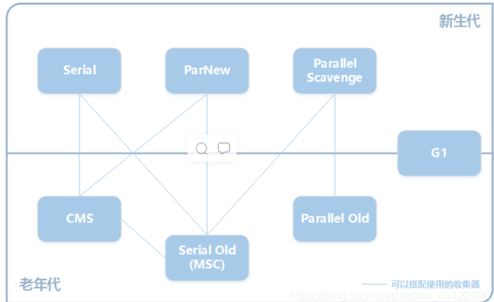
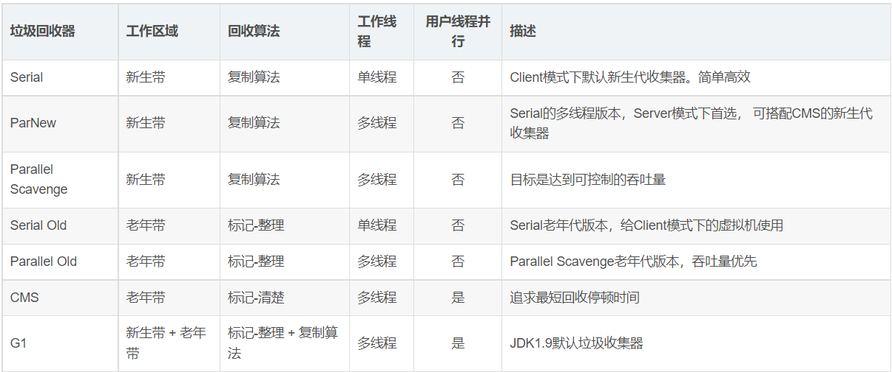

## 学习java虚拟机

#### 1. jvm概述

1. 什么是jvm?
    1. jvm是一种用于计算设备的规范，它是一个虚构出来的机器，是通过在实际的计算机上仿真模拟各种功能实现的。
    2. jvm包含一套字节码指令集，一组寄存器，一个栈，一个垃圾回收堆和一个存储方法域。
    3. jvm屏蔽了与具体操作系统平台相关的信息，使Java程序只需生成在Java虚拟机上运行的目标代码（字节码）,就可以在多种平台上不加修改地运行。
    4. jvm在执行字节码时，实际上最终还是把字节码解释成具体平台上的机器指令执行。

#### 2. jvm执行程序的过程

1. 检查类A是否被加载过。
2. 没有被加载过，则获取类A的class文件，执行类的加载，链接，初始化流程，详细流程可以参考 [类加载过程](../classloader/classloader.md ':include') 这一节内容。
3. 为新生对象分配内存空间
4. 将分配到的内存空间都初始化为零值（目前不明白什么意思）
5. 设置对象头相关数据
    1. GC分代年龄
    2. 对象的哈希码 hashCode
    3. 元数据信息
6. 执行对象<init>方法
7. 对象引用图：

   

#### 3. jvm的运行时数据区

1. jvm内存中各部分详解
    1. 程序计数器
        1. 内存空间小，线程私有。字节码解释器工作是就是通过改变这个计数器的值来选取下一条需要执行指令的字节码指令，分支、循环、跳转、异常处理、线程恢复等基础功能都需要依赖计数器完成
        2. 如果线程正在执行一个 Java 方法，这个计数器记录的是正在执行的虚拟机字节码指令的地址；如果正在执行的是 Native 方法，这个计数器的值则为 (Undefined)
    2. Java 虚拟机栈
        1. 线程私有，生命周期和线程一致。
        2. 描述的是 Java 方法执行的内存模型：每个方法在执行时都会床创建一个栈帧(Stack Frame)用于存储局部变量表、操作数栈、动态链接、方法出口等信息。
        3. 每一个方法从调用直至执行结束，就对应着一个栈帧从虚拟机栈中入栈到出栈的过程。
        4. 栈帧的内存结构：
            1. 局部变量表：存放了编译期可知的各种基本类型(boolean、byte、char、short、int、float、long、double)、对象引用(reference 类型)和 returnAddress
               类型(指向了一条字节码指令的地址)
            2. 操作数栈：方法中参与计算的变量，不停的出栈入栈，进行一个完整的逻辑运算。
            3. 动态链接：
                * 在一个class文件中，一个方法要调用其他方法，需要将这些方法的符号引用转化为其在内存地址中的直接引用，而符号引用存在于方法区中的运行时常量池。
                * Java虚拟机栈中，每个栈帧都包含一个指向运行时常量池中该栈所属方法的符号引用，持有这个引用的目的是为了支持方法调用过程中的动态连接(Dynamic Linking)。
            4. 方法出口：保存了方法return到上一层时的一些信息
    3. 本地方法栈
        1. 区别于 Java 虚拟机栈的是，Java 虚拟机栈为虚拟机执行 Java 方法(也就是字节码)服务
        2. 而本地方法栈则为虚拟机使用到的 Native 方法服务。也会有 StackOverflowError 和 OutOfMemoryError 异常。
    4. Java堆
        1. 对于绝大多数应用来说，这块区域是 JVM 所管理的内存中最大的一块。线程共享，主要是存放对象实例和数组。
        2. 内部会划分出多个线程私有的分配缓冲区(Thread Local Allocation Buffer, TLAB)。可以位于物理上不连续的空间，但是逻辑上要连续。
        3. OutOfMemoryError：如果堆中没有内存完成实例分配，并且堆也无法再扩展时，抛出该异常。
        4. 在 Java 中，堆被划分成两个不同的区域：新生代 ( Young )、老年代 ( Old )。
        5. 老年代就一个区域。新生代 ( Young ) 又被划分为三个区域：Eden、From Survivor、To Survivor。
        6. 这样划分的目的是为了使 JVM 能够更好的管理堆内存中的对象，包括内存的分配以及回收。
        7. 这样划分的目的是为了使 JVM 能够更好的管理堆内存中的对象，包括内存的分配以及回收。
        8. 新生代 ( Young ) 被细分为 Eden 和 两个 Survivor 区域，这两个 Survivor 区域分别被命名为 From Survivor 和 ToSurvivor ，以示区分。
        9. 默认的，Edem ： From Survivor ： To Survivor = 8 : 1 : 1 ( 可以通过参数 –XX:SurvivorRatio 来设定 )，即： Eden = 8/10
           的新生代空间大小，From Survivor = To Survivor = 1/10 的新生代空间大小。
        10. JVM 每次只会使用 Eden 和其中的一块 Survivor 区域来为对象服务，所以无论什么时候，总是有一块 Survivor 区域是空闲着的。因此，新生代实际可用的内存空间为 9/10 ( 即90% )
            的新生代空间。
    5. 方法区
        1. 属于共享内存区域，存储已被虚拟机加载的类信息、常量、静态变量、即时编译器编译后的代码等数据。
        2. JDK1.8后，方法区和永久代合并变成了元空间
        3. 运行时常量池:
            * 属于方法区一部分，用于存放编译期生成的各种字面量和符号引用。
            * 编译器和运行期(String 的 intern() )都可以将常量放入池中。内存有限，无法申请时抛出 OutOfMemoryError。
    6. 现在用一张图表示jvm的内存模型

       

    7. 直接内存
        1. 非虚拟机运行时数据区的部分，也就是硬件层面所理解的内存
        2. 在 JDK 1.4 中新加入 NIO (New Input/Output) 类，引入了一种基于通道(Channel)和缓存(Buffer)的 I/O 方式，它可以使用 Native
           函数库直接分配堆外内存，然后通过一个存储在 Java 堆中的 DirectByteBuffer 对象作为这块内存的引用进行操作。可以避免在 Java 堆和 Native 堆中来回的数据耗时操作。
        3. OutOfMemoryError：会受到本机内存限制，如果内存区域总和大于物理内存限制从而导致动态扩展时出现该异常。

#### 4. 关于jvm的垃圾回收机制

1. 对象的存活区域
    1. 堆空间中，分为新生代和老年代，而新生代又分为Eden区，From Survivor，To Survivor区的原因
        1. 新生代中，每次垃圾收集时都发现大批对象死去，只有少量对象存活，便采用了复制算法，只需要付出少量存活对象的复制成本就可以完成收集。
        2. 而老年代中因为对象存活率高、没有额外空间对它进行分配担保，就必须采用“标记-清理”或者“标记-整理”算法。
    2. 在新建对象的时候，数据会首先分配到Eden区当中（当然也有特殊情况，如果是大对象那么会直接放入到老年代，大对象是指需要大量连续内存空间的java对象）
    3. 当Eden没有足够空间的时候就会触发jvm发起一次Minor GC
    4. 如果对象经过一次Minor-GC还存活，并且又能被Survivor空间接受，那么将被移动到Survivor空间当中。并将其年龄设为1，对象在Survivor每熬过一次Minor GC，年龄就加1
    5. 当年龄达到一定的程度（默认为15）时，就会被晋升到老年代中了，当然晋升老年代的年龄是可以设置的。
2. Minor GC、Major GC、Full GC区别及触发条件
    1. Minor GC是新生代GC，指的是发生在新生代的垃圾收集动作。由于java对象大都是朝生夕死的，所以Minor GC非常频繁，一般回收速度也比较快。
        1. 触发条件：
            * eden区满时，触发MinorGC。即申请一个对象时，发现eden区不够用，则触发一次MinorGC。
            * 新创建的对象大小 > Eden所剩空间
    2. Major GC是老年代GC，指的是发生在老年代的GC，通常执行Major GC会连着Minor GC一起执行。Major GC的速度要比Minor GC慢的多。
        1. 触发条件：Major GC通常是跟full GC是等价的
            * 每次晋升到老年代的对象平均大小>老年代剩余空间
            * MinorGC后存活的对象超过了老年代剩余空间
            * 永久代空间不足
            * 执行System.gc()
            * 堆内存分配很大的对象
    3. Full GC是清理整个堆空间，包括年轻代和老年代
3. 如何判断对象是否存活
    1. 引用计数法
        1. 引用计数法就是如果一个对象没有被任何引用指向，则可视之为垃圾。这种方法的缺点就是不能检测到对象循环引用的存在。
        2. 每个对象在创建的时候，就给这个对象绑定一个计数器。每当有一个引用指向该对象时，计数器加一；每当有一个指向它的引用被删除时，计数器减一。这样，当没有引用指向该对象时，计数器为0就代表该对象死亡
        3. 优缺点说明：
            * 优点：引用计数算法的实现简单，判定效率也很高，在大部分情况下它都是一个不错的算法，
            * 缺点：主流的Java虚拟机里面没有选用引用计数算法来管理内存，其中最主要的原因是它很难解决对象之间相互循环引用的问题。
    2. 可达性分析法（这是目前主流的虚拟机都是采用的算法）
        1. 该种方法是从GC Roots开始向下搜索，搜索所走过的路径为引用链。当一个对象到GC Roots没用任何引用链时，则证明此对象是不可用的，表示可以回收。

           

        2. 上图中Object1、Object2、Object3、Object4、Object5到GC Roots是可达的，表示它们是有引用的对象，是存活的对象不可以进行回收
        3. Object6、Object7、Object8虽然是互相关联的，但是它们到GC Roots是不可达的，所以他们是可以进行回收的对象。
        4. 那些可以作为GC Roots 的对象：
            * 虚拟机栈（栈帧中的本地变量表）中引用的对象
            * 方法区中类静态属于引用的对象
            * 方法区中常量引用的对象
            * 方法区中常量引用的对象
4. 垃圾回收机制策略（也称为GC的算法）
    1. 引用计数算法（Reference counting）
        1. 每个对象在创建的时候，就给这个对象绑定一个计数器。每当有一个引用指向该对象时，计数器加一；
           每当有一个指向它的引用被删除时，计数器减一。这样，当没有引用指向该对象时，计数器为0就代表该对象死亡，这时就应该对这个对象进行垃圾回收操作。
        2. 如上所述，无法解决循环依赖问题，建议不使用
    2. 标记–清除算法（Mark-Sweep）
        1. 为每个对象存储一个标记位，记录对象的状态（活着或是死亡）。
        2. 分为两个阶段，一个是标记阶段，这个阶段内，为每个对象更新标记位，检查对象是否死亡；第二个阶段是清除阶段，该阶段对死亡的对象进行清除，执行 GC 操作。
        3. 标记清除算法的优点：
            1. 是可以解决循环引用的问题,必要时才回收(内存不足时)
        4. 标记清除算法的缺点：
            1. 回收时，应用需要挂起，也就是stop the world。
            2. 标记和清除的效率不高，尤其是要扫描的对象比较多的时候
            3. 会造成内存碎片(会导致明明有内存空间,但是由于不连续,申请稍微大一些的对象无法做到)
        5. 标记清除算法的应用场景：该算法一般应用于老年代,因为老年代的对象生命周期比较长。
    3. 标记–整理算法
        1. 标记清除算法和标记压缩算法非常相同，但是标记压缩算法在标记清除算法之上解决内存碎片化（有些人叫"标记整理算法"为"标记压缩算法"）
        2. 标记-整理法是标记-清除法的一个改进版。
        3. 在标记阶段，该算法也将所有对象标记为存活和死亡两种状态。
           不同的是，在第二个阶段，该算法并没有直接对死亡的对象进行清理，而是将所有存活的对象整理一下，放到另一处空间，然后把剩下的所有对象全部清除。这样就达到了标记-整理的目的。
        4. 标记–整理算法优点：解决标记清除算法出现的内存碎片问题，
        5. 标记–整理算法缺点：压缩阶段，由于移动了可用对象，需要去更新引用。
        6. 标记–整理算法应用场景：该算法一般应用于老年代,因为老年代的对象生命周期比较长。
    4. 复制算法
        1. 该算法将内存平均分成两部分，然后每次只使用其中的一部分
        2. 当这部分内存满的时候，将内存中所有存活的对象复制到另一个内存中，然后将之前的内存清空，只使用这部分内存，循环下去。
        3. 个算法与标记-整理算法的区别在于，该算法不是在同一个区域复制，而是将所有存活的对象复制到另一个区域内。
        4. 复制算法的优点：在存活对象不多的情况下，性能高，能解决内存碎片和java垃圾回收算法之-标记清除 中导致的引用更新问题。
        5. 复制算法的缺点：会造成一部分的内存浪费。不过可以根据实际情况，将内存块大小比例适当调整；如果存活对象的数量比较大，复制算法的性能会变得很差。
        6. 复制算法的应用场景：复制算法一般是使用在新生代中，因为新生代中的对象一般都是朝生夕死的，存活对象的数量并不多，这样使用复制算法进行拷贝时效率比较高。
    5. 分代算法（主要的算法就是上面四种，这个是附加的）
        1. 这种算法，根据对象的存活周期的不同将内存划分成几块，新生代和老年代，这样就可以根据各个年代的特点采用最适当的收集算法。
        2. 新生代：复制算法
        3. 老年代：标记清除法或者标记整理算法进行回收

#### 5. 垃圾收集器

1. 什么是垃圾收集器
    1. 垃圾收集器是垃圾回收算法（引用计数法、标记清楚法、标记整理法、复制算法）的具体实现
    2. 不同垃圾收集器、不同版本的JVM所提供的垃圾收集器可能会有很在差别。
    3. 以JDK8为准

       

    4. 图中展示了7种不同分代的收集器：Serial、ParNew、Parallel Scavenge、CMS、Serial Old、Parallel Old、G1
    5. 它们所处区域，则表明其是属于新生代还是老年代的收集器：
        1. 新生代收集器：Serial、ParNew、Parallel Scavenge
        2. 老年代收集器：CMS、Serial Old、Parallel Old
        3. 整堆收集器：G1
    6. 垃圾回收器详解

       

2. 垃圾收集器介绍
    1. Serial收集器
        1. 新生代收集器，使用复制算法收集新生代垃圾。
        2. 单线程的收集器，GC工作时，其它所有线程都将停止工作。
        3. 简单高效，适合单 CPU 环境。单线程没有线程交互的开销，因此拥有最高的单线程收集效率。
        4. 使用方式：
            1. 设置垃圾收集器："-XX:+UseSerialGC"  --添加该参数来显式的使用改垃圾收集器；
    2. ParNew 收集器
        1. 新生代收集器。ParNew垃圾收集器是Serial收集器的多线程版本，采用复制算法。
        2. 除了多线程外，其余的行为、特点和Serial收集器一样。
        3. 只有它能与 CMS 收集器配合使用。
        4. 但在单个CPU环境中，不比Serial收集器好，多线程使用它比较好。
        5. 使用方式：
            1. 设置垃圾收集器："-XX:+UseParNewGC"  --强制指定使用ParNew
            2. 设置垃圾收集器： "-XX:+UseConcMarkSweepGC"  --指定使用CMS后，会默认使用ParNew作为新生代收集器
            3. 设置垃圾收集器参数："-XX:ParallelGCThreads"  --指定垃圾收集的线程数量，ParNew默认开启的收集线程与CPU的数量相同
    3. Parallel Scavenge收集器
        1. 新生代收集器。
        2. 采用复制算法。
        3. 多线程收集。
        4. 和ParNew不同的是，该垃圾收集器以高吞吐量为目标（减少垃圾收集时间，让用户代码获得更长的运行时间）
        5. 使用方式：
            1. 设置垃圾收集器："-XX:+UseParallelGC"  --添加该参数来显式的使用改垃圾收集器；
            2. 设置垃圾收集器参数："-XX:MaxGCPauseMillis"  --控制垃圾回收时最大的停顿时间(单位ms)
            3. 设置垃圾收集器参数："-XX:GCTimeRatio"  --控制程序运行的吞吐量大小吞吐量大小=代码执行时间/(代码执行时间+gc回收的时间)
            4. 设置垃圾收集器参数："-XX:UseAdaptiveSizePolicy"  --内存调优交给虚拟机管理
    4. Serial Old收集器
        1. Serial Old 收集器
        2. 单线程收集。
        3. 使用方式：
            1. 在JDK1.5及之前，与Parallel Scavenge收集器搭配使用
            2. 在JDK1.6后有Parallel Old收集器可搭配。
            3. 现在的作为CMS收集器的后备预案，在并发收集发生Concurrent Mode Failure时使用
    5. Parallel old收集器
        1. 针对老年代。
        2. 采用"标记-整理"算法。
        3. 多线程收集。
        4. 但在单个CPU环境中，不比Serial Old收集器好，多线程使用它比较好。
        5. 使用方式：
            1. 设置垃圾收集器："-XX:+UseParallelOldGC"：指定使用Parallel Old收集器；
    6. CMS 收集器
        1. 针对老年代，采用标记-清楚法清除垃圾；
        2. 基于"标记-清除"算法(不进行压缩操作，产生内存碎片)；
        3. 以获取最短回收停顿时间为目标,并发收集、低停顿
        4. CMS收集器有3个明显的缺点：1.对CPU资源非常敏感、2.无法处理浮动垃圾，可能出现"Concurrent Mode Failure"失败、3.产生大量内存碎片
        5. 垃圾收集线程与用户线程（基本上）可以同时工作
        6. 使用方式：
            1. 设置垃圾收集器："-XX:+UseConcMarkSweepGC"：指定使用CMS收集器；
    7. G1收集器
        1. 分代收集器。当今收集器技术发展最前沿成果之一，是一款面向服务端应用的垃圾收集器
        2. G1可以说是CMS的终极改进版，解决了CMS内存碎片、更多的内存空间登问题。虽然流程与CMS比较相似，但底层的原理已是完全不同。
        3. 能充分利用多CPU、多核环境下的硬件优势，可以并行来缩短(Stop The World)停顿时间；
        4. 可以并发让垃圾收集与用户程序同时进行
        5. 分代收集，收集范围包括新生代和老年代
        6. 能独立管理整个GC堆（新生代和老年代），而不需要与其他收集器搭配
        7. 能够采用不同方式处理不同时期的对象
        8. 应用场景可以面向服务端应用，针对具有大内存、多处理器的机器
        9. 采用标记-整理 + 复制算法来回收垃圾
        10. 使用方式：
            1. 设置垃圾收集器："-XX:+UseG1GC"：指定使用G1收集器；
            2. 设置垃圾收集器参数："-XX:InitiatingHeapOccupancyPercent"：当整个Java堆的占用率达到参数值时，开始并发标记阶段；默认为45；

#### 6. jvm内存参数

<b>1. 常用设置</b> 

  
 -Xms：初始堆大小，JVM 启动的时候，给定堆空间大小。

-Xmx：最大堆大小，JVM 运行过程中，如果初始堆空间不足的时候，最大可以扩展到多少。

-Xmn：设置堆中年轻代大小。整个堆大小=年轻代大小+年老代大小+持久代大小。

-XX:NewSize=n 设置年轻代初始化大小大小

-XX:MaxNewSize=n 设置年轻代最大值

-XX:NewRatio=n 设置年轻代和年老代的比值。如: -XX:NewRatio=3，表示年轻代与年老代比值为 1：3，年轻代占整个年轻代+年老代和的 1/4

-XX:SurvivorRatio=n 年轻代中 Eden 区与两个 Survivor 区的比值。注意 Survivor 区有两个。8表示两个Survivor :eden=2:8 ,即一个Survivor占年轻代的1/10，默认就为8

-Xss：设置每个线程的堆栈大小。JDK5后每个线程 Java 栈大小为 1M，以前每个线程堆栈大小为 256K。

-XX:ThreadStackSize=n 线程堆栈大小

-XX:PermSize=n 设置持久代初始值

-XX:MaxPermSize=n 设置持久代大小

-XX:MaxTenuringThreshold=n 设置年轻带垃圾对象最大年龄。如果设置为 0 的话，则年轻代对象不经过 Survivor 区，直接进入年老代。

<b>2. 不常用设置</b> 

-XX:LargePageSizeInBytes=n 设置堆内存的内存页大小

-XX:+UseFastAccessorMethods 优化原始类型的getter方法性能

-XX:+DisableExplicitGC 禁止在运行期显式地调用System.gc()，默认启用

-XX:+AggressiveOpts 是否启用JVM开发团队最新的调优成果。例如编译优化，偏向锁，并行年老代收集等，jdk6纸之后默认启动

-XX:+UseBiasedLocking 是否启用偏向锁，JDK6默认启用

-Xnoclassgc 是否禁用垃圾回收

-XX:+UseThreadPriorities 使用本地线程的优先级，默认启用

