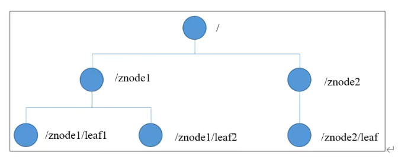
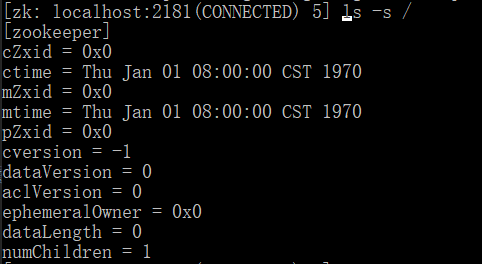
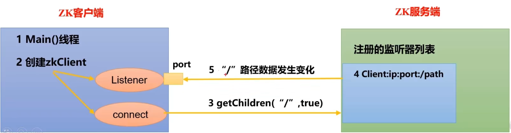
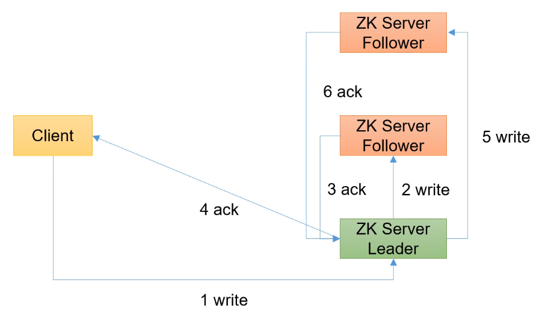
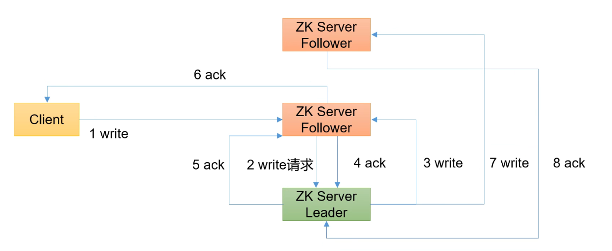

## zookeeper笔记

### 1. zookeeper简介

#### 1. 什么是zk

1. zk从设计模式的角度来理解：是一个基于观察者模式的分布式服务管理框架。
2. 它可以作为服务注册中心，也可以作为数据存储中心，一旦注册的数据发生了变化，就将会通知已经注册在zk上那些观察者们，这也是zk最重要的watcher机制，总结起来zk=文件系统+观察者模式
3. zk一般是集群使用，由一个Leader多个Follower组成使用，集群中只要有半数以上的节点能够正常运行，zk就能正常对外提供服务，所以zk集群适合由奇数台的机器组成，优点如下
    1. 节省服务器资源，假设zk集群现有5个节点或者6个节点，根据zk集群只要有半数以上的节点存活就能正常对外提供服务的原则，那么无论是5个节点的zk集群或者是6个节点的zk集群只要存活的节点有3个以上，zk都能正常对外提供服务
4. zk的数据结构
    1. 和linux的文件目录结构类似，是树形结构
    2. 整体可以看成一棵树，每一个节点称之为ZNode，每一个ZNode默认能够存储1MB的数据，每个ZNode通过唯一的路径名称去标识

       

5. 应用场景
    1. 统一的集群管理：分布式环境中，比如某个功能的集群服务器注册到zk的节点上，把该服务器的运行状态信息存储到ZNode中，调用该服务器的客户端则对该节点进行监听，能够实时获取服务器的运行状态
    2. 统一配置管理：分布式环境的配置信息同步，就可以使用zk实现，例如各个客户端监听了config这个ZNode节点，一旦config节点的数据发生了变化，就会通知客户端重新拉取数据，更新自己的配置文件
    3. 服务器节点动态上下线：当服务器节点都注册到zk上时，若有依赖关系的服务，启动顺序分先后，则可以用zk的watcher机制，通知服务器顺序启动
    4. 统一命名服务：在分布式环境下经常需要对应用/服务进行统一命名，例如父节点存储RESTFul风格的接口，子节点存储接口集群服务器的ip地址
    5. 负载均衡：zk节点的访问能够实现轮询访问，随机访问，LRU机制访问，实现负载均衡

### 2. zk的安装以及使用

1. 安装教程百度
2. zk配置文件解析
    1. tickTime=2000：zk的心跳时间
    2. initLimit=10：LF（Leader和Follower）初始化连接时的能容忍的最多心跳数（时间为10*2 S）
    3. syncLimit=5：LF同步通信时限，超过了时限后，Leader则会从服务器列表中删除未响应的Follower
    4. dataDir=/tmp/zookeeper：zk存储数据的目录
    5. clientPort=2181：客户端连接服务器的端口号
3. zk集群安装
    1. 在dataDir目录路径下新建myid文件，里面填写zk集群的编号
    2. 在zoo.config文件内编写集群的ip,格式如：server.A=B:C:D
    3. A表示集群的编号
    4. B表示集群服务器的IP地址
    5. C表示Leader服务器和Follower服务器的信息交换端口
    6. D表示zk集群进行Leader选举时的通信端口
    7. 例如：server.2=192.168.1.3:2310:2888

### 3. zk的集群选举

1. 首先了解几个zk的术语
    * SID：服务器ID，用来唯一标识一台zk集群中的服务器，每台机器不能重复和myid一致
    * ZXID：事务ID，用来标识一次zk节点的状态变更，在某一时刻，集群中的每台机器ZXID值不一定完全一致
    * Epoch：每个Leader任期的代号，没有Leader时同一轮投票过程中的逻辑时钟是完全相同的，每投完一次票这个数据就会增加
2. 服务器刚启动时的选举机制
    1. 首先把选票投给自己的服务器，启动多个服务器后根据myid的大小，重新投票
    2. 根据myid文件的配置数据选择Leader，id越大，越有机会成为Leader，当选举出Leader后，后续加入的zk服务器无论myid多大，都会成为Follower
3. 非第一次启动，即服务器运行期间无法和Leader保持连接
    1. 选举Leader规则：根据（Epoch，ZXID，SID）的大小进行选择
        * Epoch最大的当选Leader
        * 若Epoch相同，事务ID大的当选
        * 若Epoch和事务ID都相同，服务器ID大的当选

### 4. zk的一些命令以及信息

1. [ls -s /]命令：查询某个节点的详细信息，会出现以下几个属性

   

    * czxid：创建节点的事务zxid，每次修改zk状态都会产生一个zk事务id，事务id随着zk节点的操作数增加而增加
    * ctime：znode被创建的毫秒数（since 1970s）
    * mzxid：znode最后更新的事务id
    * mtime：znode最后修改的毫秒数（since 1970s）
    * pZxid：znode最后更新的子节点事务id
    * cversion：znode节点的变化好，znode子节点的修改次数
    * dataversion：znode数据变化号
    * aclVersion：znode访问控制列表的变化号
    * ephemeralOwner：如果是临时节点，这个znode拥有者的session id，如果不是临时节点则是0
    * dataLength：znode的数据长度
    * numChildren：znode子节点数量
2. zk的节点类型
    1. 持久（Persistent）：数据实现了持久化，客户端和服务器断开连接后，节点数据不丢失
    2. 短暂（Ephemeral）：客户端是服务器断开连接后，节点信息删除
    3. 节点类型分为：
        * 持久节点：会进行数据持久化
        * 持久sequence节点：创建该节点会在名称后面自动递增序号，并且会持久化，在分布式环境下，sequence节点能够实现顺序消费的功能
        * 临时节点：不会进行数据持久化
        * 临时sequence节点：创建该节点会在名称后面自动递增序号，不会进行数据持久化

### 5. zk的一些机制

1. 监听器原理概览
    1. 首先需要一个main（）线程
    2. 在main线程中创建zk客户端，这时就会创建两个线程，一个负责网络连接通信（connet），一个负责监听（listener）
    3. 通过connect线程将注册的监听事件发送给zk服务端
    4. 在zk服务器的注册监听器列表中将会注册第三步发送的监听事件，把该事件添加到列表中
    5. zk服务器监听到某个节点有数据变化或者路径变化，就会将这个消息发送给zk的客户端listener线程
    6. listener线程会内部调用process（）方法，进行业务逻辑的处理

       

    7. 常见的监听：
        * 监听节点数据的变化：get path [watch]
        * 监听节点路径的变化：ls path [watch]
        * 节点数据或者路径的监听事件只能被触发一次，被触发后，需要重新进行注册，才能再次使用事件监听机制
2. zk写数据的原理概览
    1. 写入请求发送给Leader节点
        * 客户端发送写请求给leader节点，leader节点写入数据后开始同步给follower节点
        * 只要有半数的follower节点数据同步成功并且返回了ack给leader节点，leader节点就会返回给客户端写入数据成功的结果
        * 后续再继续同步数据给其他follower节点

          

    2. 写入请求发送给follower节点
        * 客户端发送写请求给follower节点，则follower节点会转发写请求给leader节点
        * leader节点写入成功后，会把数据同步给其他follower节点
        * 当半数以上的follower节点都同步数据后，follower节点会发送ack结果给leader节点
        * leader节点收到follower节点同步数据成功的消息后，把写入成功的响应结果，再次返回给接收client写请求的follower节点
        * 最后follower节点把写入成功的结果，返回给客户端

        * 然后leader服务器继续同步数据给其他剩余的follower节点

          
