## ArrayList详解

### 简介：

ArrayList是一个数组队列，相当于动态数组。与Java中的数组相比，它的容量能动态增长。

ArrayList类声明如下： public class ArrayList<E> extends AbstractList<E> implements List<E>, RandomAccess, Cloneable,
java.io.Serializable 

* 它继承于AbstractList，实现了List、RandomAccess、Cloneable、 Serializable等接口。

* ArrayList不是线程安全的，只能用在单线程环境下，多线程环境下可以考虑用Collections.synchronizedList(List l)

  函数返回一个线程安全的ArrayList类，也可以使用concurrent并发包下的CopyOnWriteArrayList类。

* ArrayList实现了RandomAccess接口，即提供了随机访问功能，
  RandomAccess是java中用来被List实现，为List提供快速访问功能的。在ArrayList中，我们可以通过元素的序号快速获取元素对象，这就是快速随机访问。
* 实现了Cloneable接口，能被克隆；实现了Serializable接口，因此它支持序列化，能够通过序列化传输。

### ArrayList源码详解

1. ArrayList内部通过一个Object数组来存储数据：

   transient Object[] elementData;
2. ArrayList使用size变量来表示实际存储的元素个数：

   private int size;
3. ArrayList有以下三个构造方法：

    * 根据initialCapacity来创建具有指定初始容量的ArrayList

      public ArrayList(int initialCapacity)
    * 创建一个默认的ArrayList

      public ArrayList()
    * 根据其他集合来创建ArrayList

      public ArrayList(Collection<? extends E> c)
4. ArrayList扩容：
    * 使用ArrayList默认构造器进行对象创建时，list大小默认为Object[] DEFAULTCAPACITY_EMPTY_ELEMENTDATA = {}，一个长度为0的Object数组
    * 调用add方法后，若list大小为DEFAULTCAPACITY_EMPTY_ELEMENTDATA，那么进行扩容DEFAULT_CAPACITY = 10的操作
      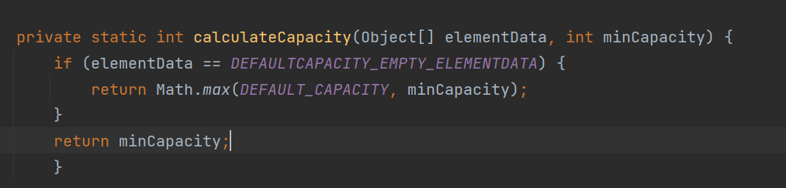
    * 当数组最小元素量大于容量时则再次扩容
      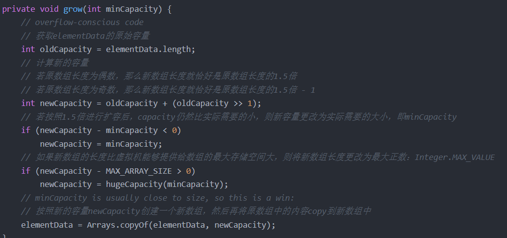
    * 扩容时会使用hugeCapacity方法对容量进行判断
      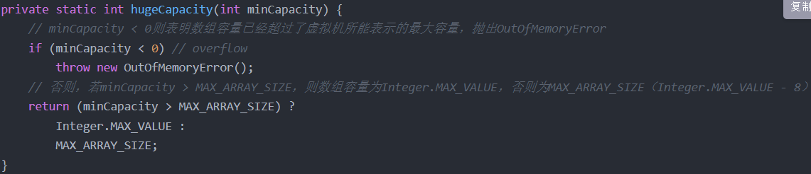
5. ArrayList细节概览
    1. Arrays.copyOf()、System.arraycopy()
        1. ArrayList的源码中大量地调用了Arrays.copyof()和System.arraycopy()方法

           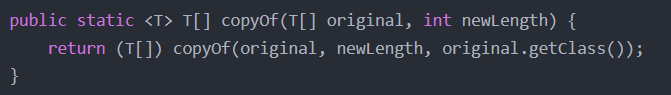
        2. copyof()方法调用了其重载方法,该方法实际上是在其内部又创建了一个长度为newLength的数组，调用System.arraycopy()方法，将原来数组中的元素复制到了新的数组中
           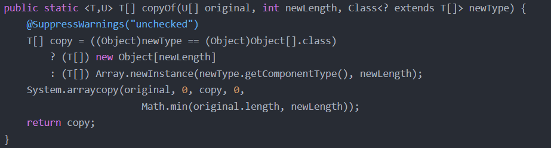
        3. System.arraycopy()方法,该方法被标记了native，调用了系统的C/C++代码
           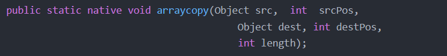
           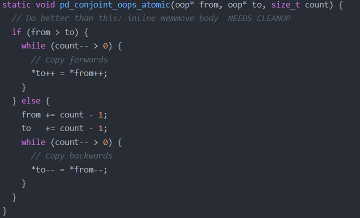
    2. fail-fast机制
        1. 在ArrayList的源码中，我们经常会看到modCount++这样的代码， 其实，modCount是用来实现fail-fast机制的，fail-fast机制是Java集合中的一种错误机制，
           当多个线程对同一个集合的内容进行操作时，就会发生fail-fast事件，
           它是一种错误检测机制，只能被用来检测错误，因为JDK并不一定保证fail-fast机制一定会发生。fail-fast机制会尽最大努力来抛出ConcurrentModificationException异常。

        2. fail-fast机制产生的最初原因是在于程序在对Collection进行迭代时，某个线程对该Collection的结构进行了修改。
           这时迭代器会抛出ConcurrentModificationException异常，从而产生fail-fast事件。 如果单线程违法了规则，也同样会抛出此异常。
        3. 迭代器在调用next()、remove()等方法时都要调用checkForComodification()方法，
           该方法主要是检测modCount是否等于expectedModCount，若不等于，则抛出ConcurrentModificationException异常。
           在创建迭代器时，会将modCount的值赋给expectedModCount，所以在迭代期间，expectedModCount不会改变，在ArrayList中，无论add、remove还是clear方法，只要改变了ArrayList的元素个数，都会导致modCount改变，从而可能导致fail-fast产生。
           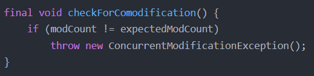
        4. 如何实现ArrayList元素遍历时的删除操作
            1. Iterator已经为我们提供了remove方法， 所以我们只需要调用迭代器里面的remove方法就可以了，
               Iterator中的remove方法移除元素后会把modCount重写赋值给expectedModCount，下一个循环时expectedModCount与modCount相等就避免此问题。如下例子：
               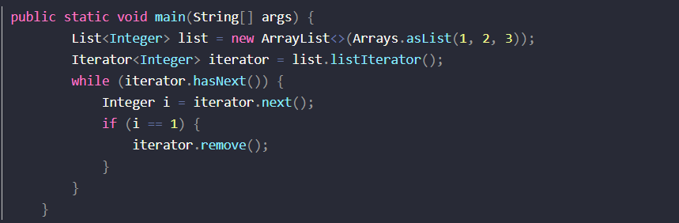
    3. ArrayList序列化机制
        1. ArrayList实现了Serializable接口，那么证明可以是被序列化的，但是elementData数组又被transient关键字修饰，
           我们知道被transient修饰的成员属性变量不被序列化，但是ArrayList确实是可以被序列化的，因为重写了readObject和writeObject来自定义的序列化和反序列化策略。
        2. 什么是自定义序列化和反序列化？
            * 在序列化过程中，如果被序列化的类中定义了writeObject 和 readObject 方法，虚拟机会试图调用对象类里的 writeObject 和 readObject
              方法，进行用户自定义的序列化和反序列化。
            * 如果没有这样的方法，则默认调用是 ObjectOutputStream 的 defaultWriteObject 方法以及 ObjectInputStream 的 defaultReadObject 方法。
            * 用户自定义的 writeObject 和 readObject 方法可以允许用户控制序列化的过程，比如可以在序列化的过程中动态改变序列化的数值。
        3. ArrayList源码自定义序列化和反序列化：
            * 序列化
              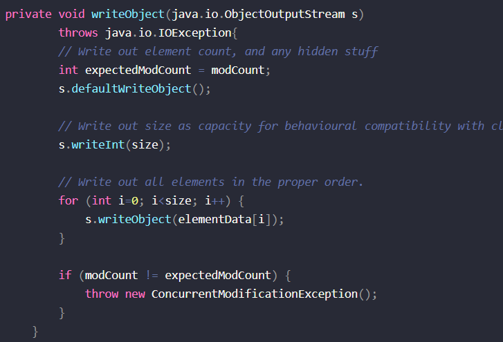
            * 反序列化
              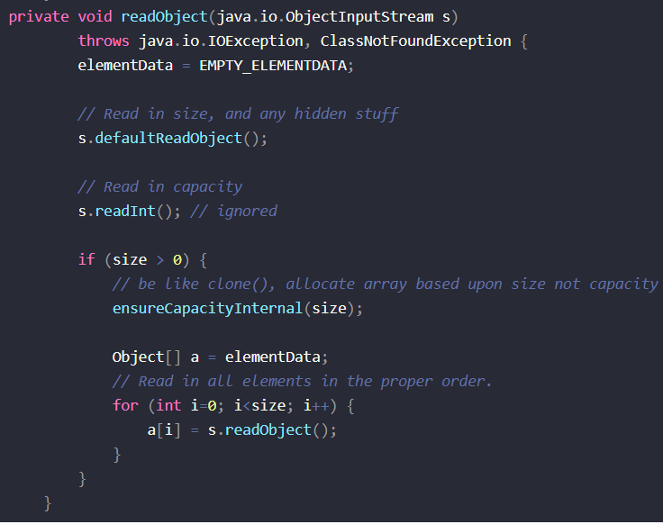
        4. 为什么要遍历元素实现序列化呢？

           ArrayList实际上是动态数组，每次在放满以后自动增长设定的长度值，如果数组自动增长长度设为100，而实际只放了一个元素，那就会序列化99个null元素。为了保证在序列化的时候不会将这么多null同时进行序列化，ArrayList把元素数组设置为transient。

    4. ArrayList clone机制 

        1. ArrayList的clone实现，其实是通过数组元素拷贝来实现的浅拷贝，很简单，我们看一下源码就行了：
           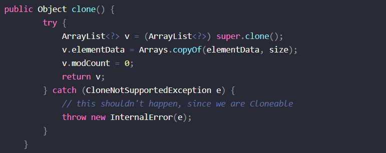