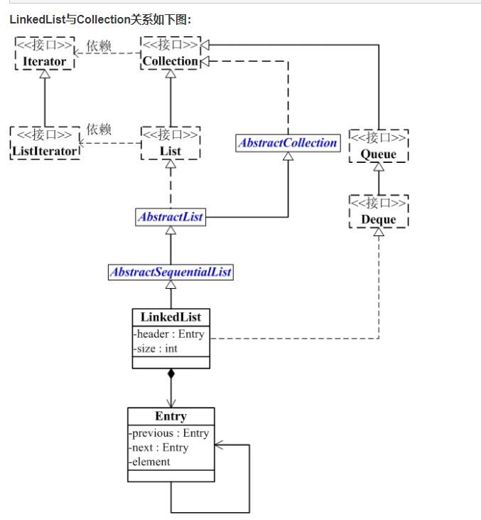
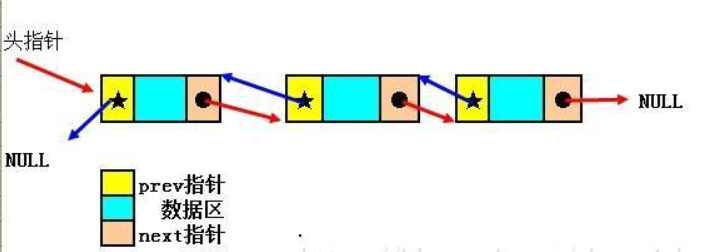
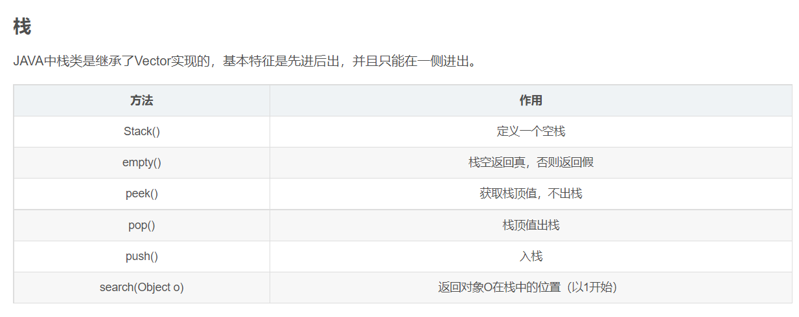
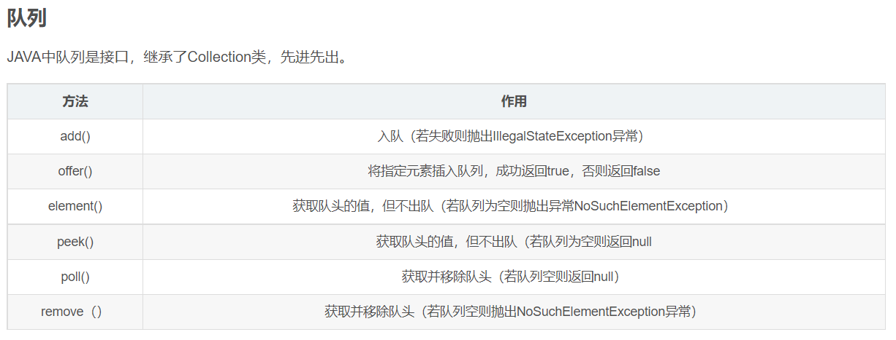

## LinkedList详解

public class LinkedList<E>
extends AbstractSequentialList<E>
implements List<E>, Deque<E>, Cloneable, java.io.Serializable {}

* LinkedList 是一个继承于AbstractSequentialList的双向链表。它也可以被当作堆栈、队列或双端队列进行操作。
* 特点是增删快，查询慢，线程不安全但效率高,可以调用Collections.synchronizedList(new LinkedList<>())实现线程安全。
* LinkedList 实现 List 接口，能对它进行队列操作。
* LinkedList 实现 Deque 接口，即能将LinkedList当作双端队列使用。
* LinkedList 实现了Cloneable接口，即覆盖了函数clone()，能克隆。
* LinkedList 实现java.io.Serializable接口，这意味着LinkedList支持序列化，能通过序列化去传输。
* LinkedList 是非同步的。

1. LinkedList类图
   
    1. LinkedList的本质是双向链表:

       (01) LinkedList继承于AbstractSequentialList，并且实现了Dequeue接口。

       (02) LinkedList包含两个重要的成员：header 和 size。

       (03) header是双向链表的表头，它是双向链表节点所对应的类Entry的实例。

       (04) Entry中包含成员变量： previous, next, element。其中，previous是该节点的上一个节点，next是该节点的下一个节点，element是该节点所包含的值。
       size是双向链表中节点的个数。
    2. 数据结构图：

       

2. LinkedList源码解析
3. 常用API解析

* 将指定元素插入此列表的开头：addFirst(E e); || offerFirst(E e);
* 将指定元素添加到此列表的结尾：addLast(E e); || offerLast(E e);
* 将指定元素添加到此列表的结尾：add(E e); || offer(E e);
* 获取并移除此列表的头(类似于队列方法)：poll(); || remove();
* 移除此列表的第一个元素：removeFirst(); || pollFirst();
* 移除此列表的最后一个元素：removeLast(); || pollLast();
* 获取但不移除列表的头(类似于队列和栈的通用取头元素方法): peek()
* 获取但不移除此列表的第一个元素: peekFirst()
* 获取但不移除此列表的最后一个元素: peekLast()
* 从此列表所表示的堆栈处弹出一个元素(类似于栈的方法)：pop()
* 从此列表中移除第一次出现的指定元素: removeFirstOccurrence("Y")
* 移除并返回此列表的最后一个元素: removeLastOccurrence("Y")
* 将此列表中某位置的元素替换为指定的元素: set(2, "S")
* 列表元素区间截取(含头不含尾，调用该方法生成的新的list，内部引用的还是原来的链表，如果改变subList中的值，主list中的值也会跟着改变): subList(1, 4)

4. 栈和队列的通用方法
   
   