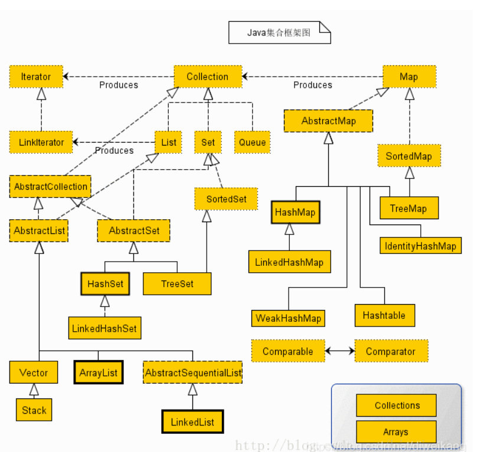
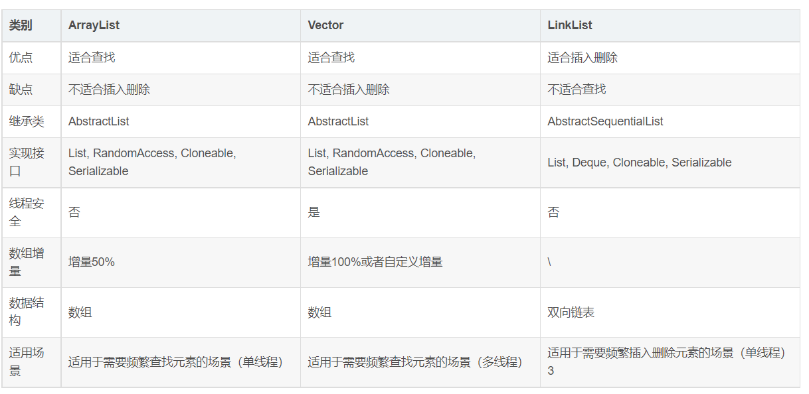
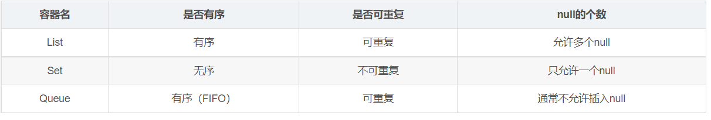

## Java集合框架概览

### 1. 架构图

### 2. Iterable接口

1. Iterable是一个超级接口，被Collection所继承。它只有一个方法： Iterator<T> iterator() //即返回一个迭代器
2. 迭代器是一种设计模式，它是一个对象，它可以遍历并选择序列中的对象，而开发人员不需要了解该序列的底层结构。迭代器通常被称为“轻量级”对象，因为创建它的代价小。
3. Java中的Iterator功能比较简单，并且只能单向移动：
    1. 使用方法iterator()要求容器返回一个Iterator。第一次调用Iterator的next()方法时，它返回序列的第一个元素。注意：iterator()
       方法是java.lang.Iterable接口,被Collection继承。
    2. 使用next()获得序列中的下一个元素。
    3. 使用hasNext()检查序列中是否还有元素。
    4. 使用remove()将迭代器新返回的元素删除。

### 3. List 接口

1. List是有序的 collection（也称为序列）。此接口的用户可以对列表中每个元素的插入位置进行精确地控制。用户可以根据元素的整数索引（在列表中的位置）访问元素，并搜索列表中的元素。
2. 用户插入的顺序或者指定的位置就是元素插入的位置。它与Set不同，List允许插入重复的值。
3. List 接口提供了特殊的迭代器，称为 ListIterator，除了允许 Iterator 接口提供的正常操作外，该迭代器还允许元素插入和替换，以及双向访问。
4. List的子类
    1. ArrayList（类）
        * ArrayLis是基于数组实现的List类，它封装了一个动态的、增长的、允许再分配的Object[ ]数组.它允许对元素进行快速随机访问
        * 当从ArrayList的中间位置插入或者删除元素时，需要对数组进行复制、移动、代价比较高。因此，它适合随机查找和遍历，不适合插入和删除。
    2. Vector（类）
        * Vector与ArrayList一样，也是通过数组实现的，不同的是它支持线程的同步，即某一时刻只有一个线程能够写Vector，避免多线程同时写而引起的不一致性，但实现同步需要很高的花费。
          因此，访问它比访问ArrayList慢。所以现在已经不太常用了
        * Vector的子类：Stack是Vector提供的一个子类，用于模拟"栈"这种数据结构(LIFO后进先出)
    3. LinkedList（类）
        * LinkedList是用链表结构存储数据的，很适合数据的动态插入和删除，随机访问和遍历速度比较慢。
        * 它还实现了Deque接口，专门用于操作表头和表尾元素，可以当作堆栈、队列和双向队列使用。
    4. 关于ArrayList，LinkedList，Vector的区别
       

### 4. Set接口

1. Set，顾名思义，集合的意思。java的集合和数学的集合一样，满足集合的无序性，确定性，单一性。所以可以很好的理解，Set是无序、不可重复的。同时，如果有多个null，则不满足单一性了，所以Set只能有一个null。
2. Set的子类：
    1. HashSet （类）
        * HashSet是Set接口的典型实现，HashSet使用HASH算法来存储集合中的元素，因此具有良好的存取和查找性能。当向HashSet集合中存入一个元素时，HashSet会调用该对象的 hashCode()
          方法来得到该对象的hashCode值，然后根据该HashCode值决定该对象在HashSet中的存储位置。
        * HashSet集合判断两个元素相等的标准是两个对象通过equals()方法比较相等，并且两个对象的hashCode()方法的返回值相等
        * LinkedHashSet是HashSet的子类
            * LinkedHashSet集合也是根据元素的hashCode值来决定元素的存储位置，但和HashSet不同的是，它同时使用链表维护元素的次序，这样使得元素看起来是以插入的顺序保存的。
            * 当遍历LinkedHashSet集合里的元素时，LinkedHashSet将会按元素的添加顺序来访问集合里的元素。
            * LinkedHashSet需要维护元素的插入顺序，因此性能略低于HashSet的性能，但在迭代访问Set里的全部元素时(遍历)将有很好的性能(链表很适合进行遍历)。
    2. SortedSet（接口）
        * 此接口主要用于排序操作，实现了此接口的子类都属于排序的子类。
            * TreeSet（类）：TreeSet是SortedSet接口的实现类，TreeSet可以确保集合元素处于排序状态
    3. EnumSet（类）
        * EnumSet是一个专门为枚举类设计的集合类，EnumSet中所有元素都必须是指定枚举类型的枚举值，该枚举类型在创建EnumSet时显式、或隐式地指定。EnumSet的集合元素也是有序的，

### 5. Queue 接口

1. 此接口用于模拟“队列”数据结构（FIFO）。新插入的元素放在队尾，队头存放着保存时间最长的元素。
2. Queue的子类、子接口
    1. PriorityQueue——优先队列（类）
        * 其实它并没有按照插入的顺序来存放元素，而是按照队列中某个属性的大小来排列的。故而叫优先队列。
    2. Deque——双端队列（接口）
        * ArrayDeque（类）：基于数组的双端队列，类似于ArrayList有一个Object[] 数组。
        * LinkedList（类）：上文已有，略

### 6. 概述List，Set，Queue三个接口的区别

### 7. Map接口

1. HashMap（类）
    1. 和HashSet集合不能保证元素的顺序一样，HashMap也不能保证key-value对的顺序。并且类似于HashSet判断两个key是否相等的标准一样: 两个key通过equals()方法比较返回true、
       同时两个key的hashCode值也必须相等
    2. HashMap的子类：
        * LinkedHashMap （类）：LinkedHashMap也使用双向链表来维护key-value对的次序，该链表负责维护Map的迭代顺序，与key-value对的插入顺序一致(
          注意和TreeMap对所有的key-value进行排序区分）。
2. HashTable（类）
    * 是一个古老的Map实现类, 线程安全版本的HashMap, 使用synchronized保证线程安全。
    *
   Properties（类）：HashTable的子类，Properties对象在处理属性文件时特别方便（windows平台的.ini文件）。Properties类可以把Map对象和属性文件关联，从而把Map对象的key
    - value对写入到属性文件中，也可把属性文件中的“属性名-属性值”加载进Map对象中。
3. SortedMap（接口）
    1. 如同Set->SortedSet->TreeSet一样，Map也有Map->SortedMap->TreeMap的继承关系。
    2. TreeMap（类）
        * TreeMap是一个红黑树结构，每个键值对都作为红黑树的一个节点。TreeMap存储键值对时，需要根据key对节点进行排序，TreeMap可以保证所有的key-value对处于有序状态。
          同时，TreeMap也有两种排序方式：自然排序、定制排序（类似于上面List的重写CompareTo()方法）。
4. WeakHashMap（类）
    1. 看名字就能发现，这是Weak后的HashMap。但是二者大体差别不大。
    2. 区别在于，HashMap的key保留了对实际对象的强引用，这意味着只要该HashMap对象不被销毁，该HashMap所引用的对象就不会被垃圾回收。
    3. 但WeakHashMap的key只保留了对实际对象的弱引用，这意味着如果WeakHashMap对象的key所引用的对象没有被其他强引用变量所引用，
       则这些key所引用的对象可能被垃圾回收，当垃圾回收了该key所对应的实际对象之后，WeakHashMap也可能自动删除这些key所对应的key-value对。
5. IdentityHashMap（类）
    1. 这个类也和HashMap类似，区别在于，在IdentityHashMap中，当且仅当两个key严格相等(key1==key2)时，IdentityHashMap才认为两个key相等
6. EnumMap（类）
    1. EnumMap是一个与枚举类一起使用的Map实现，EnumMap中的所有key都必须是单个枚举类的枚举值。创建EnumMap时必须显式或隐式指定它对应的枚举类。EnumMap根据key的自然顺序存储。