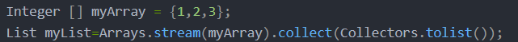

## Collections和Arrays工具

### 1. Collections类的常见操作

1. 排序

* void reverse(List list)//反转
* void shuffle(List list)//随机排序
* void sort(List list)//按自然排序的升序排序 void sort(List list, Comparator c)//定制排序，由Comparator控制排序逻辑 void swap(List
* list, int i , int j)//交换两个索引位置的元素
* void rotate(List list, int distance)//旋转。当distance为正数时，将list后distance个元素整体移到前面。当distance为负数时，将
  list的前distance个元素整体移到后面。

2. 查找、替换操作

* int binarySearch(List list, Object key)//对List进行二分查找，返回索引，注意List必须是有序的
* int max(Collection coll)//根据元素的自然顺序，返回最大的元素。 类比int min(Collection coll)
* int max(Collection coll, Comparator c)//根据定制排序，返回最大元素，排序规则由Comparatator类控制。类比int min(Collection coll, Comparator c)
* void fill(List list, Object obj)//用指定的元素代替指定list中的所有元素。
* int frequency(Collection c, Object o)//统计元素出现次数
* int indexOfSubList(List list, List target)//统计target在list中第一次出现的索引，找不到则返回-1，类比int lastIndexOfSubList(List source, list
  target).
* boolean replaceAll(List list, Object oldVal, Object newVal), 用新元素替换旧元素

3. 同步操作(将一些线程不安全的集合封装成线程同步的集合，但是效率很低。需要线程安全的集合类型时请考虑使用 JUC 包下的并发集合)

* synchronizedCollection(Collection<T>  c) //返回指定 collection 支持的同步（线程安全的）collection。
* synchronizedList(List<T> list)//返回指定列表支持的同步（线程安全的）List。
* synchronizedMap(Map<K,V> m) //返回由指定映射支持的同步（线程安全的）Map。
* synchronizedSet(Set<T> s) //返回指定 set 支持的同步（线程安全的）set。

### 2.Arrays类的常见操作

1. 排序：sort（）
2. 查找：binarySearch()，需要先排序
3. 比较: equals()，两个对象都是null也相等
4. 填充 : fill()，可以全部填充或者指定区段内填充
5. 转列表: asList()

* 将一个数组转化为一个List集合，但是其底层还是数组，所以不能使用其修改集合相关方法，add/remove/clear都会抛出异常
* 不适用与基本数据类型，当传入一个原生数据类型数组时，得到的真正参数是数组对象本身。
* 将数组与链表链接起来，当更新其中一个的时候另一个也随之更新
* 优雅的奖数组转为ArrayList
    * 简便方法：List list=new ArrayList<>(Arrays.asList(“a”,“b”,“c”));
    * 使用Stream：
