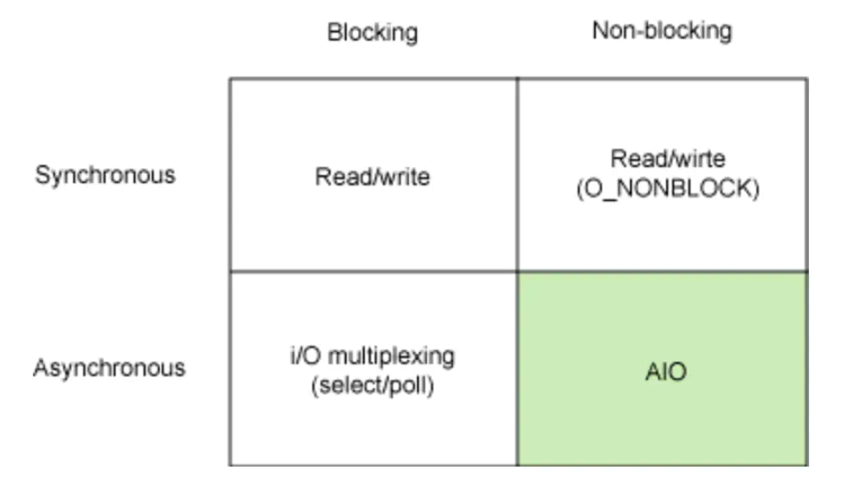
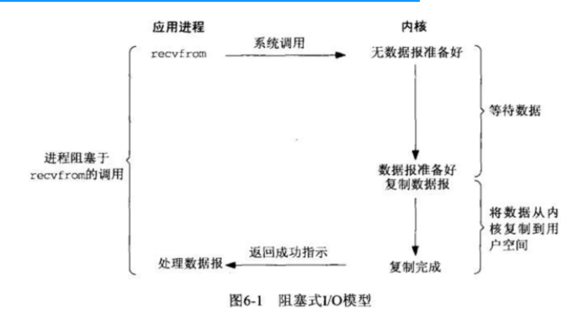
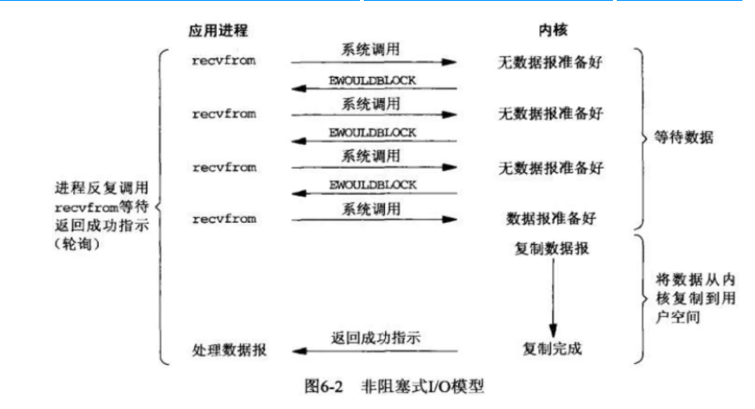
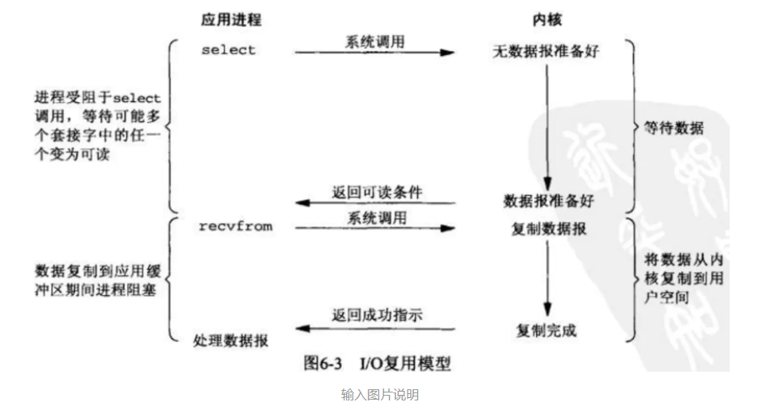
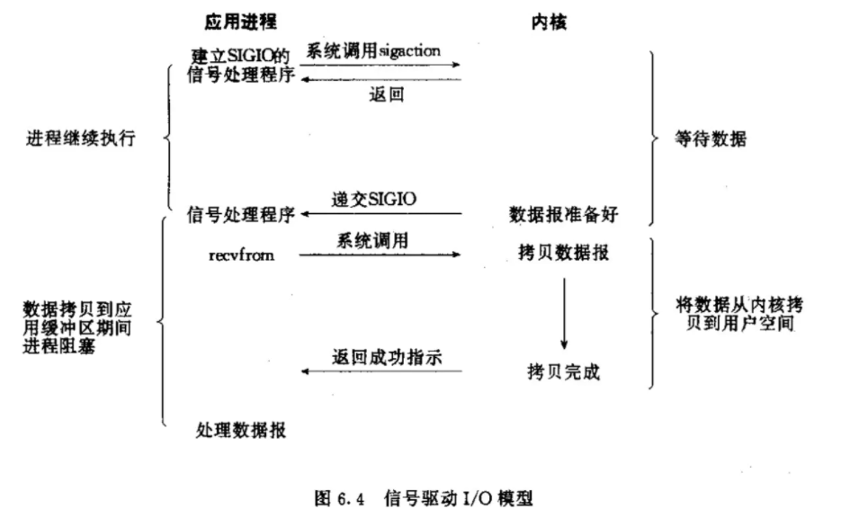
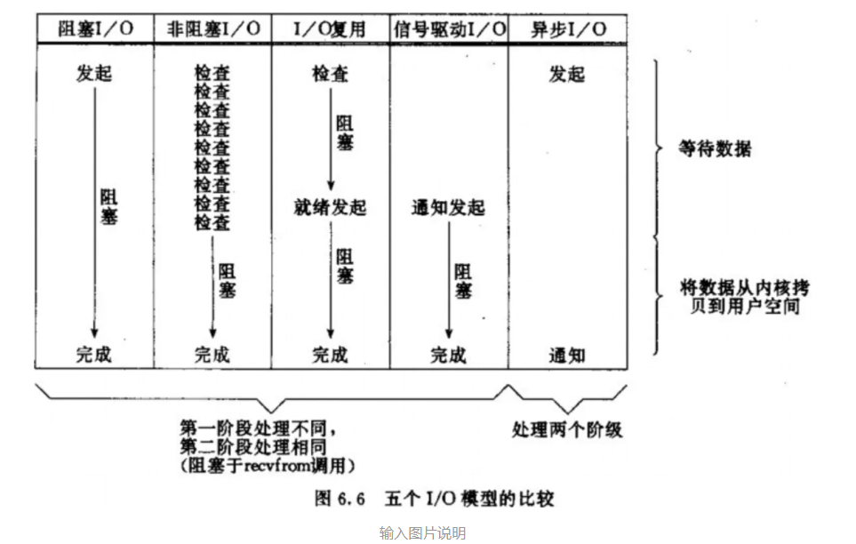

## 5种IO模型详解

### 1. 同步，异步，阻塞和非阻塞

#### 1.1 同步与异步概览

1. 同步与异步
    1. 首先来解释同步和异步的概念，这两个概念与消息的通知机制有关。也就是同步与异步主要是从消息通知机制角度来说的。
    2. 所谓同步就是一个任务的完成需要依赖另外一个任务时，只有等待被依赖的任务完成后，依赖的任务才能算完成，这是一种可靠的任务序列。要么成功都成功，失败都失败，两个任务的状态可以保持一致。
    3. 所谓异步是不需要等待被依赖的任务完成，只是通知被依赖的任务要完成什么工作，依赖的任务也立即执行，只要自己完成了整个任务就算完成了。
    4. 至于被依赖的任务最终是否真正完成，依赖它的任务无法确定，所以它是不可靠的任务序列。
2. 消息通知机制
    1. 异步的概念和同步相对。当一个同步调用发出后，调用者要一直等待返回消息（结果）通知后，才能进行后续的执行
    2. 当一个异步过程调用发出后，调用者不能立刻得到返回消息（结果）。实际处理这个调用的部件在完成后，通过状态、通知和回调来通知调用者。
3. 场景比喻：
    1. 举个例子，比如我去银行办理业务，可能会有两种方式：
        1. 选择排队等候；
        2. 另种选择取一个小纸条上面有我的号码，等到排到我这一号时由柜台的人通知我轮到我去办理业务了；
        3. 第一种：前者(排队等候)就是同步等待消息通知，也就是我要一直在等待银行办理业务情况；
        4. 第二种：后者(等待别人通知)就是异步等待消息通知。在异步消息处理中，等待消息通知者(在这个例子中就是等待办理业务的人)往往注册一个回调机制，在所等待的事件被触发时由触发机制(在这里是柜台的人)通过某种机制(
           在这里是写在小纸条上的号码，喊号)找到等待该事件的人。

#### 1.2 阻塞与非阻塞概览

1. 阻塞与非阻塞
    1. 阻塞和非阻塞这两个概念与程序（线程）等待消息通知(无所谓同步或者异步)时的状态有关。也就是说阻塞与非阻塞主要是程序（线程）等待消息通知时的状态角度来说的。
2. 概念描述
    1. 阻塞调用是指调用结果返回之前，当前线程会被挂起，一直处于等待消息通知，不能够执行其他业务。函数只有在得到结果之后才会返回。
    2. 有人也许会把阻塞调用和同步调用等同起来，实际上它们是不同的：
        1. 对于同步调用来说，很多时候当前线程可能还是激活的，只是从逻辑上当前函数没有返回而已，此时，这个线程可能也会处理其他的消息
        2. 如果这个线程在等待当前函数返回时，仍在执行其他消息处理，那这种情况就叫做同步非阻塞；
        3. 如果这个线程在等待当前函数返回时，没有执行其他消息处理，而是处于挂起等待状态，那这种情况就叫做同步阻塞；
    3. 所以同步的实现方式会有两种：同步阻塞、同步非阻塞；同理，异步也会有两种实现：异步阻塞、异步非阻塞；
    4. 对于阻塞调用来说，则当前线程就会被挂起等待当前函数返回；
    5. 非阻塞和阻塞的概念相对应，指在不能立刻得到结果之前，该函数不会阻塞当前线程，而会立刻返回。
    6. 虽然表面上看非阻塞的方式可以明显的提高CPU的利用率，但是也带了另外一种后果就是系统的线程切换增加。增加的CPU执行时间能不能补偿系统的切换成本需要好好评估。
3. 场景比喻:
    1. 继续上面的那个例子，不论是排队还是使用号码等待通知，如果在这个等待的过程中，等待者除了等待消息通知之外不能做其它的事情，那么该机制就是阻塞的
    2. 表现在程序中,也就是该程序一直阻塞在该函数调用处不能继续往下执行。
    3. 相反，有的人喜欢在银行办理这些业务的时候一边打打电话发发短信一边等待，这样的状态就是非阻塞的,因为他(等待者)没有阻塞在这个消息通知上，而是一边做自己的事情一边等待。
    4. 但是需要注意了，同步非阻塞形式实际上是效率低下的，想象一下你一边打着电话一边还需要抬头看到底队伍排到你了没有,
       如果把打电话和观察排队的位置看成是程序的两个操作的话，这个程序需要在这两种不同的行为之间来回的切换，效率可想而知是低下的
    5. 而异步非阻塞形式却没有这样的问题，因为打电话是你(等待者)的事情，而通知你则是柜台(消息触发机制)的事情，程序没有在两种不同的操作中来回切换。

### 2. 组合场景

#### 2.1 同步阻塞形式

1. 效率是最低的，拿上面的例子来说，就是你专心排队，什么别的事都不做。
2. **实际程序中：**就是未对fd 设置O_NONBLOCK标志位的read/write 操作；

#### 2.2 异步阻塞形式

1. 如果在银行等待办理业务的人采用的是异步的方式去等待消息被触发（通知），也就是领了一张小纸条，假如在这段时间里他不能离开银行做其它的事情，那么很显然，这个人被阻塞在了这个等待的操作上面；
2. 异步操作是可以被阻塞住的，只不过它不是在处理消息时阻塞，而是在等待消息通知时被阻塞。

#### 2.3 同步非阻塞形式

1. 实际上是效率低下的，想象一下你一边打着电话一边还需要抬头看到底队伍排到你了没有，如果把打电话和观察排队的位置看成是程序的两个操作的话，这个程序需要在这两种不同的行为之间来回的切换，效率可想而知是低下的。
2. 很多人会写阻塞的read/write 操作，但是别忘了可以对fd设置O_NONBLOCK 标志位，这样就可以将同步操作变成非阻塞的了。

#### 2.4 异步非阻塞形式

1. 效率更高，因为打电话是你(等待者)的事情，而通知你则是柜台(消息触发机制)的事情，程序没有在两种不同的操作中来回切换。
2. 如果使用异步非阻塞的情况，比如aio_*组的操作，当发起一个aio_read操作时，函数会马上返回不会被阻塞，当所关注的事件被触发时会调用之前注册的回调函数进行处理。

### 3. 总结

1. 同步/异步关注的是消息通知的机制
2. 阻塞/非阻塞关注的是程序（线程）等待消息通知时的状态
3. 以小明下载文件打个比方，从这两个关注点来再次说明这两组概念，希望能够更好的促进大家的理解。
    1. 同步阻塞：小明一直盯着下载进度条，到 100% 的时候就完成。
        1. 同步体现在：等待下载完成通知；
        2. 阻塞体现在：等待下载完成通知过程中，不能做其他任务处理；
    2. 同步非阻塞：小明提交下载任务后就去干别的，每过一段时间就去瞄一眼进度条，看到 100% 就完成。
        1. 同步体现在：等待下载完成通知；
        2. 非阻塞体现在：等待下载完成通知过程中，去干别的任务了，只是时不时会瞄一眼进度条；【小明必须要在两个任务间切换，关注下载进度】
    3. 异步阻塞：小明换了个有下载完成通知功能的软件，下载完成就“叮”一声。不过小明仍然一直等待“叮”的声音（看起来很傻，不是吗）。
        1. 异步体现在：下载完成“叮”一声通知；
        2. 阻塞体现在：等待下载完成“叮”一声通知过程中，不能做其他任务处理；
    4. 异步非阻塞：仍然是那个会“叮”一声的下载软件，小明提交下载任务后就去干别的，听到“叮”的一声就知道完成了。
        1. 异步体现在：下载完成“叮”一声通知；
        2. 非阻塞体现在：等待下载完成“叮”一声通知过程中，去干别的任务了，只需要接收“叮”声通知即可；【软件处理下载任务，小明处理其他任务，不需关注进度，只需接收软件“叮”声通知，即可】

4. 也就是说，同步/异步是“下载完成消息”通知的方式（机制），而阻塞/非阻塞则是在等待“下载完成消息”通知过程中的状态（能不能干其他任务），在不同的场景下，同步/异步、阻塞/非阻塞的四种组合都有应用。
5. 所以，综上所述，同步和异步仅仅是关注的消息如何通知的机制，而阻塞与非阻塞关注的是等待消息通知时的状态。
6. 也就是说，同步的情况下，是由处理消息者自己去等待消息是否被触发，而异步的情况下是由触发机制来通知处理消息者，所以在异步机制中，处理消息者和触发机制之间就需要一个连接的桥梁：
    1. 在银行的例子中，这个桥梁就是小纸条上面的号码。
    2. 在小明的例子中，这个桥梁就是软件“叮”的声音。

## 2. IO模型详解

### 2.1 概念说明

1. 在进行解释之前，首先要说明几个概念：
    1. 用户空间和内核空间
    2. 进程切换
    3. 进程的阻塞
    4. 文件描述符
    5. 缓存 IO
2. 用户空间与内核空间
    1. 现在操作系统都是采用虚拟存储器，那么对32位操作系统而言，它的寻址空间（虚拟存储空间）为4G（2的32次方）
    2. 操作系统的核心是内核，独立于普通的应用程序，可以访问受保护的内存空间，也有访问底层硬件设备的所有权限
    3. 为了保证用户进程不能直接操作内核（kernel），保证内核的安全，操作系统将虚拟空间划分为两部分，一部分为内核空间，一部分为用户空间
    4. 针对linux操作系统而言，将最高的1G字节（从虚拟地址0xC0000000到0xFFFFFFFF），供内核使用，称为内核空间，
       而将较低的3G字节（从虚拟地址0x00000000到0xBFFFFFFF），供各个进程使用，称为用户空间。
3. 进程切换
    1. 为了控制进程的执行，内核必须有能力挂起正在CPU上运行的进程，并恢复以前挂起的某个进程的执行
    2. 这种行为被称为进程切换。因此可以说，任何进程都是在操作系统内核的支持下运行的，是与内核紧密相关的。
    3. 从一个进程的运行转到另一个进程上运行，这个过程中经过下面这些变化：
        1. 保存处理机上下文，包括程序计数器和其他寄存器。
        2. 更新PCB信息。
        3. 把进程的PCB移入相应的队列，如就绪、在某事件阻塞等队列。
        4. 选择另一个进程执行，并更新其PCB。
        5. 更新内存管理的数据结构。
        6. 恢复处理机上下文。
        7. 总而言之就是很耗资源
4. 进程的阻塞
    1. 正在执行的进程，由于期待的某些事件未发生，如请求系统资源失败、等待某种操作的完成、新数据尚未到达或无新工作做等，则由系统自动执行阻塞原语(Block)，使自己由运行状态变为阻塞状态
    2. 可见，进程的阻塞是进程自身的一种主动行为，也因此只有处于运行态的进程（获得CPU），才可能将其转为阻塞状态。当进程进入阻塞状态，是不占用CPU资源的。
5. 文件描述符fd
    1. 文件描述符（File descriptor）是计算机科学中的一个术语，是一个用于表述指向文件的引用的抽象化概念。
    2. 文件描述符在形式上是一个非负整数，实际上，它是一个索引值，指向内核为每一个进程所维护的该进程打开文件的记录表
    3. 当程序打开一个现有文件或者创建一个新文件时，内核向进程返回一个文件描述符
    4. 在程序设计中，一些涉及底层的程序编写往往会围绕着文件描述符展开。但是文件描述符这一概念往往只适用于UNIX、Linux这样的操作系统。
6. 缓存 IO
    1. 缓存 IO 又被称作标准 IO，大多数文件系统的默认 IO 操作都是缓存 IO
    2. 在 Linux 的缓存 IO 机制中，操作系统会将 IO 的数据缓存在文件系统的页缓存（ page cache ）中，也就是说，数据会先被拷贝到操作系统内核的缓冲区中，然后才会从操作系统内核的缓冲区拷贝到应用程序的地址空间。
    3. 缓存 IO 的缺点：数据在传输过程中需要在应用程序地址空间和内核进行多次数据拷贝操作，这些数据拷贝操作所带来的 CPU 以及内存开销是非常大的。

### 2.2 Linux IO模型

1. 概览
    1. 网络IO的本质是socket的读取，socket在linux系统被抽象为流，IO可以理解为对流的操作
    2. 刚才说了，对于一次IO访问（以read举例），数据会先被拷贝到操作系统内核的缓冲区中，然后才会从操作系统内核的缓冲区拷贝到应用程序的地址空间。所以说，当一个read操作发生时，它会经历两个阶段：
        1. 第一阶段：等待数据准备 (Waiting for the data to be ready)。
        2. 第二阶段：将数据从内核拷贝到进程中 (Copying the data from the kernel to the process)。
    3. 对于socket流而言：
        1. 第一步：通常涉及等待网络上的数据分组到达，然后被复制到内核的某个缓冲区。
        2. 第二步：把数据从内核缓冲区复制到应用进程缓冲区。
    4. 网络应用需要处理的无非就是两大类问题，网络IO，数据计算。相对于后者，网络IO的延迟，给应用带来的性能瓶颈大于后者
2. 网络IO的模型大致有如下几种：
    1. 同步IO（synchronous IO）
    2. 阻塞IO（bloking IO）
    3. 非阻塞IO（non-blocking IO）
    4. 多路复用IO（multiplexing IO）
    5. 信号驱动式IO（signal-driven IO）
    6. 异步IO（asynchronous IO）
    7. 由于signal driven IO在实际中并不常用，所以我这只提及剩下的四种IO Model。
3. 在深入介绍Linux IO各种模型之前，让我们先来探索一下基本 Linux IO 模型的简单矩阵。如下图所示：
   
4. 每个 IO 模型都有自己的使用模式，它们对于特定的应用程序都有自己的优点:
   常见的IO模型有阻塞、非阻塞、IO多路复用，异步。以一个生动形象的例子来说明这四个概念。周末我和女友去逛街，中午饿了，我们准备去吃饭。周末人多，吃饭需要排队，我和女友有以下几种方案。
5. 同步阻塞 IO（blocking IO）
    1. 场景描述：
        1. 我和女友点完餐后，不知道什么时候能做好，只好坐在餐厅里面等，直到做好，然后吃完才离开。
           女友本想还和我一起逛街的，但是不知道饭能什么时候做好，只好和我一起在餐厅等，而不能去逛街，直到吃完饭才能去逛街，中间等待做饭的时间浪费掉了。这就是典型的阻塞。
    2. 网络模型:
        1. 同步阻塞 IO 模型是最常用的一个模型，也是最简单的模型。在linux中，默认情况下所有的socket都是blocking。它符合人们最常见的思考逻辑。阻塞就是进程 "被" 休息, CPU处理其它进程去了。
        2. 在这个IO模型中，用户空间的应用程序执行一个系统调用（recvform），这会导致应用程序阻塞，什么也不干
        3. 直到数据准备好，并且将数据从内核复制到用户进程，最后进程再处理数据
        4. 在等待数据到处理数据的两个阶段，整个进程都被阻塞。不能处理别的网络IO。调用应用程序处于一种不再消费 CPU 而只是简单等待响应的状态
        5. 因此从处理的角度来看，这是非常有效的。在调用recv()/recvfrom()函数时，发生在内核中等待数据和复制数据的过程，大致如下图：
           
    3. 流程描述:
        1. 当用户进程调用了recv()/recvfrom()
           这个系统调用，kernel就开始了IO的第一个阶段：准备数据（对于网络IO来说，很多时候数据在一开始还没有到达。比如，还没有收到一个完整的UDP包。这个时候kernel就要等待足够的数据到来）
        2. 这个过程需要等待，也就是说数据被拷贝到操作系统内核的缓冲区中是需要一个过程的
        3. 而在用户进程这边，整个进程会被阻塞（当然，是进程自己选择的阻塞）
        4. 第二个阶段：当kernel一直等到数据准备好了，它就会将数据从kernel中拷贝到用户内存，然后kernel返回结果，用户进程才解除block的状态，重新运行起来。
        5. 所以，blocking IO的特点就是在IO执行的两个阶段都被block了。
        6. 优点：
            1. 能够及时返回数据，无延迟；
            2. 对内核开发者来说这是省事了；
        7. 缺点：
            1. 对用户来说处于等待就要付出性能的代价了；
6. 同步非阻塞 IO（nonblocking IO）
    1. 场景描述:
        1. 我女友不甘心白白在这等，又想去逛商场，又担心饭好了。所以我们逛一会，回来询问服务员饭好了没有，来来回回好多次，饭都还没吃都快累死了啦。这就是非阻塞。需要不断的询问，是否准备好了。
    2. 网络模型:
        1. 同步非阻塞就是 “每隔一会儿瞄一眼进度条” 的轮询（polling）方式。在这种模型中，设备是以非阻塞的形式打开的
        2. 这意味着 IO 操作不会立即完成，read 操作可能会返回一个错误代码，说明这个命令不能立即满足（EAGAIN 或 EWOULDBLOCK）。
        3. 在网络IO时候，非阻塞IO也会进行recvform系统调用，检查数据是否准备好，与阻塞IO不一样，"非阻塞将大的整片时间的阻塞分成N多的小的阻塞, 所以进程不断地有机会 '被' CPU光顾"。
        4. 也就是说非阻塞的recvform系统调用调用之后，进程并没有被阻塞，内核马上返回给进程，如果数据还没准备好，此时会返回一个error
        5. 进程在返回之后，可以干点别的事情，然后再发起recvform系统调用。重复上面的过程，循环往复的进行recvform系统调用,这个过程通常被称之为轮询
        6. 轮询检查内核数据，直到数据准备好，再拷贝数据到进程，进行数据处理。需要注意，拷贝数据整个过程，进程仍然是属于阻塞的状态。
        7. 在linux下，可以通过设置socket使其变为non-blocking。当对一个non-blocking socket执行读操作时，流程如图所示：
           
    3. 流程描述:
        1. 当用户进程发出read操作时，如果kernel中的数据还没有准备好，那么它并不会block用户进程，而是立刻返回一个error
        2. 从用户进程角度讲，它发起一个read操作后，并不需要等待，而是马上就得到了一个结果。用户进程判断结果是一个error时，它就知道数据还没有准备好，于是它可以再次发送read操作
        3. 一旦kernel中的数据准备好了，并且又再次收到了用户进程的system call，那么它马上就将数据拷贝到了用户内存，然后返回。
        4. 所以，nonblocking IO的特点是用户进程需要不断的主动询问kernel数据好了没有。
    4. 同步非阻塞方式相比同步阻塞方式：
        1. 优点：能够在等待任务完成的时间里干其他活了（包括提交其他任务，也就是 “后台” 可以有多个任务在同时执行）。
        2. 缺点：任务完成的响应延迟增大了，因为每过一段时间才去轮询一次read操作，而任务可能在两次轮询之间的任意时间完成。这会导致整体数据吞吐量的降低。
7. IO 多路复用（ IO multiplexing）
    1. 场景描述:
        1. 与第二个方案差不多，餐厅安装了电子屏幕用来显示点餐的状态，这样我和女友逛街一会，回来就不用去询问服务员了，直接看电子屏幕就可以了。这样每个人的餐是否好了，都直接看电子屏幕就可以了，这就是典型的IO多路复用。
    2. 网络模型:
        1. 由于同步非阻塞方式需要不断主动轮询，轮询占据了很大一部分过程，轮询会消耗大量的CPU时间
        2. 而 “后台” 可能有多个任务在同时进行，人们就想到了循环查询多个任务的完成状态，只要有任何一个任务完成，就去处理它
        3. 如果轮询不是进程的用户态，而是有人帮忙就好了。那么这就是所谓的 “IO 多路复用”
        4. UNIX/Linux 下的 select、poll、epoll 就是干这个的（epoll 比 poll、select 效率高，做的事情是一样的）。
        5. IO多路复用有两个特别的系统调用select、poll、epoll函数。select调用是内核级别的，select轮询相对非阻塞的轮询的区别在于---前者可以等待多个socket，能实现同时对多个IO端口进行监听，
           当其中任何一个socket的数据准好了，就能返回进行可读，然后进程再进行recvform系统调用，将数据由内核拷贝到用户进程，当然这个过程是阻塞的
        6. select或poll调用之后，会阻塞进程，与blocking IO阻塞不同在于，此时的select不是等到socket数据全部到达再处理,
           而是有了一部分数据就会调用用户进程来处理。如何知道有一部分数据到达了呢？监视的事情交给了内核，内核负责数据到达的处理。也可以理解为"非阻塞"吧。
        7. I/O复用模型会用到select、poll、epoll函数，这几个函数也会使进程阻塞，
           但是和阻塞I/O所不同的的，这两个函数可以同时阻塞多个I/O操作。而且可以同时对多个读操作，多个写操作的I/O函数进行检测，直到有数据可读或可写时（注意不是全部数据可读或可写），才真正调用I/O操作函数。
        8. 对于多路复用，也就是轮询多个socket。多路复用既然可以处理多个IO，也就带来了新的问题，多个IO之间的顺序变得不确定了，当然也可以针对不同的编号。具体流程，如下图所示：
           
    3. 流程描述：
        1. IO multiplexing就是我们说的select，poll，epoll，有些地方也称这种IO方式为event driven IO
        2. select/epoll的好处就在于单个process就可以同时处理多个网络连接的IO。
           它的基本原理就是select，poll，epoll这个function会不断的轮询所负责的所有socket，当某个socket有数据到达了，就通知用户进程。
        3. 当用户进程调用了select，那么整个进程会被block，而同时，kernel会“监视”所有select负责的socket，
           当任何一个socket中的数据准备好了，select就会返回。这个时候用户进程再调用read操作，将数据从kernel拷贝到用户进程。
        4. 多路复用的特点是通过一种机制一个进程能同时等待IO文件描述符，内核监视这些文件描述符（套接字描述符）， 其中的任意一个进入读就绪状态，select， poll，epoll函数就可以返回。对于监视的方式，又可以分为
           select， poll， epoll三种方式。
        5. 上面的图阻塞IO的图其实并没有太大的不同，事实上，还更差一些。因为这里需要使用两个system call (select 和 recvfrom)，而blocking IO只调用了一个system call (
           recvfrom)。但是，用select的优势在于它可以同时处理多个connection。
        6. 如果处理的连接数不是很高的话，使用select/epoll的web server不一定比使用multi-threading + blocking IO的web
           server性能更好，可能延迟还更大。（select/epoll的优势并不是对于单个连接能处理得更快，而是在于能处理更多的连接。）
        7. 在IO multiplexing
           Model中，实际中，对于每一个socket，一般都设置成为non-blocking，但是，如上图所示，整个用户的process其实是一直被block的。只不过process是被select这个函数block，而不是被socket
           IO给block。所以IO多路复用是阻塞在select，epoll这样的系统调用之上，而没有阻塞在真正的I/O系统调用如recvfrom之上。
        8. 在I/O编程过程中，当需要同时处理多个客户端接入请求时，可以利用多线程或者I/O多路复用技术进行处理。
           I/O多路复用技术通过把多个I/O的阻塞复用到同一个select的阻塞上，从而使得系统在单线程的情况下可以同时处理多个客户端请求。
        9. 与传统的多线程/多进程模型比，I/O多路复用的最大优势是系统开销小，系统不需要创建新的额外进程或者线程，也不需要维护这些进程和线程的运行，降底了系统的维护工作量，节省了系统资源，I/O多路复用的主要应用场景如下：
            1. 服务器需要同时处理多个处于监听状态或者多个连接状态的套接字。
            2. 服务器需要同时处理多种网络协议的套接字。
        10. 从整个IO过程来看，他们都是顺序执行的，因此可以归为同步模型(synchronous)。都是进程主动等待且向内核检查状态。
8. 信号驱动式IO（signal-driven IO）
    1. 信号驱动式I/O：首先我们允许Socket进行信号驱动IO,并安装一个信号处理函数，进程继续运行并不阻塞
    2. 当数据准备好时，进程会收到一个SIGIO信号，可以在信号处理函数中调用I/O操作函数处理数据。过程如下图所示：
       
9. 异步非阻塞 IO（asynchronous IO）
    1. 场景描述：
        1. 女友不想逛街，又餐厅太吵了，回家好好休息一下。于是我们叫外卖，打个电话点餐，然后我和女友可以在家好好休息一下，饭好了送货员送到家里来。这就是典型的异步，只需要打个电话说一下，然后可以做自己的事情，饭好了就送来了。
    2. 网络模型：
        1. 相对于同步IO，异步IO不是顺序执行。
        2. 用户进程进行aio_read系统调用之后，无论内核数据是否准备好，都会直接返回给用户进程，然后用户态进程可以去做别的事情
        3. 等到socket数据准备好了，内核直接复制数据给进程，然后从内核向进程发送通知。IO两个阶段，进程都是非阻塞的。
        4. Linux提供了AIO库函数实现异步，但是用的很少。目前有很多开源的异步IO库，例如libevent、libev、libuv。异步过程如下图所示：
           
    3. 流程描述：
        1. 用户进程发起aio_read操作之后，立刻就可以开始去做其它的事
        2. 而另一方面，从kernel的角度，当它受到一个asynchronous read之后，首先它会立刻返回，所以不会对用户进程产生任何block
        3. 然后，kernel会等待数据准备完成，然后将数据拷贝到用户内存，当这一切都完成之后，kernel会给用户进程发送一个signal或执行一个基于线程的回调函数来完成这次 IO 处理过程，告诉它read操作完成了。
        4. 在 Linux 中，通知的方式是 “信号”：
            1. 如果这个进程正在用户态忙着做别的事（例如在计算两个矩阵的乘积），那就强行打断之，调用事先注册的信号处理函数
            2. 这个函数可以决定何时以及如何处理这个异步任务。由于信号处理函数是突然闯进来的，因此跟中断处理程序一样，有很多事情是不能做的，因此保险起见，一般是把事件 “登记” 一下放进队列，然后返回该进程原来在做的事。
            3. 如果这个进程正在内核态忙着做别的事，例如以同步阻塞方式读写磁盘，那就只好把这个通知挂起来了，等到内核态的事情忙完了，快要回到用户态的时候，再触发信号通知。
            4. 如果这个进程现在被挂起了，例如无事可做 sleep 了，那就把这个进程唤醒，下次有 CPU 空闲的时候，就会调度到这个进程，触发信号通知。
10. 各个IO Model的比较如图所示：
    

    1. 过上面的图片，可以发现non-blocking IO和asynchronous IO的区别还是很明显的。
    2. 在non-blocking IO中，虽然进程大部分时间都不会被block，但是它仍然要求进程去主动的check，并且当数据准备完成以后，也需要进程主动的再次调用recvfrom来将数据拷贝到用户内存。
    3. 而asynchronous IO则完全不同。它就像是用户进程将整个IO操作交给了他人（kernel）完成，然后他人做完后发信号通知。在此期间，用户进程不需要去检查IO操作的状态，也不需要主动的去拷贝数据。