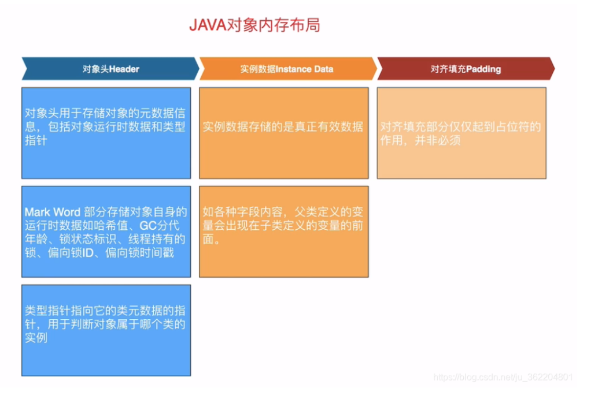
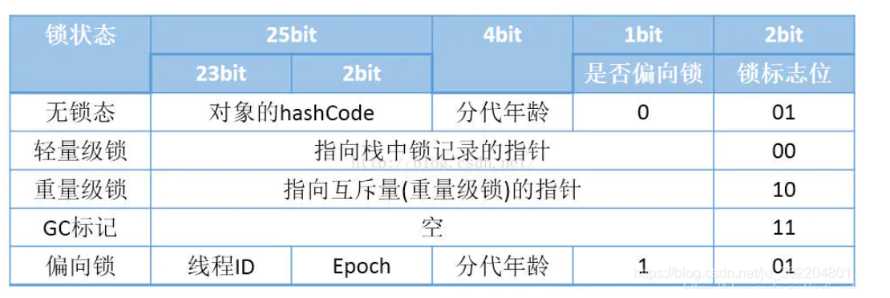
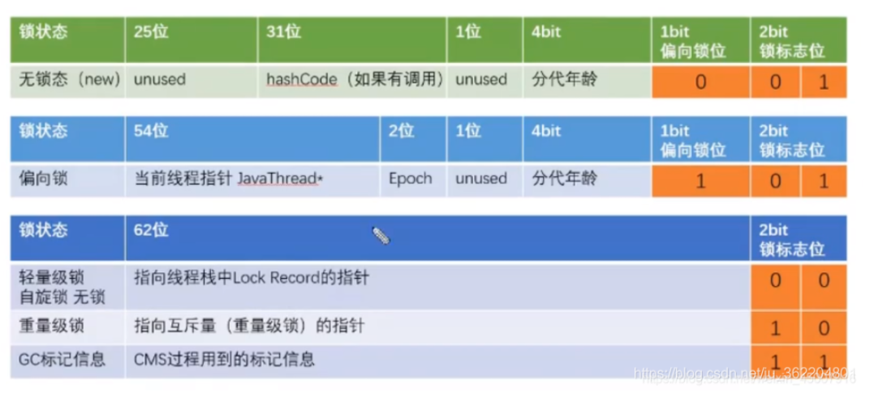
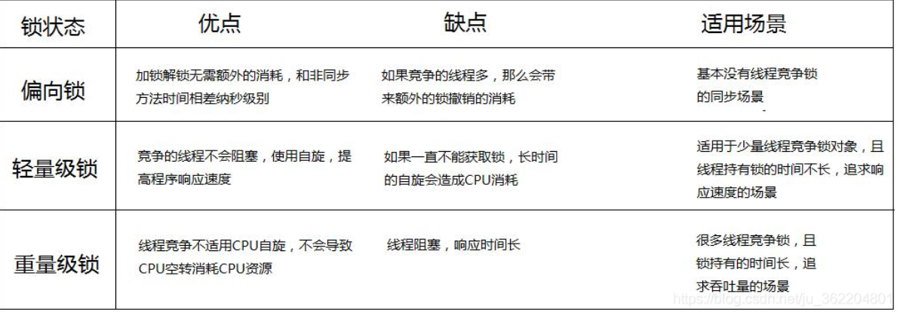

## synchronized详解

1. synchronized概念
    1. synchronized的作用主要有以下三个：
        1. 原子性：线程互斥的访问同步代码块，可以将小原子合成大原子。
        2. 可见性：synchronized解锁之前，必须将工作内存中的数据同步到主内存，其它线程操作该变量时每次都可以看到被修改后的值。
        3. 有序性：一个线程的加锁，必须等到其它线程将锁释放；一个线程要释放锁，首先要加锁。
    2. synchronized方法就保证了同一时刻只有一个线程对方法或者代码块有共享数据的操作。
    3. 而且，synchronized保证了一个线程对共享变量操作的变化被其他线程看到（可以替代volatile功能）。
    4. Synchronized就是内置锁，是java语言特性提供的内置锁，其获得锁和释放锁是隐式的（进入代码块就是获得锁，走出代码就是释放锁）。
    5. synchronized可以修饰类、方法（实例方法和静态方法）和代码块（修饰代码块实现同步），区别就是作用范围的不同：
        1. 修饰类的时候和修饰静态方法是一样的，都是给所有的对象加了同一把锁；
        2. 修饰实例方法时作用范围就是整个函数，给当前实例加锁；
        3. 修饰代码块时作用范围就是大括号内的内容，对给定的对象加锁。
    6. synchronized不能被继承，不能使用Synchronized关键字修饰接口方法；构造方法也不能用Synchronized。
    7. 类锁和对象锁是两个不一样的锁，控制着不同的区域，它们是互不干扰的。同样，线程获得对象锁的同时，也可以获得该类锁，即同时获得两个锁，这是允许的。
    8. Synchronized是可重入锁
        1. 当线程请求一个由其它线程持有的对象锁时，该线程会阻塞，而当线程请求由自己持有的对象锁时，如果该锁是重入锁，请求就会成功，否则阻塞
        2. 实现机制：：每一个锁关联一个线程持有者和计数器，当计数器为 0 时表示该锁没有被任何线程持有，那么任何线程都可能获得该锁而调用相应的方法
        3. 当某一线程请求成功后，JVM会记下锁的持有线程，并且将计数器置为 1
        4. 此时其它线程请求该锁，则必须等待
        5. 而该持有锁的线程如果再次请求这个锁，就可以再次拿到这个锁，同时计数器会递增
        6. 当线程退出同步代码块时，计数器会递减，如果计数器为 0，则释放该锁。
        7. 需要特别注意另外一种情况，当子类继承父类时，子类也是可以通过可重入锁调用父类的同步方法。
    9. synchronized是基于monitor实现的，因此每次重入，monitor中的计数器仍会加1,monitorenter指令进入，
       然后monitorexit释放锁在执行monitorenter之前需要尝试获取锁，如果这个对象没有被锁定，或者当前线程已经拥有了这个对象的锁，那么就把锁的计数器加1。
    10. 当执行monitorexit指令时，锁的计数器也会减1。当获取锁失败时会被阻塞，一直等待锁被释放。
3. synchronized锁升级原理
    1. 要想了解synchronized锁升级的原理，首先了解一下java对象的存储结构
    2. 在虚拟机中，对象在内存中的存储布局可分为三块：对象头、实例数据和对齐填充
       
        1. 对象头
            * 对象头用于存储对象的元数据信息
            * 对象头又可以分为两块内容：第一部分用于存储对象自身的运行时数据，如哈希码（HashCode）、GC分代年龄、锁状态标志、线程持有的锁、偏向线程ID、偏向时间戳等
            * 这部分数据的长度在32位和64位的虚拟机中分别位32bit和64bit，官方称它为 Mark Word，这部分在32位虚拟机占用4个字节，在64位虚拟机占用8个字节
            * 因为对象头信息是与对象自身定义的数据无关的额外存储成本，考虑到虚拟机的空间效率，Mark Word 被设计成为一个非固定的数据结构，以便在极小的空间内存储尽量多的信息，它会根据对象的状态复用自己的存储空间。
            * 也就是说，Mark Word会随着程序的运行发生变化，变化状态如下
                * 32位虚拟机：
                  
                * 64位虚拟机：
                  
            * 对象头的另一部分是类型指针，指向它的类元数据的指针 Klass Pointer，用于判断对象属于哪个类的实例，默认开启压缩Klass Pointer占4个字节，不开启压缩的话占8个字节。
            * 如果对像是一个数组，那在对象头中还必须有一块用于记录数组长度的数据，4个字节来记录数组的长度
            * 因为虚拟机可以通过普通Java对象的元数据信息确定Java对象的大小，但是从数组的元数据中却无法确定数组的大小。
            * 默认情况下，正常对象头的大小是12字节，数组情况下对象头的大小是16字节
        2. 实例数据
            * 实例数据部分是对象真正存储的有效信息，也是在程序代码中所定义各种类型的字段内容
            * 无论是从父类继承下来的，还是在子类中定义的，都需要记录下来。父类定义的变量会出现在子类定义的变量的前面。
            * 各字段的分配策略为longs/doubles、ints、shorts/chars、bytes/boolean、oops(ordinary object pointers)
              ，相同宽度的字段总是被分配到一起，便于之后取数据。
        3. 对齐填充
            * 对齐填充并不是必然存在的，也没有特别的含义，它仅仅起着占位符的作用。
            * 由于hotspot VM的自动内存管理系统要求对象起始地址必须是8字节的整数倍，换句话，就是对象的大小必须是8字节的整数倍。
            * 因此，当对象头和对象实例数据部分不是8个字节的整数倍时，就需要通过对齐填充来补全。
    3. 了解完java对象的存储结构后，可知synchronized锁对象是存储在对象头的Mark Word里
    4. 为什么说Synchronized是重量级的锁：
        1. Java的线程是映射到操作系统的原生线程之上的，如果要阻塞或者恢复一个线程，都需要操作系统来帮忙完成
        2. 这就需要从操作系统的用户态转换到核心态，这个转换需要消耗很多的资源和处理器时间
        3. 因为用户态与内核态都有各自专用的内存空间，专用的寄存器等，用户态切换至内核态需要传递给许多变量、参数给内核，内核也需要保护好用户态在切换时的一些寄存器值、变量等，以便内核态调用结束后切换回用户态继续工作。
        4. 对于简单的代码同步块儿，很可能执行代码的时间还没这个状态转换消耗的时间长。
        5. 所以synchronized是Java里一个重量级的操作，一般有经验的程序员都会在确实有必要的情况下才会去使用这种操作。
        6. 而JDK1.6之后，虚拟机本身也会进行一些优化，譬如在通知操作系统阻塞一个线程之前，会加入一段自旋等待的过程（自旋锁）来避免过于频繁的切入到核心态。
    5. 了解到Synchronized是重量级的锁，JDK1.6后对Synchronized的实现从JVM层面进行了优化，加入了各种锁优化技术，其中就包括偏向锁，轻量级锁等。
        1. 偏向锁，自旋锁，轻量级锁等这些锁，不是来取代替换synchronized重量级锁的，它们是来优化synchronized重量级锁的
        2. 引入这些锁的目的只有一个，就是尽量减少不必要情况下频繁的状态切换，从而提升效率，理解明白这一点非常重要
        3. synchronized锁有四种状态，无锁，偏向锁，轻量级锁，重量级锁，这几个状态会随着竞争状态逐渐升级，锁可以升级但不能降级，但是偏向锁状态可以被重置为无锁状态
        4. 偏向锁：
            * 为什么要引入偏向锁？因为经过HotSpot的作者大量的研究发现，大多数时候是不存在锁竞争的，常常是一个线程多次获得同一个锁
            * 因此如果每次都要竞争锁会增大很多没有必要付出的代价
            * 为了降低获取锁的代价，才引入的偏向锁。它的目的是消除有同步但无竞争的程序性能。有一点需要注意：偏向锁不会主动释放锁。
            * 还有一点需要注意的是：偏向锁是适用于有锁但无竞争的情况，但是如果明明知道会有很多竞争的情况下，再使用偏向锁就有点不合适了，反而会导致性能下降，因为会额外多出很多撤销锁这个动作的开销
            * 基于这个考虑，JVM有个小优化的点，那就是在JVM启动4秒后才会开启偏向锁，因为它知道刚刚启动肯定会有好多线程来竞争锁，所以在刚启动的前4秒干脆就不开启偏向模式，反而会提升性能。
            * 偏向锁原理和升级过程：
                * 当线程1进入同步代码块儿时，它首先需要获取锁对象，如果当前的锁对象的状态是无锁的时候，线程1就可以顺利的获取到锁对象，然后它会把当前线程的ThreadID记录到锁对象的对象头Mark Word里
                * 下次再进入同步代码块的时候，会拿着Mark Word里存的ThreadID和当前的线程ID进行对比，如果一致（还是线程1获取锁对象），则无需使用CAS来加锁、解锁
                * 如果不一致，也就是其他线程（如线程2）目前正持有这把锁或者曾经持有过这把锁
                * 说目前正持有这把锁比较好理解，那为什么说或者曾经持有过这把锁呢？
                * 因为由于偏向锁不会主动释放锁，因此每个线程进来获得锁的时候都需要判断一下当前锁对象的对象头的Mark Word里存储的线程ID对应的线程目前是否还存活
                * 如果没有存活（用大白话理解就是曾经持有过这把锁），那么锁对象被重置为无锁状态，其它线程可以竞争，并将其设置为偏向锁
                * 如果存活，那么立刻查找该线程的栈帧信息，如果还是需要继续持有这个锁对象（正在持有这个把锁），那么此时需要撤销偏向锁，升级为轻量级锁
                * 此时为什么需要撤销偏向锁升级成轻量级锁呢？因为咱们刚才说了，偏向锁它是适用于一个线程多次获得同一个锁的情况，
                  但是此时已经说明有别的其他线程来竞争这把锁了，已经不是一个线程多次获得同一个锁了，所以偏向锁已经不再适用了，需要升级成轻量级锁
        5. 轻量级锁：
            * 为什么要引入轻量级锁？偏向锁考虑的是有同步无竞争时程序的效率，而轻量级锁考虑的是竞争锁对象的线程不多，而且线程持有锁的时间也不长的情景
            * 因为阻塞线程需要CPU从用户态转到内核态，代价较大，如果刚刚阻塞不久这个锁就被释放了，那这个代价就有点得不偿失了，因此这个时候就干脆不阻塞这个线程，让它自旋这等待锁释放。
            * 轻量级锁原理和升级过程：
                * 线程1获取轻量级锁时会先把锁对象的对象头MarkWord复制一份到线程1的栈帧中创建的用于存储锁记录的空间（称为DisplacedMarkWord）
                * 然后使用CAS的方式把对象头Mark Word中的内容替换为线程1存储的锁记录（DisplacedMarkWord）的地址
                * 这里为什么要使用CAS来替换呢？因为如果在线程1复制对象头的同时（在线程1CAS之前），其他线程（比如线程2）也可能在竞争这把锁，所以需要用CAS的方式来保证操作的安全性。
                * 当线程1抢先获得了锁，线程2CAS失败后，开始让线程2进行自旋等待以求在自旋等待过程中对方释放锁
                * 但是，因为自旋是要消耗CPU的，因此自旋的次数是有限制的，比如10次或者100次，现在基本上都使用自适应自旋锁，也就是说具体自旋多少次它是会根据情况去动态调整，会做出当前做合理的选择
                * 如果线程2的自旋次数到了上限了，线程1还没有释放锁，此时轻量级锁就会膨胀为重量级锁
                * 或者线程1还在执行中且线程2自旋次数还未达上限，这时又有其他更多的线程过来竞争这个锁，那么过来竞争的这些线程都要进入自旋，当进入自旋的线程数大于
                  CPU核数的二分之一的时候，那么这个时候轻量级锁也要膨胀为重量级锁
                * 升级成重量级锁之后，重量级锁会把除了拥有锁的线程都阻塞掉，防止过多的线程自旋导致CPU比较大量的空转，浪费CPU资源。
        6. 几种锁的优缺点以及适用场景：
           

4. 