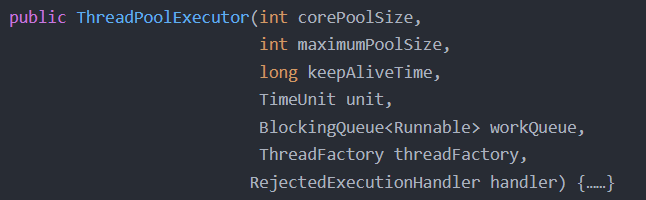
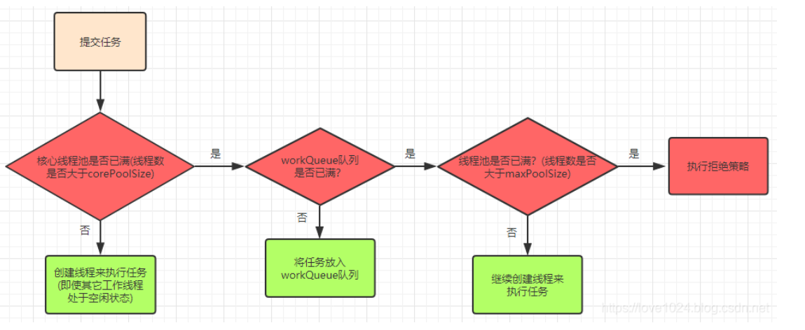
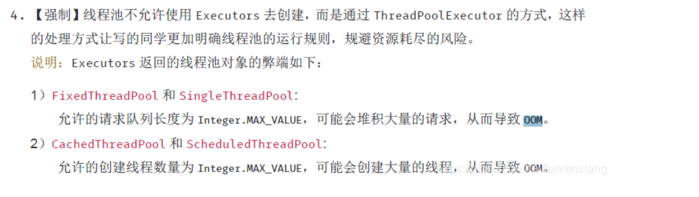
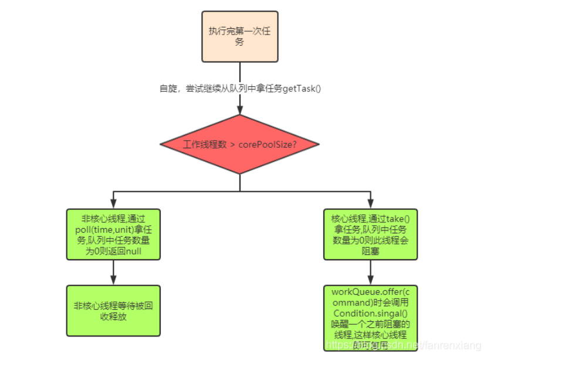
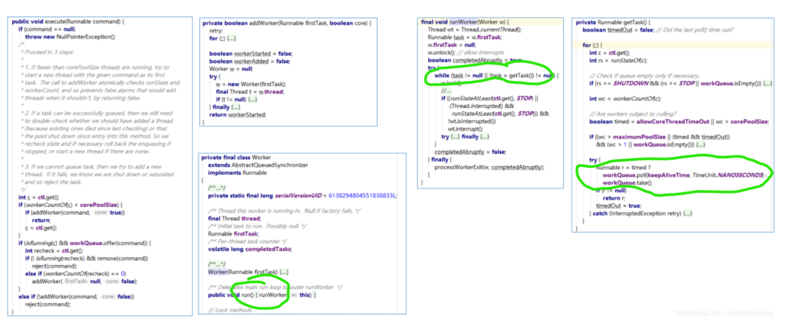

## Java线程池详解

### 1.什么是线程池

* 从字面意思理解，线程池就是放线程Thread的池子，相当于鱼池，线程类似于鱼池里的鱼
* 当我们需要使用线程时，可以直接在池子里捞出一个线程，而不是重新创建（创建线程需要和机器打的内核进行交互，比较耗费资源）
  相当于你想吃一条鱼，就可以直接去鱼池里捞一条鱼出来做一顿红烧鱼，而不是需要自己去买鱼苗，天天喂鱼吃草（这和创建线程一样麻烦），然后等鱼长大之后才能饱餐一顿
* 当使用的线程执行完任务之后，该线程就会放回到线程池中，等待执行下一个任务，而不是直接消亡
* 为什么要使用线程池:
    * java中经常需要用到多线程来处理一些业务，我们非常不建议单纯使用继承Thread或者实现Runnable接口的方式来创建线程，那样势必有创建及销毁线程耗费资源、线程上下文切换问题
    * 同时创建过多的线程也可能引发资源耗尽的风险，这个时候引入线程池比较合理，方便线程任务的管理
* 线程池的使用场景：
    * 加快请求响应（响应时间优先）：比如用户在饿了么上查看某商家外卖，需要聚合商品库存、店家、价格、红包优惠等等信息返回给用户，接口逻辑涉及到聚合、级联等查询，
      从这个角度来看接口返回越快越好，那么就可以使用多线程方式，把聚合/级联查询等任务采用并行方式执行，从而缩短接口响应时间
    * 加快处理大任务（吞吐量优先）:比如业务中台每10分钟就调用接口统计每个系统/项目的PV/UV等指标然后写入多个sheet页中返回， 这种情况下往往也会使用多线程方式来并行统计。 和"时间优先"
      场景不同，这种场景的关注点不在于尽可能快的返回而是关注利用有限的资源尽可能的在单位时间内处理更多的任务，即吞吐量优先。
    *

### 2. 线程池的操作

1. 线程池可以自动创建也可以手动创建，自动创建体现在Executors工具类中
2. 常见的可以创建newFixedThreadPool、newCachedThreadPool、newSingleThreadExecutor、newScheduledThreadPool
3. 手动创建体现在可以灵活设置线程池的各个参数，体现在代码中即ThreadPoolExecutor类构造器上各个实参的不同：

   

    * corePoolSize：核心线程数，也是线程池中常驻的线程数，线程池初始化时默认是没有线程的，当任务来临时才开始创建线程去执行任务
    * maximumPoolSize：最大线程数，在核心线程数的基础上可能会额外增加一些非核心线程，需要注意的是只有当workQueue队列填满时才会创建多于corePoolSize的线程(线程池总线程数不超过maxPoolSize)
    * keepAliveTime：非核心线程的空闲时间超过keepAliveTime就会被自动终止回收掉，注意当corePoolSize=maxPoolSize时，keepAliveTime参数也就不起作用了(因为不存在非核心线程)；
    * unit：keepAliveTime的时间单位
    * workQueue：用于保存任务的队列，可以为无界、有界、同步移交三种队列类型之一，当池子里的工作线程数大于corePoolSize时，这时新进来的任务会被放到队列中
    * threadFactory：创建线程的工厂类，默认使用Executors.defaultThreadFactory()，也可以使用guava库的ThreadFactoryBuilder来创建
    * handler：线程池无法继续接收任务(队列已满且线程数达到maximunPoolSize)
      时的饱和策略，取值有AbortPolicy、CallerRunsPolicy、DiscardOldestPolicy、DiscardPolicy
4. 线程池中的线程创建流程图：

   

5. workQueue队列:
    * SynchronousQueue(同步移交队列)：队列不作为任务的缓冲方式，可以简单理解为队列长度为零
    * LinkedBlockingQueue(无界队列)：队列长度不受限制，当请求越来越多时(任务处理速度跟不上任务提交速度造成请求堆积)可能导致内存占用过多或OOM
    * ArrayBlockintQueue(有界队列)：队列长度受限，当队列满了就需要创建多余的线程来执行任务
6. 常见的几种自动创建线程池方式
    1. newFixedThreadPool：使用的构造方式为new ThreadPoolExecutor(var0, var0, 0L, TimeUnit.MILLISECONDS, new
       LinkedBlockingQueue())，设置了corePoolSize=maxPoolSize，keepAliveTime=0(此时该参数没作用)，无界队列，任务可以无限放入，当请求过多时(
       任务处理速度跟不上任务提交速度造成请求堆积)可能导致占用过多内存或直接导致OOM异常
    2. newSingleThreadExector：使用的构造方式为new ThreadPoolExecutor(1, 1, 0L, TimeUnit.MILLISECONDS, new LinkedBlockingQueue(),
       var0)，基本同newFixedThreadPool，但是将线程数设置为了1，单线程，弊端和newFixedThreadPool一致
    3. newCachedThreadPool：使用的构造方式为new ThreadPoolExecutor(0, 2147483647, 60L, TimeUnit.SECONDS, new SynchronousQueue())
       ，corePoolSize=0，maxPoolSize为很大的数，同步移交队列，也就是说不维护常驻线程(核心线程)
       ，每次来请求直接创建新线程来处理任务，也不使用队列缓冲，会自动回收多余线程，由于将maxPoolSize设置成Integer.MAX_VALUE，当请求很多时就可能创建过多的线程，导致资源耗尽OOM
    4. newScheduledThreadPool：使用的构造方式为new ThreadPoolExecutor(var1, 2147483647, 0L, TimeUnit.NANOSECONDS, new
       ScheduledThreadPoolExecutor.DelayedWorkQueue())，支持定时周期性执行，注意一下使用的是延迟队列，弊端同newCachedThreadPool一致
7. 在实际项目开发中也是推荐使用手动创建线程池的方式，而不用默认方式，关于这点在《阿里巴巴开发规范》中是这样描述的：

   

8. handler拒绝策略:
    * AbortPolicy：中断抛出异常
    * DiscardPolicy：默默丢弃任务，不进行任何通知
    * DiscardOldestPolicy：丢弃掉在队列中存在时间最久的任务
    * CallerRunsPolicy：让提交任务的线程去执行任务(对比前三种比较友好一丢丢)
9. 关闭线程池
    * shutdownNow()：立即关闭线程池(暴力)，正在执行中的及队列中的任务会被中断，同时该方法会返回被中断的队列中的任务列表
    * shutdown()：平滑关闭线程池，正在执行中的及队列中的任务能执行完成，后续进来的任务会被执行拒绝策略
    * isTerminated()：当正在执行的任务及对列中的任务全部都执行（清空）完就会返回true

### 3. 线程池实现线程复用的原理

1. 线程池里执行的是任务,核心逻辑在ThreadPoolExecutor类的execute方法中,同时ThreadPoolExecutor中维护了HashSet<Worker> workers;
2. addWorker()方法来创建线程执行任务,如果是核心线程的任务,会赋值给Worker的firstTask属性;
3. Worker实现了Runnable,本质上也是任务,核心在run()方法里;
4. run()方法的执行核心runWorker(),自旋拿任务while (task != null || (task = getTask()) != null)),task是核心线程Worker的firstTask或者getTask()
5. getTask()的核心逻辑:
    * 若当前工作线程数量大于核心线程数->说明此线程是非核心工作线程,通过poll()拿任务,未拿到任务即getTask()返回null, 然后会在processWorkerExit(w, completedAbruptly)
      方法释放掉这个非核心工作线程的引用;
    * 若当前工作线程数量小于核心线程数->说明此时线程是核心工作线程,通过take()拿任务
    * take()方式取任务,如果队列中没有任务了会调用await()阻塞当前线程,直到新任务到来,所以核心工作线程不会被回收; 当执行execute方法里的workQueue.offer(command)
      时会调用Condition.singal()方法唤醒一个之前阻塞的线程,这样核心线程即可复用

      
    * 关键代码：

      
