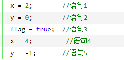
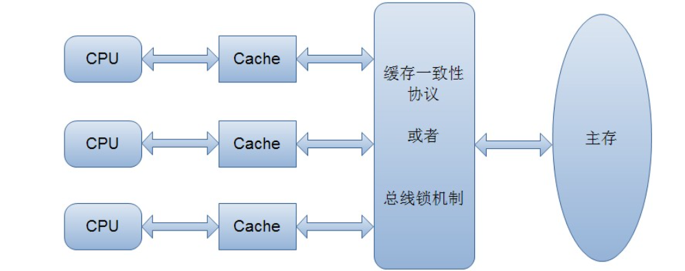
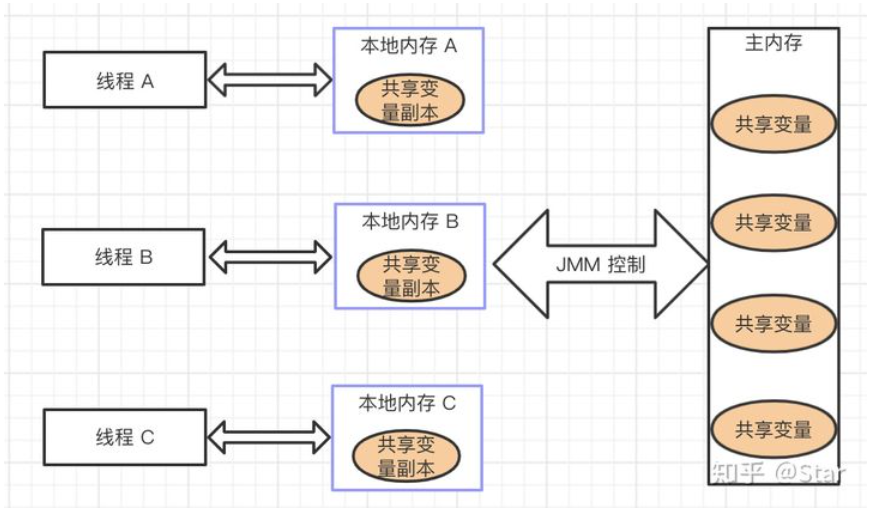

## volatile详解

#### 1. 概念

1. volatile关键字的两层语义,一旦一个共享变量（类的成员变量、类的静态成员变量）被volatile修饰之后，那么就具备了两层语义：
    1. 保证了不同线程对这个变量进行操作时的可见性，即一个线程修改了某个变量的值，这新值对其他线程来说是立即可见的。
    2. 禁止进行指令重排序。
2. volatile关键字能保证可见性，但是volatile没办法保证对变量的操作的原子性。
3. volatile关键字禁止指令重排序有两层意思：
    1. 当程序执行到volatile变量的读操作或者写操作时，在其前面的操作的更改肯定全部已经进行，且结果已经对后面的操作可见；在其后面的操作肯定还没有进行；
    2. 在进行指令优化时，不能将在对volatile变量访问的语句放在其后面执行，也不能把volatile变量后面的语句放到其前面执行。
    3. 可能上面说的比较绕，举个简单的例子：

       

    4. 由于flag变量为volatile变量，那么在进行指令重排序的过程的时候，不会将语句3放到语句1、语句2前面，也不会讲语句3放到语句4、语句5后面。但是要注意语句1和语句2的顺序、语句4和语句5的顺序是不作任何保证的。
    5. 并且volatile关键字能保证，执行到语句3时，语句1和语句2必定是执行完毕了的，且语句1和语句2的执行结果对语句3、语句4、语句5是可见的。

#### 2. 原理

1. 由于volatile关键字是与Java的内存模型有关的，因此在讲述volatile关键之前， 我们先来了解一下与内存模型相关的概念和知识，然后分析了volatile关键字的实现原理，最后给出了几个使用volatile关键字的场景。
2. 内存模型的相关概念：
    1. 计算机在执行程序时，每条指令都是在CPU中执行的，而执行指令过程中，势必涉及到数据的读取和写入
    2. 由于程序运行过程中的临时数据是存放在主存（物理内存）当中的，
       这时就存在一个问题，由于CPU执行速度很快，而从内存读取数据和向内存写入数据的过程跟CPU执行指令的速度比起来要慢的多，因此如果任何时候对数据的操作都要通过和内存的交互来进行，会大大降低指令执行的速度。因此在CPU里面就有了高速缓存
    3. 当程序在运行过程中，会将运算需要的数据从主存复制一份到CPU的高速缓存当中，那么CPU进行计算时就可以直接从它的高速缓存读取数据和向其中写入数据，当运算结束之后，再将高速缓存中的数据刷新到主存当中
    4. 举个简单的例子，比如下面的这段代码：i = i + 1;
        * 当线程执行这个语句时，会先从主存当中读取i的值，然后复制一份到高速缓存当中，然后CPU执行指令对i进行加1操作，然后将数据写入高速缓存，最后将高速缓存中i最新的值刷新到主存当中。
        * 这个代码在单线程中运行是没有任何问题的，但是在多线程中运行就会有问题了。
        * 在多核CPU中，每条线程可能运行于不同的CPU中，因此每个线程运行时有自己的高速缓存（对单核CPU来说，其实也会出现这种问题，只不过是以线程调度的形式来分别执行的）
        * 我们以多核CPU为例。比如同时有2个线程执行这段代码，假如初始时i的值为0，那么我们希望两个线程执行完之后i的值变为2。但是事实会是这样吗？
        * 可能存在下面一种情况：初始时，两个线程分别读取i的值存入各自所在的CPU的高速缓存当中，然后线程1进行加1操作，然后把i的最新值1写入到内存。
          此时线程2的高速缓存当中i的值还是0，进行加1操作之后，i的值为1，然后线程2把i的值写入内存。
        * 最终结果i的值是1，而不是2。这就是著名的缓存一致性问题。通常称这种被多个线程访问的变量为共享变量。
        * 为了解决缓存不一致性问题，通常来说有以下2种解决方法：
            * 通过在总线加LOCK#锁的方式
            * 通过缓存一致性协议
            * 这2种方式都是硬件层面上提供的方式。
            * 在早期的CPU当中，是通过在总线上加LOCK#锁的形式来解决缓存不一致的问题。
            * 因为CPU和其他部件进行通信都是通过总线来进行的，如果对总线加LOCK#锁的话，也就是说阻塞了其他CPU对其他部件访问（如内存），从而使得只能有一个CPU能使用这个变量的内存
            * 比如上面例子中 如果一个线程在执行 i = i +1，如果在执行这段代码的过程中，在总线上发出了LCOK#锁的信号，
              那么只有等待这段代码完全执行完毕之后，其他CPU才能从变量i所在的内存读取变量，然后进行相应的操作。这样就解决了缓存不一致的问题。
            * 但是上面的方式会有一个问题，由于在锁住总线期间，其他CPU无法访问内存，导致效率低下。
            * 所以就出现了缓存一致性协议。最出名的就是Intel 的MESI协议，MESI协议保证了每个缓存中使用的共享变量的副本是一致的
            * 它核心的思想是：当CPU写数据时，如果发现操作的变量是共享变量，即在其他CPU中也存在该变量的副本，会发出信号通知其他CPU将该变量的缓存行置为无效状态
            * 因此当其他CPU需要读取这个变量时，发现自己缓存中缓存该变量的缓存行是无效的，那么它就会从内存重新读取

              
    5. 可见性的问题是如何出现的呢
        1. 由于Java 内存模型规定：
            * 每一个线程还存在自己的工作内存，线程的工作内存，保留了被线程使用的变量的工作副本。
            * 线程对变量的所有的操作（读，取）都必须在工作内存中完成，而不能直接读写主内存中的变量。
            * 不同线程之间也不能直接访问对方工作内存中的变量，线程间变量的值的传递需要通过主内存中转来完成。

              

            * JMM 这样的规定可能会导致线程对共享变量的修改没有即时更新到主内存，或者线程没能够即时将共享变量的最新值同步到工作内存中，从而使得线程在使用共享变量的值时，该值并不是最新的。
            * 正因为 JMM 这样的机制，就出现了可见性问题
3. volatile的原理和实现机制
    1. “观察加入volatile关键字和没有加入volatile关键字时所生成的汇编代码发现，加入volatile关键字时，会多出一个lock前缀指令”
    2. lock前缀指令实际上相当于一个内存屏障（也成内存栅栏），内存屏障会提供3个功能：
        1. 它确保指令重排序时不会把其后面的指令排到内存屏障之前的位置，也不会把前面的指令排到内存屏障的后面；即在执行到内存屏障这句指令时，在它前面的操作已经全部完成；
        2. 它会强制将对缓存的修改操作立即写入主存；
        3. 如果是写操作，它会导致其他CPU中对应的缓存行无效。

#### 3. 使用volatile关键字的场景

1. synchronized关键字是防止多个线程同时执行一段代码，那么就会很影响程序执行效率，而volatile关键字在某些情况下性能要优于synchronized
2. 但是要注意volatile关键字是无法替代synchronized关键字的，因为volatile关键字无法保证操作的原子性
3. 通常来说，使用volatile必须具备以下2个条件：
    1. 对变量的写操作不依赖于当前值
    2. 该变量没有包含在具有其他变量的不变式中