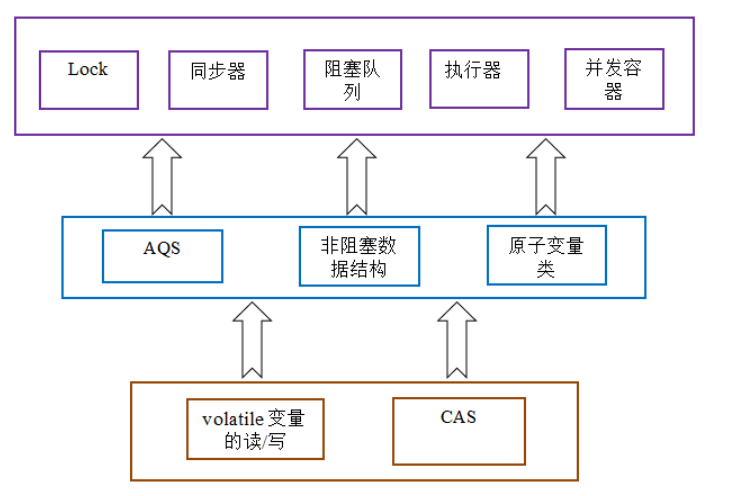
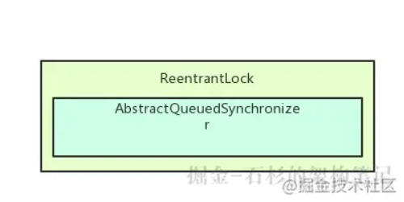
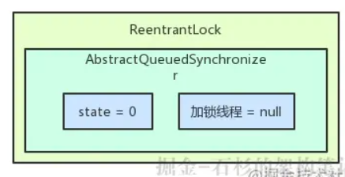
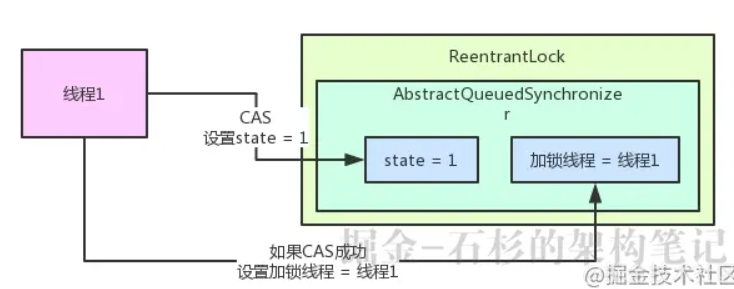
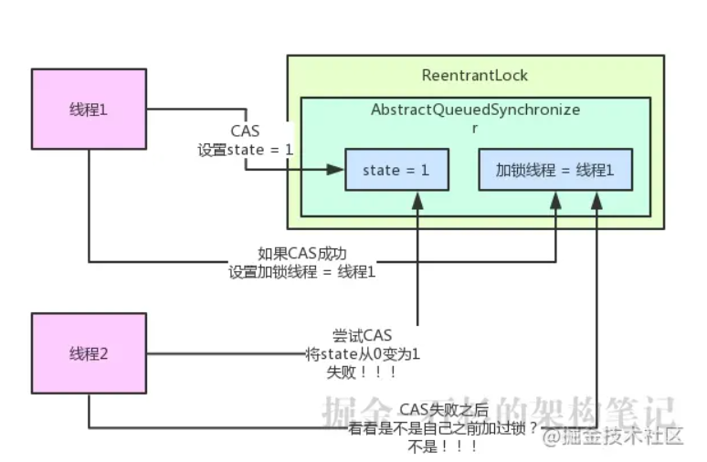
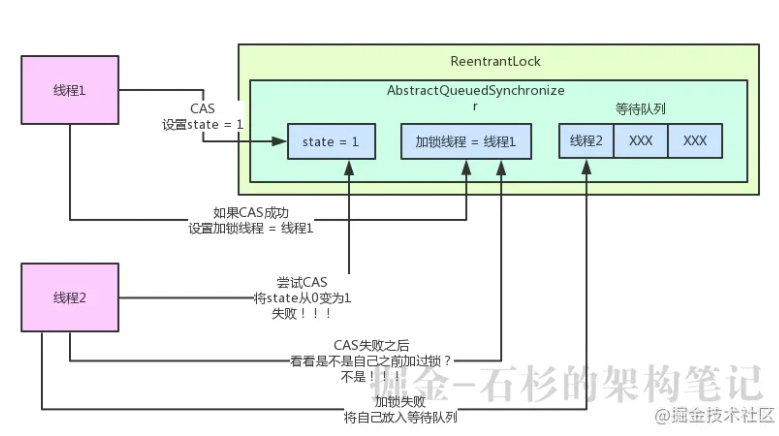
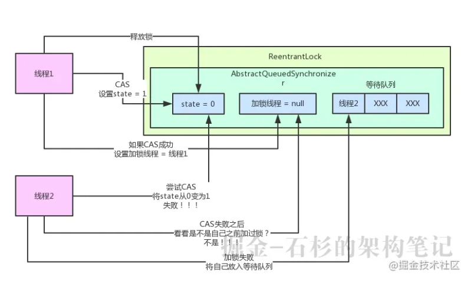
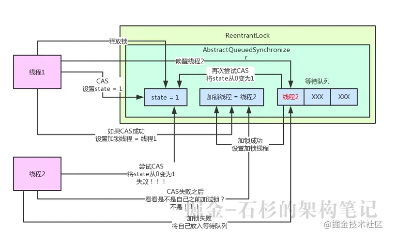

## Java多线程笔记

### 1 CAS

#### 1.1 CAS概念

* CAS,compare and swap的缩写，中文翻译成比较并交换。

* CAS 操作包含三个操作数 —— 内存位置（V）、预期原值（A）和新值(B)。 如果内存位置的值与预期原值相匹配，那么处理器会自动将该位置值更新为新值 。否则，处理器不做任何操作。无论哪种情况，它都会在 CAS 指令之前返回该
  位置的值。（在 CAS 的一些特殊情况下将仅返回 CAS 是否成功，而不提取当前 值。）CAS 有效地说明了“我认为位置 V 应该包含值 A；如果包含该值，则将 B 放到这个位置；否则，不要更改该位置，只告诉我这个位置现在的值即可。

#### 1.2 CAS的目的

* 利用CPU的CAS指令，同时借助JNI来完成Java的非阻塞算法。其它原子操作都是利用类似的特性完成的。而整个J.U.C都是建立在CAS之上的，因此对于synchronized阻塞算法，J.U.C在性能上有了很大的提升。

#### 1.3 CAS存在的问题

* CAS虽然很高效的解决原子操作，但是CAS仍然存在三大问题。ABA问题，循环时间长开销大和只能保证一个共享变量的原子操作

1. ABA问题。因为CAS需要在操作值的时候检查下值有没有发生变化，如果没有发生变化则更新，
   但是如果一个值原来是A，变成了B，又变成了A，那么使用CAS进行检查时会发现它的值没有发生变化，但是实际上却变化了。ABA问题的解决思路就是使用版本号。在变量前面追加上版本号，每次变量更新的时候把版本号加一，那么A－B－A
   就会变成1A-2B－3A。

2. 从Java1.5开始JDK的atomic包里提供了一个类AtomicStampedReference来解决ABA问题。
   这个类的compareAndSet方法作用是首先检查当前引用是否等于预期引用，并且当前标志是否等于预期标志，如果全部相等，则以原子方式将该引用和该标志的值设置为给定的更新值。

3. 循环时间长开销大。自旋CAS如果长时间不成功，会给CPU带来非常大的执行开销。
   如果JVM能支持处理器提供的pause指令那么效率会有一定的提升，pause指令有两个作用，第一它可以延迟流水线执行指令（de-pipeline）,使CPU不会消耗过多的执行资源，延迟的时间取决于具体实现的版本，在一些处理器上延迟时间是零。第二它可以避免在退出循环的时候因内存顺序冲突（memory
   order violation）而引起CPU流水线被清空（CPU pipeline flush），从而提高CPU的执行效率。

4. 只能保证一个共享变量的原子操作。当对一个共享变量执行操作时，我们可以使用循环CAS的方式来保证原子操作，但是对多个共享变量操作时，循环CAS就无法保证操作的原子性，这个时候就可以用锁，
   或者有一个取巧的办法，就是把多个共享变量合并成一个共享变量来操作。比如有两个共享变量i＝2,j=a，合并一下ij=2a，然后用CAS来操作ij。从Java1.5开始JDK提供了AtomicReference类来保证引用对象之间的原子性，你可以把多个变量放在一个对象里来进行CAS操作。

#### 1.4 concurrent包的实现

* 由于java的CAS同时具有 volatile 读和volatile写的内存语义，因此Java线程之间的通信现在有了下面四种方式：

1. A线程写volatile变量，随后B线程读这个volatile变量。
2. A线程写volatile变量，随后B线程用CAS更新这个volatile变量。
3. A线程用CAS更新一个volatile变量，随后B线程用CAS更新这个volatile变量。
4. A线程用CAS更新一个volatile变量，随后B线程读这个volatile变量。

* Java的CAS会使用现代处理器上提供的高效机器级别原子指令，这些原子指令以原子方式对内存执行读-改-写操作，这是在多处理器中实现同步的关键
  （从本质上来说，能够支持原子性读-改-写指令的计算机器，是顺序计算图灵机的异步等价机器，因此任何现代的多处理器都会去支持某种能对内存执行原子性读-改-写操作的原子指令）。
  同时，volatile变量的读/写和CAS可以实现线程之间的通信。把这些特性整合在一起，就形成了整个concurrent包得以实现的基石。如果我们仔细分析concurrent包的源代码实现，会发现一个通用化的实现模式：

1. 首先，声明共享变量为volatile；
2. 然后，使用CAS的原子条件更新来实现线程之间的同步；
3. 同时，配合以volatile的读/写和CAS所具有的volatile读和写的内存语义来实现线程之间的通信。

* AQS，非阻塞数据结构和原子变量类（java.util.concurrent.atomic包中的类），这些concurrent包中的基础类都是使用这种模式来实现的，
  而concurrent包中的高层类又是依赖于这些基础类来实现的。从整体来看，concurrent包的实现示意图如下：
  

### 2 AQS理论

#### 2.1 AQS概念

* AbstractQueuedSynchronizer，抽象队列同步器，是一个可以给我们实现锁的框架。

#### 2.2 AQS实现和原理

1. ReentrantLock、ReentrantReadWriteLock底层都是基于AQS来实现的

   

   我们来看上面的图。说白了，ReentrantLock内部包含了一个AQS对象，也就是AbstractQueuedSynchronizer类型的对象。这个AQS对象就是ReentrantLock可以实现加锁和释放锁的关键性的核心组件。

2. ReentrantLock加锁和释放锁的底层原理

   AQS对象内部有一个核心的变量叫做state，是int类型的，代表了加锁的状态。初始状态下，这个state的值是0。另外，这个AQS内部还有一个关键变量，用来记录当前加锁的是哪个线程，初始化状态下，这个变量是null
   

#### 2.3 AQS例子

1. 线程1跑过来调用ReentrantLock的lock()方法尝试进行加锁，这个加锁的过程，直接就是用CAS操作将state值从0变为1。如果之前没人加过锁，那么state的值肯定是0，此时线程1就可以加锁成功。
   一旦线程1加锁成功了之后，就可以设置当前加锁线程是自己。所以大家看下面的图，就是线程1跑过来加锁的一个过程。
   

   其实看到这儿，大家应该对所谓的AQS有感觉了。说白了，就是并发包里的一个核心组件，里面有state变量、加锁线程变量等核心的东西，维护了加锁状态。
   你会发现，ReentrantLock这种东西只是一个外层的API，内核中的锁机制实现都是依赖AQS组件的。
2. 这个ReentrantLock之所以用Reentrant打头，意思就是他是一个可重入锁。 可重入锁的意思，就是你可以对一个ReentrantLock对象多次执行lock()加锁和unlock()
   释放锁，也就是可以对一个锁加多次，叫做可重入加锁。 大家看明白了那个state变量之后，就知道了如何进行可重入加锁！
   其实每次线程1可重入加锁一次，会判断一下当前加锁线程就是自己，那么他自己就可以可重入多次加锁，每次加锁就是把state的值给累加1，别的没啥变化。
3. 如果线程1加锁了之后，线程2跑过来加锁会怎么样呢？

   **我们来看看锁的互斥是如何实现的？**线程2跑过来一下看到，哎呀！state的值不是0啊？所以CAS操作将state从0变为1的过程会失败，因为state的值当前为1，说明已经有人加锁了！
   接着线程2会看一下，是不是自己之前加的锁啊？当然不是了，**“加锁线程”**这个变量明确记录了是线程1占用了这个锁，所以线程2此时就是加锁失败。 给大家来一张图，一起来感受一下这个过程：
   
4. 接着，线程2会将自己放入AQS中的一个等待队列，因为自己尝试加锁失败了，此时就要将自己放入队列中来等待，等待线程1释放锁之后，自己就可以重新尝试加锁了
   所以大家可以看到，AQS是如此的核心！AQS内部还有一个等待队列，专门放那些加锁失败的线程！ 同样，给大家来一张图，一起感受一下：
   
5. 接着，线程1在执行完自己的业务逻辑代码之后，就会释放锁！他释放锁的过程非常的简单，就是将AQS内的state变量的值递减1，如果state值为0，则彻底释放锁，会将“加锁线程”变量也设置为null！
   
6. 最后，会从等待队列的队头唤醒线程2重新尝试加锁。

   好！线程2现在就重新尝试加锁，这时还是用CAS操作将state从0变为1，此时就会成功，成功之后代表加锁成功，就会将state设置为1。 此外，还要把**“加锁线程”**设置为线程2自己，同时线程2自己就从等待队列中出队了。
   最后再来一张图，大家来看看这个过程。
   

#### 2.4 总结

AQS就是一个并发包的基础组件，用来实现各种锁，各种同步组件的。它包含了state变量、加锁线程、等待队列等并发中的核心组件。
