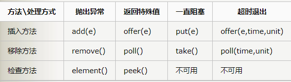
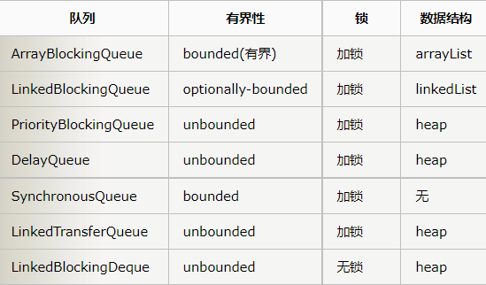

## Java阻塞队列笔记

### 1 BlockingQueue

#### 1.1 BlockingQueue概念
阻塞队列（BlockingQueue）是一个支持两个附加操作的队列。
这两个附加的操作是：

在队列为空时，获取元素的线程会等待队列变为非空。
当队列满时，存储元素的线程会等待队列可用。

阻塞队列常用于生产者和消费者的场景，生产者是往队列里添加元素的线程，消费者是从队列里拿元素的线程。阻塞队列就是生产者存放元素的容器，而消费者也只从容器里拿元素。

阻塞队列提供了四种处理方法:

* 异常：是指当阻塞队列满时候，再往队列里插入元素，会抛出IllegalStateException("Queue full")异常。当队列为空时，从队列里获取元素时会抛出NoSuchElementException异常。

* 返回特殊值：插入方法会返回是否成功，成功则返回true。移除方法，则是从队列里拿出一个元素，如果没有则返回null。

* 一直阻塞：当阻塞队列满时，如果生产者线程往队列里put元素，队列会一直阻塞生产者线程，直到拿到数据，或者响应中断退出。当队列空时，消费者线程试图从队列里take元素，队列也会阻塞消费者线程，直到队列可用。

* 超时退出：当阻塞队列满时，队列会阻塞生产者线程一段时间，如果超过一定的时间，生产者线程就会退出。

####1.2 BlockingQueue的成员

* ArrayBlockingQueue：是一个用数组实现的有界阻塞队列，此队列按照先进先出（FIFO）的原则对元素进行排序。支持公平锁和非公平锁。【注：每一个线程在获取锁的时候可能都会排队等待，如果在等待时间上，先获取锁的线程的请求一定先被满足，那么这个锁就是公平的。反之，这个锁就是不公平的。公平的获取锁，也就是当前等待时间最长的线程先获取锁】

* LinkedBlockingQueue：一个由链表结构组成的有界队列，此队列的长度为Integer.MAX_VALUE。此队列按照先进先出的顺序进行排序。

* PriorityBlockingQueue： 一个支持线程优先级排序的无界队列，默认自然序进行排序，也可以自定义实现compareTo()方法来指定元素排序规则，不能保证同优先级元素的顺序。

* DelayQueue： 一个实现PriorityBlockingQueue实现延迟获取的无界队列，在创建元素时，可以指定多久才能从队列中获取当前元素。只有延时期满后才能从队列中获取元素。（DelayQueue可以运用在以下应用场景：1.缓存系统的设计：可以用DelayQueue保存缓存元素的有效期，使用一个线程循环查询DelayQueue，一旦能从DelayQueue中获取元素时，表示缓存有效期到了。2.定时任务调度。使用DelayQueue保存当天将会执行的任务和执行时间，一旦从DelayQueue中获取到任务就开始执行，从比如TimerQueue就是使用DelayQueue实现的。）

* SynchronousQueue： 一个不存储元素的阻塞队列，每一个put操作必须等待take操作，否则不能添加元素。支持公平锁和非公平锁。SynchronousQueue的一个使用场景是在线程池里。Executors.newCachedThreadPool()就使用了SynchronousQueue，这个线程池根据需要（新任务到来时）创建新的线程，如果有空闲线程则会重复使用，线程空闲了60秒后会被回收。

* LinkedTransferQueue： 一个由链表结构组成的无界阻塞队列，相当于其它队列，LinkedTransferQueue队列多了transfer和tryTransfer方法。

* LinkedBlockingDeque： 一个由链表结构组成的双向阻塞队列。队列头部和尾部都可以添加和移除元素，多线程并发时，可以将锁的竞争最多降到一半。
